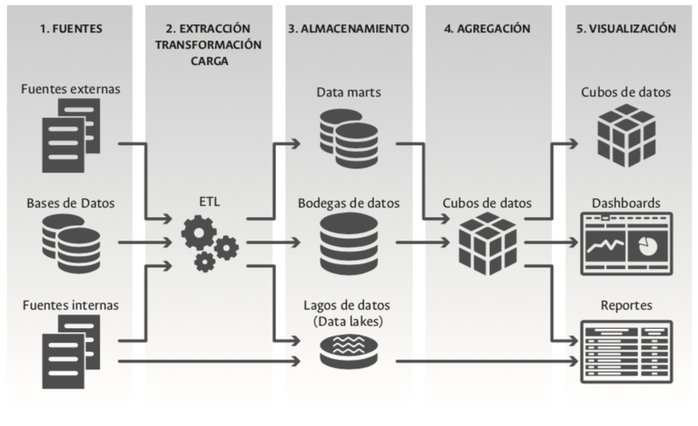

# **El _boom_ de los datos y el protagonismo de la tecnología** {#Cap02}


```{block2, type='flushright', html.tag='p'}
_A diferencia de las cosas materiales --los alimentos que comemos,_\
_una vela que arde--, el valor de los datos no disminuye cuando estos se usan;_\
_pueden volver a procesarse una y otra vez. Los datos constituyen lo que los_\
_economistas llaman un bien “no rival”: su uso por una persona no impide_\
_que los use otra. Y la información no se desgasta con el uso, _\
_como sí lo hacen los bienes materiales._\
--- **@mayer2013big, pág. 129**
```

Los datos, en especial desde finales del siglo pasado y hasta nuestros días, han dejado de ser un recurso escaso y de bajo interés en el ámbito de la gestión organizacional y se están convirtiendo en uno abundante, necesario y de imprescindible abordaje en el contexto de la gestión moderna. Su auge es tal que hoy, en algunas latitudes, estos han sido elevados a la categoría de activo y recurso estratégico de carácter inagotable, dada su capacidad para ser usados en múltiples propósitos.

El origen del _boom_ que hoy experimentan los datos es diverso, disperso y complejo. Algunos de los responsables de este auge son: las organizaciones privadas y públicas, que se gestionan en un contexto de libre competencia con alcances globales, esto les exige contar con más y mejor información para tomar decisiones que les permitan sobrevivir, pero, sobre todo, crecer; los gobiernos, que han cambiado sus prioridades de proveer los bienes y servicios que las sociedades demandan por regular, evaluar y certificar a través del uso de información la provisión de servicios por parte de terceros y por sus entidades; las sociedades modernas, cada vez más formadas, que demandan tanto del Estado como de sus organizaciones mayores niveles de transparencia, rendiciones permanentes de cuentas y acceso a las cifras derivadas de su gestión; el internet y las redes sociales, que han permitido comunicaciones veloces y la posibilidad de compartir todo tipo de información, incluidos sentimientos expresados en palabras y conversaciones; el crecimiento de las transacciones electrónicas y de las aplicaciones tecnológicas, que proveen nuevos bienes y servicios; el surgimiento de nuevos artefactos, que hacen posible capturar, almacenar, procesar y tomar decisiones autónomas basadas en cientos, miles y millones de datos recolectados; el aumento de manera vertiginosa de la capacidad de almacenamiento, de cómputo, de acceso, y la posibilidad de compartir códigos a nivel mundial, entre otros.

## **Los datos**

Los datos, según @Ety, citado en el [Conpes 3920](https://colaboracion.dnp.gov.co/CDT/Conpes/Econ%C3%B3micos/3920.pdf), son “la representación primaria de variables cualitativas y cuantitativas que son almacenables, transferibles, pueden ser visualizados, controlados y entendidos”^[Conpes 3920, Política Nacional de Explotación de Datos (_Big Data_), p. 25.]. Así mismo, según este documento, los datos en la actualidad pueden ser clasificados en estructurados, semiestructurados y no estructurados según su grado de afinidad con las siguientes definiciones^[Según este mismo documento, los datos a su vez pueden ser clasificados desde una perspectiva orgánica en públicos y privados, y desde un criterio cualitativo en personales e impersonales.].

+ **Estructurados:** están organizados conforme a un modelo o esquema. Se almacenan en forma tabular y algunas veces su estructura también incluye la definición de las relaciones entre ellos. Típicamente están representados en bases de datos que hacen parte del funcionamiento de sistemas de información.

+ **Semiestructurados:** su organización y presentación tiene una estructura básica (etiquetas o marcadores), pero no tienen establecida una definición de relaciones en su contenido. En esta categoría se incluyen contenidos de correos electrónicos, tuits, archivos XML.

+ **No estructurados:** su organización y presentación no está guiada por ningún modelo o esquema. En esta categoría se incluyen las imágenes, texto, audios, contenidos de redes sociales, videos, entre otros.

Hace no más de 30 años el mundo de los datos estaba gobernado por aquellos de naturaleza estructurada; hoy estos conservan un lugar especial, pero el protagonismo está pasando, gracias a la incidencia de las nuevas tecnologías, al escenario de lo semiestructurado y lo no estructurado. Esta realidad ha implicado grandes transformaciones, entre ellas, en la forma como los datos son capturados, procesados y, sobre todo, analizados. De un escenario del análisis de datos centrado en la matemática y la estadística, estamos incursionando en uno donde están participando nuevos fenómenos, disciplinas y marcos de trabajo soportados en gran medida en las nuevas tecnologías de la información y las comunicaciones. El _Big Data_, la analítica o minería de datos, la inteligencia de negocios y la ciencia de los datos se han sumado hoy a la matemática y la estadística para conformar un verdadero arsenal capaz de enfrentar y extraer el conocimiento oculto en conjuntos de datos que hoy crecen de manera vertiginosa en cantidad y variedad.


## ***Big data***

Con la llegada del siglo XXI y con el desarrollo de las nuevas tecnologías de la información y las comunicaciones, hemos superado nuestras capacidades para: almacenar y conservar grandes cantidades de datos, extender el espectro a una gran variedad de datos, y procesar y extraer de manera rápida información contenida en estos para generar nuevo conocimiento o tomar mejores decisiones. A la gran cantidad y variedad de datos que la humanidad está generando a diario, así como la capacidad de almacenamiento y la velocidad con la que estos están siendo procesados se le conoce como _Big Data_^[Por ejemplo, a manera de ilustración de este fenómeno y según \@LoriLewis y \@OfficiallyChadd, actualmente _en un minuto_ en internet se realizan 3,7 millones de búsquedas en Google, se ven 4,3 millones de horas de video en YouTube, se ven 266.000 horas de contenido en Netflix, se envían 481.000 tuits, se intercambian 38 millones de mensajes a través de WhatsApp, se realizan 862.823 compras en línea, se envían 187 millones de correos electrónicos, se inician 973.000 sesiones en Facebook, se descargan 375.000 aplicaciones de App Store y Google Play, etc. Y, actualmente, la humanidad está en capacidad de almacenar y procesar toda esta cantidad de datos para distintos propósitos.]

Aunque no existe precisión sobre el significado de _Big Data_, este fenómeno, “se refiere a cosas que se pueden hacer a gran escala, pero no a una escala inferior, para extraer nuevas percepciones o crear nuevas formas de valor, de tal forma que trasforman los mercados, las organizaciones, las relaciones entre los ciudadanos y los gobiernos, etc.”, según [@mayer2013big, pág. 17]. Así mismo, según estos autores, el término más adecuado para describir lo que en la actualidad está sucediendo a raíz de este fenómeno es la datificación del todo: “Datificar se refiere a recopilar información sobre cuanto existe bajo el sol –incluyendo cosas que en modo alguno solíamos considerar información antes, como la localización de una persona, las vibraciones de un motor o la tensión que soporta un puente– y transformarla a formato de datos para cuantificarlas” (pág. 28).

En conclusión, el fenómeno del _Big Data_ se caracteriza por la intención contemporánea de convertir en datos (datificar), dada la capacidad tecnológica actualmente disponible, “una inmensa cantidad de cosas que antes nunca pudieron medirse, almacenarse, analizarse y compartirse” [@mayer2013big, pág. 31]. El surgimiento del _Big Data_ como la estrategia que cobija la intención de datificar, se caracteriza principalmente por tres rasgos definitorios popularizados a través de las 3 V: volumen, velocidad y variedad^[Además del volumen, la variedad y la velocidad, al fenómeno del Big Data se le asocian en menor medida otros rasgos característicos como la veracidad de los datos, la viabilidad para extraer conocimiento, el valor potencial de los mismos, así como la capacidad de estos para ser representados de manera gráfica.].

En primer lugar, el volumen hace referencia a la cantidad creciente de datos disponibles (_datificación_) y a los retos que estos están generando tanto para su almacenamiento como para su análisis. Del byte^[En el sitio web https://es.wikipedia.org/wiki/Byte se puede explorar el tamaño de las diferentes unidades actualmente existentes para la medición del almacenamiento de información a nivel tecnológico.] de años atrás pasamos rápidamente a los megabytes; hoy ya no nos son ajenos términos como los gigabytes o terabytes y seguramente, en un futuro no muy lejano, serán de uso cotidiano términos como zettabytes y yottabytes. Estos términos, que hacen referencia a la unidad de medida que representa el tamaño de una tabla/archivo que contiene un conjunto dado de datos, vienen incursionando de manera vertiginosa en nuestra cotidianidad gracias al aumento exponencial de la capacidad tecnológica de almacenamiento disponible, a los bajos costos, a la existencia de múltiples y variados mecanismos de captura de datos, a la facilidad de acceso a los datos por el crecimiento del internet, al surgimiento de fuertes movimientos de apertura de datos y la presencia de nuevas apuestas tecnológicas como la computación en la nube (_cloud computing_).

El segundo rasgo del _Big Data_ es la _variedad_, que hace referencia a los diferentes tipos de datos que son extraídos en la actualidad desde múltiples y diversas fuentes de información. De un mundo analógico, pasando por uno digital, hemos evolucionado hasta uno en donde todo cuanto está a nuestro alrededor es susceptible de ser reducido a datos, es decir, _datificado_. Datos asociados a imágenes, audios, textos, videos, datos georreferenciados, datos provenientes de millones de sitios web, etc., se han sumado al contexto tradicional de información estructurada para conformar una verdadera explosión tanto en el volumen como en la variedad de tipos de datos actualmente disponibles y susceptibles de ser analizados.

La _variedad_ en los tipos de datos hoy existentes exige ir más allá del paradigma tradicional de datos estructurados e incursionar en el mundo de los datos semiestructurados y no estructurados^[En la actualidad se estima que entre un 80 y un 90% de los datos existentes a nivel mundial corresponden a datos semiestructurados y, en especial, a datos no estructurados, lo que contrasta, por ejemplo, con la concentración de una proporción importante de las capacidades académicas, analíticas, y en una menor medida tecnológicas, centradas en la gestión de datos de tipo estructurado.]. La variedad, a diferencia del volumen, sí es una de las grandes responsables del surgimiento del término _Big Data_ pues este fenómeno no existía años atrás y su tratamiento actual ha implicado grandes trasformaciones en la forma como los diversos tipos de datos existentes deben ser capturados, cómo deben ser almacenamos y conservados y, sobre todo, cómo y a través de qué técnicas deben ser analizados.

La _velocidad_ es la tercera característica que define el _Big Data_. Hoy la disponibilidad y oportunidad con la que se entrega la información extraída a partir de los datos juega un rol central en la sostenibilidad y el crecimiento de muchas organizaciones, en especial aquellas de naturaleza privada. Horas, minutos e incluso segundos caracterizan, en muchos casos, aquello que se considera oportuno. En este sentido, los métodos tradicionales de análisis y entrega de información requieren de nuevas y creativas formas de abordar los datos, escenario donde la tecnología juega un rol central. La velocidad con la que se procesa y entrega la información es fundamental para las organizaciones de carácter público y privado, no obstante, hay importantes diferencias entre lo que se considera oportuno al interior de estos contextos. Por ejemplo, en el ámbito de las universidades, la oportunidad en las cifras puede estar asociada con disponer de información cuantitativa de manera anual, semestral o a lo sumo mensual. Desde luego que estas temporalidades en la disposición de cifras del contexto universitario son, por ejemplo, inoportunas en ámbitos como el de los mercados accionarios.

La variedad en los datos hoy disponibles, el volumen y la velocidad con la que estos están siendo generados, así como la capacidad existente para ser analizados ha conllevado una verdadera revolución en la forma como actualmente los capturamos, los almacenamos, los procesamos y extraemos conocimiento a partir de ellos.


A la encuesta y el registro administrativo como mecanismos tradicionales de captura de datos se han adicionado nuevos instrumentos, principalmente tecnológicos, como los sensores, las cámaras, los móviles, los sistemas de posicionamiento global (GPS por sus siglas en inglés), los secuenciadores a gran escala de ADN, los telescopios, las transacciones electrónicas globalizadas, las redes sociales, la web, etc. De la misma manera, el aumento significativo en el volumen y la variedad de datos hoy existentes, sumado a la existencia de redes tecnológicas de comunicación modernas, ha permitido la construcción de bases de datos capaces de hacer uso de recursos tecnológicos compartidos en múltiples servidores ubicados en distintas latitudes de nuestro planeta, y ha superado el paradigma tradicional de las bases de datos SQL, y ha incursionado en el de las bases de datos no solamente SQL o NoSQL^[Aunque no existe precisión sobre la definición de una base de datos NoSQL, estas se caracterizan por su capacidad de réplica y de distribución del almacenamiento de los datos en tiempo real en múltiples servidores.]. Este fenómeno ha implicado evolucionar a nuevas y especializadas formas de capturar, almacenar y acceder a datos no estructurados o semiestructurados, principalmente. A los proveedores tradicionales de bases de datos SQL como Oracle, MySQL, PosgreSQL, Microsoft SQL Server, ODBC, SQLite, DB2, etc., hoy se suman nuevos proveedores especializados como Cassandra, mongoDB, Neo4j, Apache HBASE, Redis, CouchDB, GoogleBigtable, los cuales han llegado para quedarse y para consolidar un amplio, diverso y creciente escenario de bases de datos y, con ellos, de nuevas y variadas fuentes de datos disponibles para el análisis y la extracción de la información allí contenida.

El gran volumen de datos existente, su variedad y la velocidad con la que se desea extraer conocimiento a partir de los mismos ha implicado a nivel tecnológico la implementación de innovadoras formas de procesamiento de los datos dada la baja capacidad de los métodos tradicionales estadísticos para abordar estos retos en los tiempos requeridos y a unos costos computaciones aceptables. Algunas de las nuevas formas de analizar la información en un mundo gobernado por el _Big Data_ son los modelos de computación paralela que hacen uso de paradigmas computacionales como MapReduce, en donde se divide un gran problema de análisis de datos en cientos, miles o millones de pequeños problemas en igual cantidad de nodos o servidores que trabajan de manera simultánea en lugares diferentes y bajo marcos de trabajo _frameworks_ como Hadoop o Spark.

El crecimiento en la cantidad de datos, en su variedad y en la velocidad con la que se debe generar información a partir de los mismos, así como la reciente formulación en el contexto público colombiano, como se presentó en el capítulo anterior, de una política nacional de explotación de datos _Big Data_ (Conpes 3920), presiona en la actualidad a las entidades, y entre estas a las universidades, para que, además de una gestión y disposición de las cifras descriptivas institucionales provistas por marcos tradicionales, incursionen en el dominio y uso de técnicas que permiten extraer conocimiento que se encuentra oculto en las cifras y que no es adquirible a partir de una aproximación descriptiva de los datos institucionales disponibles.

## **Analítica/minería de datos (_analytics_)**

La expresión _analítica de datos_, al igual que el _Big Data_, se posiciona durante los primeros años de este siglo, a pesar de que muchas de las técnicas que hoy soportan esta disciplina se venían estudiando y desarrollando desde los años setenta del siglo pasado bajo el rótulo de la llamada minería de datos^[Aunque no existe claridad acerca del porqué del uso actual del término _analytics_ o analítica como sustituto del término minería de datos, se cree que este último se ha usado con la intención de modernizar el mismo y adaptarlo al contexto actual del mercado de los datos. Desde luego que el término _analytics_ es más comercial y despierta mayor interés que el término minería de datos. Para propósitos del presente documento, cuando hagamos referencia a los términos analítica de datos, minería de datos o analytics, nos referimos a lo mismo.]. En el contexto de las organizaciones, y entre estas en las entidades públicas, el uso de la analítica o minería de datos tiene un propósito central: la toma de decisiones institucionales a partir de la extracción de conocimiento oculto existente en datos estructurados, semiestructurados y no estructurados, y expresable a través de patrones extrapolables a escenarios futuros (enfoque predictivo).

La extracción de patrones existente en pequeños, grandes o diversos conjuntos de datos es el objetivo central de la analítica de datos (_analytics_), y para ello se apoya en dos recursos principales: los algoritmos y la disposición de cientos de técnicas o métodos que hacen uso de estos para múltiples propósitos. Los _algoritmos_ son el método de facto empleado por las técnicas de analítica de datos y los mismos pueden ser entendidos como un conjunto de instrucciones o reglas claramente definidas, las cuales se ejecutan mediante pasos sucesivos con el fin de encontrar un estado final deseado. Los pasos sucesivos requeridos en la ejecución de un algoritmo pueden, en muchos casos, alcanzar cifras de cientos o millones por lo que estos deben valerse de las capacidades de cómputo actualmente existentes para su viabilidad.

Aunque en la actualidad, en muchos casos, los algoritmos se consideran como creaciones ajenas que poco impactan nuestra cotidianidad, su uso está cada vez más presente en nuestro día a día. Recomendaciones de compras en plataformas de internet, autocompletado de palabras en aplicaciones de mensajería instantánea, autocompletado de consultas en la web, acceso a recursos financieros en cuestión de minutos, acceso a dispositivos a través de reconocimiento facial, publicidad personalizada de acuerdo al consumo y los gustos expresados en la web y en redes sociales, recomendaciones musicales y de televisión gracias a nuestros consumos o el de personas con gustos o características semejantes, toma de decisiones autónomas por parte de las cosas que están a nuestro alrededor (internet de las cosas), etc., son tan solo una pequeña muestra de lo cercano que hoy están los algoritmos a nuestra cotidianidad, del uso de los datos hoy existentes y, con ello del surgimiento de un mundo transformado digitalmente y gobernado por estos instrumentos cuyos impactos políticos, sociales, económicos e incluso familiares están aún por verse.

Una pequeña muestra de los métodos y las técnicas que hoy conforman el cuerpo de la analítica o minería de datos son: la minería de texto, el análisis de redes, la minería de imágenes, la minería de audios, el análisis de asociación, los árboles de decisión, las redes neuronales, los métodos de clasificación, la regresión logística, la regresión lineal, el aprendizaje de máquina, los vectores de soporte de máquinas, el aprendizaje profundo, la inteligencia artificial, la analítica de procesos, etc. Estos métodos usan cientos, miles y millones de algoritmos para su buen desempeño, viven entre nosotros, son ampliamente empleados por entidades privadas y, en especial, por aquellas de base tecnológica y, como reza el Conpes 3920, se busca que sean empleados cada vez más dentro de la cultura de las organizaciones públicas colombianas, tanto para la toma de decisiones institucionales informadas como para la prestación de mejores servicios de cara a los ciudadanos.

La analítica o minería de datos (_analytics_) –al igual que el fenómeno del _Big Data_– puede ser usada para múltiples propósitos y para ello cuenta con un cuerpo de recursos metodológicos y tecnológicos propios. En primer lugar, esta puede ser usada para propósitos descriptivos, explicativos o predictivos y para ello se vale de dos enfoques centrales: el análisis supervisado y el no supervisado. El _análisis no supervisado_ usa técnicas de minería de datos descriptiva o exploratoria para obtener patrones o perfiles donde no es de interés la disposición de variables dependientes sobre las cuales se desee describir o predecir un comportamiento dado; las técnicas de clasificación, por ejemplo, hacen parte del análisis no supervisado. En contraste, el _análisis supervisado_ hace uso de técnicas para comprender y predecir el comportamiento de un evento futuro con base en eventos que ya pasaron y sobre los cuales se cuenta con información precisa –variables independientes, variables dependientes, conjuntos de datos de prueba y conjuntos de datos de entrenamiento–; las regresiones, los árboles de decisión, las redes neuronales, etc., por ejemplo, hacen parte del análisis supervisado desde la perspectiva de la analítica o minería de datos.

En segundo lugar, la analítica de datos requiere de la existencia, el dominio y el uso de metodologías y rutinas soportadas en _software_ especializados capaces de ejecutar múltiples algoritmos asociados a las técnicas existentes. Entre los software más populares hoy disponibles para la ejecución de técnicas de minería de datos se encuentran, en el ámbito comercial, KMINE, RapidMiner, SAS e IBM y, en el escenario del _software_ libre, R y Python principalmente.

## **Inteligencia de negocios**

La _inteligencia de negocios (BI por sus siglas en inglés: Business Intelligence)_, cuya acepción se presume fue acuñada por primera vez en los años noventa del siglo XX por miembros de la empresa Gartner, es considerada como “el conjunto de aplicaciones, infraestructura, herramientas y mejores prácticas que permiten el acceso y análisis de la información para mejorar y optimizar el desempeño de las organizaciones"^[Ver blog, en http://blogs.gartner.com/it-glossary/business-intelligence-bi/]. En la figura \@ref(fig:fig3) se presenta la arquitectura típica genérica que acompaña un modelo de inteligencia de negocios^[Dado el propósito del presente documento, son muchos los aspectos particulares asociados a la inteligencia de negocios que no se incluyen en este trabajo.] a través del cual, aprovechando las bondades que nos ofrece la tecnología, es posible disponer de información cuantitativa oportuna y de calidad para la toma de decisiones institucionales.

Los datos contenidos en bases de datos de sistemas de información transaccionales internos, datos contenidos en otros registros internos, así como datos disponibles en fuentes externas de información, conforman el primer elemento de un modelo de inteligencia de negocios. Los datos almacenados en las bases de datos asociadas a los sistemas de información SQL o NoSQL, como se ilustra en la figura \@ref(fig:fig3), son la fuente central en el modelo. De manera complementaria, en las organizaciones aún existe información interna que no se encuentra almacenada en sus bases de datos o que es de naturaleza externa y no está bajo su gobernabilidad, pero que es de interés por el valor institucional de la misma para la toma de decisiones. Un ejemplo de fuente de información externa de interés de las universidades públicas y privadas en Colombia son los resultados obtenidos por los estudiantes en las competencias genéricas y específicas del Examen de Estado de Calidad de la Educación Superior Saber Pro a cargo del Instituto Colombiano para la Evaluación de la Educación (Icfes).

```{r fig3, fig.align='center', out.width='90%', fig.show='hold', fig.cap='Arquitectura tecnológica típica de un modelo de inteligencia de negocios. Adaptación con base en arquitecturas semejantes. Fuente: elaboración propia.',echo=FALSE}

```

El segundo componente de un modelo de inteligencia de negocios lo conforman las herramientas tecnológicas centradas en la extracción (E), transformación (T) y carga de los datos (L) con propósitos analíticos (ETL). Los datos de interés que se encuentran disponibles en las bases de datos de los sistemas de información y en otras fuentes internas y externas deben ser extraídos y luego transformados, de acuerdo con las necesidades que se tengan en términos de información institucional para finalmente ser cargados en un lugar especial para su posterior uso. Los procesos ETL se enfrentan a una realidad que presenta una buena parte de los sistemas de información institucional y que llevan al fracaso de una gran proporción de este tipo de iniciativas, como son: desconocimiento de la arquitectura de las bases de datos institucionales^[A esta realidad se enfrenta cualquier apuesta institucional interesada en extraer cifras oficiales para la toma de decisiones, independientemente de si el proceso se lleva a cabo mediante una apuesta de BI o mediante otra iniciativa. No en vano, como menciona [@wickham2014tidy], alrededor de un 80\% del proceso de extracción de con cimiento a través de datos se dedica a actividades de limpieza y ajuste de los datos requeridos.], duplicidad de acciones semejantes en diferentes sistemas, tecnologías distintas, una alta cantidad de sistemas de información, bajos niveles de interoperabilidad entre los sistemas, poca calidad de los datos almacenados, ausencia de codificaciones y bajo uso de estándares institucionales, nacionales e internacionales, entre otros criterios. Si estos aspectos no son analizados y resueltos pueden impedir el desarrollo de un proyecto de inteligencia de negocios a nivel institucional.

Los datos que son extraídos (E) de las bases de datos u otras fuen- tes de interés institucional y luego son trasformados (T) con propósitos analíticos son almacenados, en una apuesta tradicional de BI, en bases de datos conocidas como bodegas de datos (Data Warehouse DW), Data Marts DM o Data Lakes^[Los Data Marts y las bodegas de datos son instrumentos tecnológicos empleados para el almacenamiento de datos provenientes de bases de datos que contienen información estructurada, mientras que los Data Lakes o lagos de datos son empleados para el acopio de datos carentes de estructura o no estructurados, principalmente.]; estos conforman el tercer elemento en una arquitectura y apuesta de BI (figura \@ref(fig:fig3)) y son quizá el corazón de este tipo de iniciativas, pues es allí donde se encuentra almacenada la información requerida para los análisis y la toma de decisiones institucionales.

Según Gartner, “una bodega de datos^[Aunque en la figura \@ref(fig:fig3) se presentan los Data Marts, las bodegas de datos DW y los Data Lakes como herramientas tecnológicas distintas, todas en sí son bodegas de datos dada su orientación hacia el almacenamiento de información obtenida a través de los datos disponibles en los sistemas de información transaccionales, principalmente. Los Data Marts están orientados a almacenar información proveniente de datos estructurados de un único tema o sector dentro de una organización, las DW a almacenar información estructurada proveniente de todos los temas o sectores de una organización, y los Data Lakes a almacenar la información proveniente de datos no estructurados o semiestructurados.] es una arquitectura de almacenamiento de información diseñada para mantener datos extraídos de sistemas transaccionales, bodegas de datos operacionales y fuentes externas”^[Ver _IT Glossary_, en https://www.gartner.com/it-glossary/data-warehouse]. Así mismo, según Oracle, “una bodega de datos es una base de datos diseñada para permitir las actividades de inteligencia de negocios: existe para ayudar a los usuarios a comprender y mejorar el rendimiento de la organización^[Ver _Database Data Warehousing Guide_, en https://docs.oracle.com/database/121/DWHSG/concept.htm#DWHSG001]. Las bodegas de datos están orientadas principalmente al almacenamiento, la consulta y el análisis de datos históricos provenientes de bases de datos relacionales y se valen, para ello, de una arquitectura e infraestructura especial^[Las bases de datos relacionales están soportadas en una arquitectura que permite ejecutar un número elevado de operaciones o transacciones que a diario se realizan en una organización (contrataciones, compras, pagos, etc.). En contraste, las bodegas de datos están soportadas en una arquitectura orientada al almacenamiento y la disposición de los datos requeridos para el análisis y la toma de decisiones institucionales. Estas dos arquitecturas distan de manera significativa, hecho que exige ser diseñadas, construidas y administradas de manera diferencial]. Aunque existen diversas propuestas de arquitectura para las bodegas de datos y en sí para una apuesta de BI^[Cuando una apuesta de BI se concentra en un tema área de una entidad, el mecanismo de almacenamiento de los datos no se llama bodega de datos sino Data Mart. En otras palabras, un Data Mart es una base de datos orientada a almacenar la información de un tema puntual o área dentro de una organización como, por ejemplo, para el caso de una universidad, los datos académicos, de investigación o financieros.], el debate en general se centra en dos paradigmas: la arquitectura propuesta por @kimball2013data y la propuesta por @inmon2005building.

El cuarto y el quinto de los componentes de una arquitectura típica de una apuesta de inteligencia de negocios BI lo conforman las herramientas y aplicaciones tecnológicas encargadas de suministrar las cifras de interés institucional a los usuarios e interesados finales. Estos componentes, que se ilustran gráficamente en las partes 4 y 5 de la figura \@ref(fig:fig3), agrupan un número importante de aplicaciones entre las que se destacan los datacubos, los reportes y los cuadros de mando, tableros o _dashboards_.

En primer lugar, los datacubos, cubos de datos o cubos de información son una estrategia tecnológica empleada para dos propósitos principales: como mecanismo previo para la disposición y visualización de las cifras requeridas a nivel institucional (componente 4 de la figura \@ref(fig:fig3)) o con el objetivo de que el usuario final interactúe, de manera tabular y en línea, con el fin de construir, reconstruir y extraer, desde múltiples perspectivas/dimensiones, información de interés particular contenida en los Data Marts y en las bodegas de datos. En un sentido general, un cubo de datos es equivalente a las funciones que cumple una tabla dinámica en Excel, con la diferencia de que esta se encuentra disponible en línea.

En segundo lugar, los reportes son una estrategia empleada para suministrar tecnológicamente información tabular que contiene cifras de interés institucional, de alta utilidad para aquellas organizaciones o entidades que requieren suministrar informes o _microdatos_ de manera periódica a actores internos o externos.

En tercer lugar, los tableros de mando o _dashboards_ conforman la apuesta gráfica para el seguimiento y la presentación de las cifras, principalmente de naturaleza descriptiva, de una organización y son, de lejos, el mecanismo tecnológico más empleado para gestionar la información cuantitativa institucional en una organización guiada por una apuesta de inteligencia de negocios.

Aunque los _dashboards_ pueden ser empleados en una entidad para presentar información de manera gráfica y tabular proveniente de datos de cualquier naturaleza y complejidad, desde sus orígenes han sido ampliamente empleados para representar información gráfica de tipo descriptivo y derivada de fuentes estructuradas o, a lo sumo, semiestructuradas. Conteos, tortas, diagramas de barras, histogramas, diagramas de caja (*box plots*), mapas, diagramas de líneas, gráficos de dispersión, barras de progreso, velocímetros, etc., conforman, con una alta frecuencia, la estructura de los objetos gráficos^[En el sitio web http://visualizationuniverse.com/ se presenta una propuesta con un inventario de los tipos de gráficos hoy disponibles para la representación gráfica de datos así como otros recursos asociados a la visualización de datos.] de un _dashboard_ tradicional. Este tipo de instrumentos, que alcanzaron una alta popularidad especialmente en el sector privado a finales del siglo pasado e inicios del actual, es la estrategia que más se utiliza en la actualidad por las entidades que están incursionando de manera decidida en la gestión de la información cuantitativa institucional y consideran la tecnología como su aliado para este propósito.

El diseño y la construcción de _dashboards_ o de otra estrategia institucional a través de la cual se suministra información cuantitativa de manera tabular y gráfica que permita apoyar la toma de decisiones institucionales y rendir cuentas a la sociedad a través de la apertura de sus cifras (transparencia) implica, a su vez, el dominio, el conocimiento y la disposición principalmente de dos elementos centrales y constitutivos de las mismas: la construcción de gráficos y la disposición, acceso y dominio de herramientas tecnológicas modernas para su visualización^[En el ámbito de lo público, y en especial en el contexto de la transparencia institucional, como veremos más adelante, existe un tercer elemento central que es el de los metadatos o descripción del lenguaje que acompañan las cifras institucionales para que estas sean comprendidas y usadas de la manera correcta por los usuarios de la información expuesta.].

Aunque se cree que la construcción y representación gráfica de cifras cuantitativas es sencilla y relativamente moderna, esta tiene raíces históricas profundas construidas durante siglos de historia en donde consideraciones psicológicas, sociológicas, artísticas, estéticas, estadísticas y recientemente computacionales han jugado un rol central en su diseño, construcción y disposición. Estos requisitos, muy pocas veces conocidos y dominados en el contexto de la construcción de gráficos almacenados en _dashboards_ institucionales son fundamentales en el mensaje que pretende ser llevado y, en muchos casos, son una de las piezas centrales de abuso y desinformación de aquello que pretende ser contado a través de una representación gráfica^[Entre los trabajos destacados en esta dirección resaltamos los de @friendly2008handbook; @tufte1997; @chambers2017graphical; @cleveland1985elements, y @wilkinson, los cuales invitamos a explorar y estudiar.].

Finalmente, la disposición de gráficos para representar cifras institucionales es una actividad que ha adquirido un alto interés y desarrollo desde una perspectiva tecnológica durante los últimos años. Del boletín estadístico, cuyos objetos gráficos en un principio eran diseñados y construidos por dibujantes, hemos pasado a disponer de un sinnúmero de herramientas tecnológicas de uso comercial o libre en donde el estadistico, ingeniero, diseñador, técnico u otro experto con habilidades para el dominio de este tipo de herramientas son los encargados de su construcción y visualización.

Aunque actualmente existen cientos de herramientas tecnológicas de alcance comercial o libre para la construcción y visualización de gráficos que permitan representar cifras institucionales^[En el sitio web https://keshif.me/demo/VisTools#515 se presenta un inventario con más de 400 herramientas tecnológicas muchas de las cuales pueden ser usadas en una apuesta de BI a nivel institucional.], en el contexto de la inteligencia de negocios sobresalen software para tal propósito como Tableau, PowerBI, OBIEE, Qlik, Pentaho, SAS, IBM, SAP, R, Phyton, principalmente. En otras palabras, en el escenario de la inteligencia de negocios o de cualquier otra estrategia emprendida por las instituciones para representar y entregar información cuantitativa institucional a través del uso de TIC, el problema no es la ausencia de herramientas sino la abundancia de las mismas, así como el dominio y la capacidad institucional de selección de las que mejor convengan.

El _Big Data_, la analítica o minería de datos y la inteligencia de negocios, como acabamos de presentar, tienen dos denominadores comunes: son herramientas o fenómenos que han surgido y se han desarrollado durante los últimos años y se valen de manera intensiva para su desarrollo del dominio y acceso a las TIC. No obstante, la analítica de datos apunta a la extracción de conocimiento oculto existente en datos y expresable a través de patrones extrapolables a escenarios futuros (enfoque predictivo); del _Big Data_, a la extracción de conocimiento útil contenido en grandes volúmenes de datos, con diversas estructuras y a una gran velocidad y, finalmente, la inteligencia de negocios, a la disposición de una arquitectura tecnológica útil para la extracción y presentación regular de la información contenida en los datos disponibles en una entidad. Estas tres tendencias contemporáneas de abordaje y estudio de los datos son hijas del avance de las TIC, pero el fin buscado con su implementación se ha conservado desde el surgimiento de los Estados modernos: conocimiento para comprender la realidad y tomar las mejores decisiones. Estas nuevas formas de aproximación y estudio de los datos han llegado para acompañar el uso de las técnicas tradicionales de análisis estadístico y enriquecer, con nuevos recursos y aproximaciones, el estudio y la extracción del conocimiento contenido en los datos disponibles a nivel institucional.

## **Estadística**

La inteligencia de negocios, el surgimiento del fenómeno del _Big Data_, la incursión de las técnicas de minería o analítica de datos para la extracción y disposición de cifras institucionales y para la generación de nuevo conocimiento requerido para la toma de decisiones institucionales, tienen una tradición reciente, la cual no supera el medio siglo de antigüedad, por no mencionar que estas técnicas y paradigmas, en una buena medida y gracias a los grandes avances tecnológicos, se han desarrolladoy popularizado principalmente durante los primeros años del nuevo siglo. Aunque lo anterior podría llevar al equívoco de considerar que previo a la incursión de estas no existía el interés ni se producía información cuantitativa de manera regular para la planeación, la toma de decisiones institucionales y para otros usos, tal conclusión está lejos de ser cierta y en especial en el escenario de lo público.

La relación entre información cuantitativa (o descripción estadística) y planeación y toma de decisiones, por ejemplo, no es propia ni de la actualidad ni de la modernidad. A lo largo de la historia de la humanidad la información cuantitativa ha sido de suma importancia en el proceso de consolidación de los gobiernos; la práctica de contar a la población –y no solo a la población– ha estado presente desde que los pueblos y las comunidades humanas se han organizado como unidades político-administrativas^[Algunos ejemplos de antiguos recuentos estadísticos dan fe de dicha práctica. En el año 3050 a. C. se llevó a cabo un conteo de las riquezas y de la población de Egipto, cuya finalidad era conocer los recursos humanos y económicos disponibles para construir las pirámides; el censo de las tierras de Egipto realizado por el faraón Ramsés II en el año 1400 a. C. para hacer un nuevo reparto. Entre los siglos IV y II a. C., los chinos realizaban censos de población y llevaban tablas de estadísticas agrícolas; la estadística de tipo productiva y comercial ordenada por el emperador Yao; imperios griegos y romanos hicieron recuentos y censos con fines militares, fiscales, de repartición de tierras o de contabilización de recursos para las campañas. El emperador Augusto realizó una gran encuesta sobre las riquezas del imperio; enumeró todos los soldados, los navíos, toda suerte de recursos y las rentas públicas. En la época romana se realizaron al menos 69 censos con distintas finalidades: tributarios, número de hombres con derecho al voto y posibilidades para la ejecución de campañas militares. Carlomagno, en el año 762 d. C., pidió la descripción detallada de las propiedades de la Iglesia; en el siglo IX se contaron los siervos que había en los feudos ingleses. En 1482 los Reyes Católicos realizaron un censo de sus reinos al que siguió otro después de la conquista de Granada. Años más tarde se llevaría a cabo un recuento de hogares en Cataluña, Navarra, Vascongadas y Valencia; el censo realizado por España en el Perú en 1548, bajo la dirección del virrey Pedro de la Fasca (@ramos, págs. 5 y 6; @guthardt, pág. 4; @rodriguez, pág. 19)].

Desde su origen, la _disciplina estadística_ ha tenido un especial interés por la descripción y el comportamiento de los principales rasgos y aspectos que caracterizan la situación de una sociedad organizada. Esta ha sido y continúa siendo una disciplina orientada a la descripción cifrada de los pueblos y sus formas de organización, la cual va más allá de su uso masivo para otros propósitos contemporáneos. La estadística ha acompañado y continúa acompañando el desarrollo de los Estados modernos. La forma como la estadística se ha acercado a lo estatal, sus métodos y sus aproximaciones técnicas y metodológicas han variado a lo largo de la consolidación de esta disciplina hasta alcanzar el estatus científico del que hoy goza. Aunque el propósito de este documento no se centra en la historia del papel que ha jugado la estadística en el proceso de consolidación de las naciones como hoy las conocemos, se podría afirmar que esta disciplina a lo largo de su trayectoria ha sufrido por lo menos tres deslizamientos conceptuales y procedimentales que han reconfigurado su relación con los Estados y sus instituciones^[Los hechos históricos sobre la evolución de la estadística a nivel mundial, que se presentan de manera general y ligera en este apartado, se soportan en los libros _Curso de estadística_ en 3 tomos, tomo I, de Emilio C. @guthardt, en la _Política de los grandes números_ de @desrosieres y en _Lecciones de estadística_ de @rodriguez. Estos textos, que invitamos a estudiar, presentan de manera detallada y rigurosa un número importante de acontecimientos históricos ocurridos en el proceso de consolidación de la disciplina estadística cuya descripción supera el alcance del presente documento.].

La primera relación formal de la estadística con el Estado se da durante la primera mitad del siglo XVII con el surgimiento del término _estadística_ en Alemania como marco formal y lógico que permitía describir y compilar de manera ordenada los hechos notables y las características de los habitantes del Estado^[Aunque se atribuye a los alemanes el origen de la palabra _estadística_, “algunos autores sostienen que ya en el año 1589 el italiano Ghilini ha dado el nombre de _statistica_ a una serie de conferencias que dictara sobre los métodos que debieran seguirse en la descripción de los Estados” @guthardt, ágp. 5.]. La estadística desarrollada en esa época se refería al estudio de las condiciones físicas y morales^[Nombre que se le daba en ese entonces a las ciencias humanas @desrosieres, pág. 31).] de los habitantes de las diversas naciones, y describía la política, la geografía, la economía, la topografía, la meteorología, la agricultura, las industrias, el comercio, los sistemas tributarios, el desarrollo de artes y oficios, etc. (@guthardt, pág. 5; @desrosieres, pág. 34). Un hecho sorprendente para muchos es que estas descripciones rara vez estaban acompañadas de cifras cuantitativas por lo que la estadística de dicha época tanto como palabra y como cuerpo hoy no sería necesariamente reconocida como tal^[La estadística de esa época se diferenciaba de algunas formas de expresión literaria como las crónicas o los relatos en razón de que “solamente las universidades desarrollaban esta disciplina, es decir, sentaban doctrinas sobre los métodos que debieran observarse en la descripción de asuntos públicos. Pero esta forma de la ‘estadística’ era literaria y puramente descriptiva” @guthardt, pág. 5.].

La segunda relación de la estadística con el Estado se da con el surgimiento y la masificación, durante la segunda mitad del siglo XVII, el siglo XVIII y parte del siglo XIX, de la _aritmética política_. La aritmética política es la expresión con la que en Inglaterra en 1660 se nombra a un conjunto de técnicas de registro y de cálculo^[Además de Inglaterra, la aritmética política tiene lugar gracias a los esfuerzos hechos por otros países como Alemania y Francia en los siglos XVII y siguientes.]: los recuentos de los registros religiosos y administrativos y las técnicas de cálculo que permiten analizarlos y extrapolarlos. La aritmética política, a diferencia de la estadística cualitativa alemana, incursiona en el contexto de los Estados a través de la construcción de apreciaciones numéricas para un amplio espectro temático: población, edificios, agricultura, comercio, industrias, renta nacional, potencia militar, etc. El deslizamiento de la estadística descriptiva y cualitativa alemana hacia la aritmética política, y con ella la incursión y el fomento de estudios como el de las tasas de mortalidad y natalidad derivadas del examen de registros parroquiales sobre bautismos, matrimonios y defunciones de la época dieron las primeras pistas sobre la presencia de algo más que el uso de la aritmética. Con la creación de estas nuevas formas de medir, y los desarrollos alcanzados en otros frentes del conocimiento, en especial en el ámbito de la física, la astronomía y el cálculo de probabilidades como mecanismo de apoyo a la selección de opciones en presencia de incertidumbre, se empezó a incursionar en el mundo de las matemáticas, lo que dio lugar al surgimiento de las primeras técnicas estadísticas y al involucramiento de la ciencia moderna al interior de los Estados en detrimento de otras aproximaciones populares como las metafísicas.

La tercera relación de la estadística con el Estado y sus instituciones –la cual, en buena medida persiste hoy– se da con la _matematización_ y _tecnificación_, tanto en la disciplina estadística, como en su relación con los problemas de los Estados. Esta nueva forma de relación de la estadística con los problemas de lo público, que se viene presentando desde finales del siglo XIX, principalmente, implicó un distanciamiento de la disciplina estadística contemporánea respecto de sus orígenes alemanes e ingleses de los siglos XVII y XVIII –de corte administrativo– y un nuevo acercamiento de la misma, gracias a los desarrollos alcanzados en el contexto de la matemática, la inferencia, la probabilidad y la tecnología, hacia la creación y consolidación de la disciplina científica que hoy caracteriza esta actividad del conocimiento. En tres siglos de historia pasamos de considerar la estadística como un método cualitativo con el que se describían los principales rasgos de una sociedad a considerarla hoy una disciplina científica.

Estos deslizamientos^[Hoy, con la incursión de la nueva gestión pública en el contexto de las instituciones y el surgimiento de los Estados evaluadores, ha emergido un nuevo cuerpo de “mediciones” conocidas como “indicadores”, “indicadores de cumplimiento” o “indicadores de gestión” soportados en normas internacionales tipo ISO, principalmente, los cuales podrían ser considerados como una evolución, refinamiento, focalización o reducción de la actividad estadística en el contexto de los Estados y sus instituciones. No obstante, aún están pendientes las discusiones de si este nuevo tipo de mediciones son, en sentido estricto, mediciones, y si hacen parte del estudio y alcance de la disciplina estadística en el contexto de lo público.] de la estadística en torno a su relación con el Estado y sus instituciones han traído consigo importantes consecuencias al contexto de lo público, muchas de las cuales aún están por estudiarse y documentarse tanto en el escenario nacional como en el contexto mundial. Por ejemplo, la inclinación científica moderna de la estadística, su matematización y la tecnificación la alejó de la otrora estadística de corte administrativo derivada de la estadística alemana y la aritmética política inglesa cuyas metodologías y objetos de estudio siguen siendo ampliamente usados y demandados en la actualidad por buena parte de los países y sus entidades. Hoy, en sentido estricto, la estadística que podríamos clasificar como de tipo descriptivo o de corte administrativo carece de liderazgo y desarrollos formales a nivel académico, hecho que ha implicado que esta actividad esté cayendo en manos de actores e interesados que pueden, sin quererlo, estar alejándola de sus fines y propósitos primarios: la descripción cifrada de los Estados y sus instituciones.

## **Ciencia de los datos**

El _boom_ de los datos y el protagonismo contemporáneo que está adquiriendo la tecnología en los procesos de gestión de información cuantitativa con miras a la extracción del conocimiento existente en los mismos está demandando a nivel de los países y sus organizaciones la presencia de un número cada vez más elevado de profesionales con com- petencias matemáticas, estadísticas, técnicas y de negocio a los cuales se les conoce hoy como científicos de datos o _data science_.

Hoy se espera que un científico de datos sea un profesional con conocimientos y dominio de: bodegas de datos, ETL, Data Marts, Data Lakes, Data Cubos, cuadros de mando, visualización de datos, matemáticas, probabilidad, inferencia estadística, modelamiento estadístico, minería de datos, algoritmos, programación en múltiples lenguajes, desarrollo web, _software_ especializados para la gestión de datos e indicadores y estadísticas. Igualmente, se espera que los científicos de datos sean capaces de gestionar datos estructurados, semiestructurados o no estructurados almacenados en bases de datos SQL y NoSQL, así como acceder y manipular grandes volúmenes de datos a través de la implamentación de marcos y técnicas computacionales avanzadas que aprovechan de manera distribuida o en paralelo recursos computacionales ubicados en cientos o miles de nodos. Finalmente, estos profesionales deben contar con habilidades para la comunicación oral y escrita, y ser conocedores del proceso estadístico asociado a los datos institucionales disponibles en las organizaciones o entidades en las cuales laboran.

El elevado número de competencias requeridas, y la complejidad asociada a muchas de ellas, hacen que hoy la presencia de científicos de datos y la formación en ciencia de los datos sea más una utopía^[Coloquialmente se dice que los científicos de datos son como los unicornios, todos hablan de ellos y tienen una idea de cómo son, pero en la realidad nunca han sido vistos.] que una realidad. A la fecha, salvo algunos casos asociados a la formación posgradual, en Colombia no existen programas oficiales a nivel universitario cuyo título, por ejemplo, haga referencia explícita a la ciencia de los datos^[La Facultad de Ciencias de la Sede Bogotá de la Universidad Nacional de Colombia, en el año 2016 y después de 50 años sin crear programas académicos de pregrado, aprobó la creación del programa titulado _Ciencias de la Computación_ el cual busca, entre otros propósitos, la formación de profesionales con pensamiento abstracto y capacidad de analizar, construir y usar algoritmos; entender y dominar las técnicas computacionales requeridas en el procesamiento y la representación de la información contenida en los datos así como el desarrollo de modelos capaces de representar la información contenida en problemas de naturaleza práctica y teórica. Sin lugar a dudas, un importante paso de esta Universidad en la búsqueda de la formación de profesionales orientados a suplir parte de las necesidades que demanda la ciencia de los datos.]. Aunque en la actualidad algunos profesionales con habilidades y conocimientos asociados a los datos se autodenominan data science, e incluso algunas organizaciones han y se encuentran creando áreas y demandando perfiles asociados a la ciencia de los datos, la realidad es que es muy difícil, por no decir que imposible, encontrar en un solo profesional todas las competencias que demanda la ciencia de los datos.

A pesar de que no existan programas académicos formales o profesionales con las competencias que exige la ciencia de los datos, estas son cruciales para una adecuada gestión de los datos en los Estados, sus entidades y, desde luego, sus universidades. Para ello, lo que se propone es la disposición de equipos multidisciplinarios cuyas competencias sumadas conformen las habilidades que definen a los llamados científicos de datos; es decir, más que hablar de científicos de datos, lo correcto sería hablar de áreas o grupos^[En la Universidad Nacional de Colombia, por ejemplo, se creó un grupo administrativo denominado _Grupo Matricial para la Actividad Estadítica_, con el fin de compartir experiencias y perspectivas relacionadas con el entendimiento académico y la gestión de la información cuantitativa a nivel institucional. Este grupo, conformado por profesionales provenientes de diversas áreas administrativas y disciplinas del conocimiento, ha resultado crucial en el reconocimiento actual del valor de la información estadística, así como en la definición de la forma como esta debe ser concebida, entendida, gobernada, gestionada, usada y presentada en esta Universidad.] de ciencia de los datos conformadas por profesionales provenientes de diversas disciplinas como, por ejemplo, la matemática, la estadística, la ingeniería computacional, el desarrollo web, la administración de empresas, la ingeniería industrial, el diseño gráfico, la inteligencia de negocios, e incluso provenientes de áreas de las ciencias sociales y humanas como el derecho, la geografía, la antropología, la psicología y la sociología^[Desde luego que el protagonismo y la participación de cada una de estas disciplinas en el contexto de la gestión moderna de los datos es diferencial. El protagonismo de la estadística, la matemática y la ingeniería computacional, por ejemplo, contrasta con el aporte “tangencial” de otras disciplinas como la geografía, el derecho, la psicología o la sociología, sin desconocer la importancia de su visión en ciertos aspectos o momentos del proceso de extracción del conocimiento existente en los datos disponibles.]. La gestión contemporánea de los datos exige la participación interdisciplinaria de múltiples profesiones las cuales, desde nuestro criterio y como se ha expuesto, es imposible condensar en una única disciplina académica capaz de formar en la totalidad de competencias requeridas para el tratamiento y maximización del valor contenido en los datos disponibles.