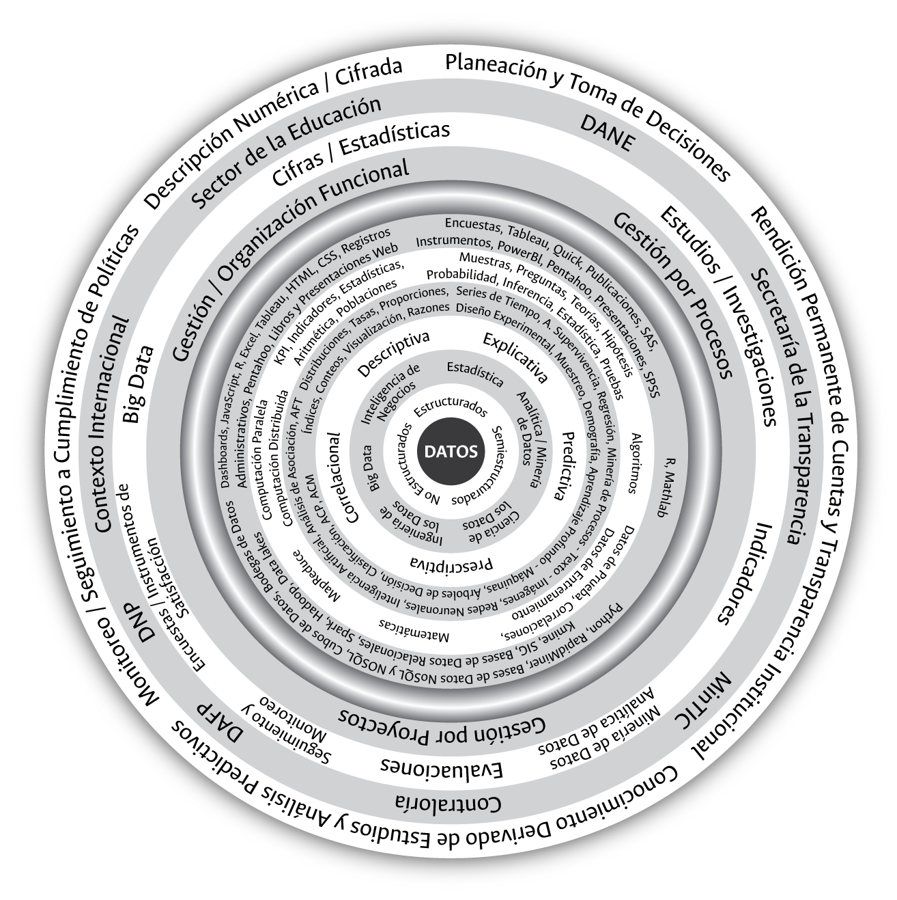

# **Gestión de la información cuantitativa en las universidades: el encuentro de dos mundos** {#Cap03}

```{block2, type='flushright', html.tag='p'}
_El pensamiento estadístico será un día tan necesario_\
_para el ciudadano eficiente como la capacidad de leer y escribir._\
--- **H. G. Wells, 1866-1946**
```


El contexto contemporáneo de los datos y la información cuantitativa, como hemos presentado a lo largo de este documento, está mediado por múltiples disciplinas, propósitos, marcos, métodos, fundamentos y herramientas, principalmente tecnológicas, que soportan el volumen creciente, la variedad existente y la velocidad con la que estos están siendo capturados, almacenados y procesados. La universidad en general, y la universidad estatal colombiana en especial, experimenta una creciente demanda de información cuantitativa para diferentes propósitos, entre los que se destacan la definición y disposición de las principales cifras cuantitativas institucionales, la construcción y disposición de indicadores que permitan monitorear el cumplimiento de políticas y objetivos institucionales, la implementación de evaluaciones a políticas institucionales soportadas en estudios e investigaciones, así como el fomento y la promoción del uso y aprovechamiento de nuevas técnicas de análisis soportados en las TIC como la minería de datos y el _Big Data_. 

Las razones del crecimiento de la importancia y la necesidad de disponer de información en las universidades estatales, en especial aquella de naturaleza cuantitativa, son de diversa índole: reconocimiento creciente del valor contenido en los datos disponibles a nivel institucional; crecimiento de necesidades internas de información cuantitativa para propósitos diversos como las acreditaciones y certificaciones de calidad; profundización del Estado evaluador; surgimiento de nuevas y variadas formas y modelos de organización institucional soportados en marcos propios de medición; protagonismo al interior de las universidades de la planeación y la gestión por procesos y proyectos; disposición y provisión de datos e información a un alto número de entidades del orden local y nacional; surgimiento de una sociedad cada vez más informada e interesada en el conocimiento y acceso a los datos e información disponible a nivel institucional, y necesidad creciente de cifras que permitan soportar los procesos de focalización y rendición de cuentas que eleven los niveles de transparencia institucional y aporten a la reducción de posibles riesgos de corrupción a través de la apertura de las cifras institucionales.

La necesidad de contar con más y mejor información cuantitativa en el escenario administrativo de lo público enfrenta hoy a las universidades al reto de gestionar esta información de tal manera que responda de forma eficiente tanto a las demandas externas como a las necesidades internas. Esta gestión implica el reconocimiento de dos mundos: 1) el contexto externo e interno de demandas de información cuantitativa que viven hoy las universidades estatales, y 2) el dominio académico y técnico requerido para una adecuada gestión de los datos disponibles a nivel estatal e institucional. 

En la figura \@ref(fig:fig4) se ilustran los niveles contenidos dentro de los dos mundos mencionados. El contenido de estos niveles se presenta en este capítulo desde una aproximación académica y técnica que compila lo expuesto en los capítulos anteriores, y además pueden ser leídos en clave metodológica, en tanto son útiles como un instrumento de gestión, dado que si una universidad está interesada en abordar la gestión de las cifras cuantitativas institucionales podrá ir identificando en cada nivel las características de su institución y, así mismo, definir algunas apuestas para el futuro de la gestión de la información que requiere. Para ello, a lo largo del capítulo se plantean algunas preguntas guía.

```{r fig4, fig.align='center', out.width='75%', fig.show='hold', fig.cap='Contexto institucional, académico y técnico de la información cuantitativa en una universidad colombiana. Fuente: elaboración propia.',echo=FALSE}

```

## **Contexto de la información cuantitativa en las universidades estatales en Colombia**

Los cuatro niveles que caracterizan el contexto de la información cuantitativa en las universidades estatales en Colombia incluyen el fin o propósito superior buscado con la disposición de los datos institucionales; las políticas, normas, directrices bajo los cuales son producidos, gestionados y divulgados los datos; las diversas y dispersas demandas de medidas e información que hoy enfrenta la universidad pública colombiana, y las estructuras administrativas internas que inciden de manera significativa en el lenguaje, el entendimiento y la forma como debe ser configurada la gestión de la información cuantitativa.

### ***Nivel 1.1. Fin de la información cuantitativa –propósito superior–***

El primer nivel que orienta la gestión de la información cuantitativa en las universidades estatales está relacionado con el fin o propósito superior buscado con la disposición de dichas cifras. ¿Por qué y para qué son útiles las cifras cuantitativas en el escenario de la universidad estatal contemporánea? Esta es la primera pregunta que debe orientar a la gestión de la información cuantitativa en una universidad. 

Aunque pueden existir otros propósitos y usos derivados de la gestión y disposición de las cifras cuantitativas al interior de las universidades, dado el carácter no rival que asiste a los datos disponibles, como se ilustra en la figura \@ref(fig:fig5), estos pueden ser empleados actualmente al menos para cinco fines alcanzables a través de su gestión y transformación en información a nivel institucional. A continuación, se expone brevemente el contenido de cada uno de estos posibles usos.

```{r fig5, fig.align='center', out.width='75%', fig.show='hold', fig.cap='Fin de la información cuantitativa – Propósito superior. Fuente: elaboración propia.',echo=FALSE}
knitr::include_graphics('imagenes/F_5.png')
```

+ A través de la gestión de los datos y su trasformación en estadísticas institucionales es posible obtener una descripción numérica de las universidades estatales, conocer a partir del comportamiento de las cifras cuantitativas disponibles quiénes son, qué hacen y qué han hecho a lo largo de la historia en pro del cumplimiento de los fines y las funciones misionales para la cuales fueron creadas. 

+ Los datos y la información cuantitativa extraíble a partir de estos adquiere cada vez más un papel protagónico en el ejercicio de la planeación y la toma de decisiones institucionales, hecho que se materializa en la construcción de políticas de desarrollo institucional a partir del comportamiento observado en estos. Hoy día se ha vuelto imperativo tomar decisiones a nivel institucional basadas en el comportamiento de las cifras cuantitativas disponibles y no en intuiciones personales, aunque estas aún resulten comunes en algunos ámbitos de la gestión de lo público.

+ Los datos institucionales son insumo fundamental para la construcción de indicadores que permitan medir el grado de cumplimiento de una o más metas asociadas a políticas institucionales, las cuales se materializan en las universidades públicas en planes de desarrollo y programas y proyectos institucionales de corto, mediano y largo plazo. Mientras las estadísticas permiten describir el pasado y presente de una universidad, los indicadores permiten monitorear las metas asociadas a políticas. Estas dos ideas, la de las estadísticas y la de los indicadores son la piedra angular que determina el éxito de cualquier modelo de aproximación descriptiva que apueste por la organización de las cifras cuantitativas institucionales^[En el siguiente capítulo de este documento se muestra cómo, a partir del uso y la claridad en el alcance de estos dos conceptos o ideas, la Universidad Nacional de Colombia ha iniciado un proceso que busca, a futuro, consolidar un sistema estadístico que responda a las necesidades cuantitativas que exige la contemporaneidad.]. 

+ Los datos disponibles en las universidades se pueden usar como base para la construcción de modelos y la realización de análisis y estudios de naturaleza explicativa o evaluativa. La minería de datos y la estadística, por ejemplo, centran su atención en la obtención de patrones que permitan predecir o modificar comportamientos de futuro, dar respuestas a preguntas de investigación con grados de certeza aceptables, así como evaluar el impacto de políticas institucionales. En todos estos casos, los mismos datos que son útiles para la construcción de estadísticas e indicadores pueden serlo también para la construcción de modelos y la realización de estudios o investigaciones.

+ El comportamiento observado en las estadísticas y los indicadores, así como el modelamiento y conocimiento obtenido a través del estudio de fenómenos institucionales con el uso de los datos disponibles, resultan útiles si se toman mejores decisiones, se monitorea su cumplimiento, se evalúan los resultados de las decisiones tomadas, se construyen modelos de futuros posibles y, sobre todo, si se comparten estos resultados a través de ejercicios, como por ejemplo, la rendición de cuentas periódica a la sociedad y el irrestricto acceso a su información. La apertura de la información cuantitativa institucional y su acceso a través del uso de instrumentos contemporáneos como los que nos ofrecen las TIC se convierten hoy en una oportunidad de rendir cuentas de manera permanente y de elevar los niveles de transparencia que hoy demanda la sociedad de sus universidades.

### ***Nivel 1.2. Políticas, normas, actores nacionales e internacionales***

El segundo nivel que orienta la gestión de la información cuantitativa en las universidades estatales está relacionado con el conocimiento y alcance que tienen sobre estas las normas expedidas y las políticas lideradas por entidades externas a la universidad. Por ello es fundamental que en todo proceso de gestión de la información se conozca qué normas o lineamientos existen a nivel nacional e internacional para orientar la construcción y disposición de cifras en el contexto de las entidades y universidades públicas, y cuál es el alcance a nivel institucional de dichas normas y lineamientos. 

La universidad pública en Colombia, como lo ilustra la figura \@ref(fig:fig6), se encuentra inmersa dentro de un contexto internacional, nacional y sectorial que se caracteriza por la existencia de un número elevado de políticas, normas, lineamientos, estándares, etc., asociados con la medición y la gestión de los datos a nivel institucional. Estos lineamientos, además de hacer un uso puntual y particular de definiciones y formas de entender los datos y las cifras cuantitativas, carecen entre sí de la suficiente coordinación, hecho que incrementa la dificultad para su gestión a nivel institucional y mengua la cohesión que debiera existir para un efectivo uso de esta información en el ámbito nacional. 

```{r fig6, fig.align='center', out.width='75%', fig.show='hold', fig.cap='Políticas, normas, actores nacionales e internacionales. Fuente: elaboración propia.',echo=FALSE}
knitr::include_graphics('imagenes/F_6.png')
```

Para los indicadores, las cifras o las estadísticas institucionales se deben seguir las orientaciones del SEN y cumplir con los requisitos de calidad exigidos en la NTCPE 1000 expedida por el DANE y el Icontec para que estas sean consideradas de calidad y, por ende, oficiales. Si lo que se busca es dar respuesta a través de cifras a los procesos de autoevaluación con fines de obtención o renovación de Registro Calificado^[El Registro Calificado no aplica para la Universidad Nacional de Colombia.], o para la acreditación ante el CNA, se deben seguir los lineamientos definidos por el Sistema de Aseguramiento de la Calidad en Colombia o por otra agencia en el caso de acreditaciones internacionales. Si se trata de reportar datos a los sistemas nacionales de información como el SNIES, el Sistema de Prevención y Análisis de la Deserción en las Instituciones de Educación Superior (Spadies) y el Observatorio Laboral para la Educación (OLE), se deben cumplir unas reglas que pueden cambiar periódicamente y que difieren entre sistemas. Para el monitoreo, el seguimiento y la evaluación de políticas institucionales disponemos de instrumentos como la _Guía metodológica para el seguimiento y la evaluación a políticas públicas_ de Sinergia del DNP. 

En el escenario de la gestión pública, del autocontrol institucional y del control interno, se requiere adoptar los lineamientos, las directrices y las guías contenidas en el MIPG, en el MECI, así como alimentar de manera periódica y a nivel de microdatos un número creciente de plantillas que hacen parte del Sireci de la Contraloría General de la República. También se nos insta a implementar la Política Nacional de Explotación de Datos –_Big Data_– y el uso de técnicas de minería o analítica de datos contenidas en el Conpes 3920 expedido por el Consejo Nacional de Política Económica y Social. Con el fin de rendir cuentas a la sociedad, fomentar la transparencia institucional y abrir nuestros datos, debemos cumplir leyes como la Ley Nacional de Transparencia y Acceso a la Información Pública, así como los lineamientos e instrumentos contenidos en la estrategia de gobierno digital –antes electrónico–, liderados respectivamente por la Secretaría de Transparencia de la Presidencia de la República y el MinTIC. Lo anterior sin olvidar que, en el proceso de gestión de los datos e información cuantitativa institucional debemos ser cuidadosos de no violar el derecho que tiene todo ciudadano a que sus datos sean manejados siguiendo las directrices contenidas en la Ley de _Habeas Data_, Ley Estatutaria 1581.

El escenario normativo, de políticas y de lineamientos asociados a la cuantificación y la medición institucional, como acabamos de mencionar, es creciente y diverso. Aunque el crecimiento y la diversidad que se observan en este aspecto podrían entenderse como enriquecedores, se torna confuso al ser aplicado al contexto de las universidades. Uso de términos iguales entendidos de manera diferente según la entidad que los expida, ausencia de metadatos estatales, diversidad en el uso y propósito buscado con los datos, duplicidad de requerimientos de información por parte de entidades nacionales, desconocimiento de los lineamientos expedidos entre entidades pares, etc., muestran que más que diversidad lo que podría existir hoy en el ámbito estatal es poco orden e ingobernabilidad sobre la forma, el propósito, la organización y el uso de los datos disponibles a nivel institucional. Una mejor comunicación entre las distintas entidades del orden nacional encargadas de fijar y orientar políticas relacionadas con el uso de los datos institucionales sin duda redundará en un mejor uso de estas en beneficio de más y mejores modelos de aprovechamiento de los datos disponibles en las entidades públicas en general y en las universidades oficiales en particular.

Colombia, por ser parte de organismos como la Organización de las Naciones Unidas (ONU) y la OCDE, se beneficia y adquiere un número importante de responsabilidades entre las cuales se destaca la entrega de manera periódica de información cuantitativa bajo ciertas reglas –estándares– para que pueda ser comparada entre las distintas naciones que conforman dichas asociaciones u organismos. Aunque en este documento no se profundiza sobre el número y alcance en el uso de estándares internacionales en el contexto de la gestión y disposición de estadísticas nacionales e institucionales, basta con mencionar que en el contexto de las universidades, por ejemplo, las áreas del conocimiento a través de las cuales se agrupan los programas académicos en el país e, incluso, la forma como se organiza buena parte de la información cuantitativa derivada de la investigación está orientada respectivamente por la Clasificación Internacional Normalizada de la Educación (CINE) de la UNESCO, y la Propuesta de Norma Práctica para encuestas de Investigación y Desarrollo Experimental de la OCDE, más conocido como Manual de Frascati. El contexto internacional, como hemos presentado brevemente y se ilustra en la figura \@ref(fig:fig6), impacta la gestión y organización de las cifras institucionales, además del escenario normativo nacional, y debe ser tenido en cuenta por los diferentes modelos de organización de las cifras en el escenario de las universidades públicas en cualquier país.

### ***Nivel 1.3. Demandas de información***

El tercer nivel de contexto de la gestión de la información cuantitativa en las universidades estatales, como lo ilustra la figura \@ref(fig:fig7), está relacionado con la capacidad que estas deben tener para responder a la pregunta: ¿cuál es el uso y alcance que se dará a los datos disponibles a nivel institucional?

Las demandas de información que en la actualidad experimentan las universidades oficiales en general, y la Universidad Nacional de Colombia en particular, muchas de las cuales son producto de los frentes que definen la nueva gestión pública y que se presentaron de manera detallada en el Capítulo \@ref(Cap01), como lo muestra la figura \@ref(fig:fig7), incluyen la disposición de cifras estadísticas e indicadores institucionales, el uso masivo de mediciones para el monitoreo, el seguimiento y la evaluación de políticas institucionales, y la incursión y el aprovechamiento de las técnicas actualmente disponibles de minería o analítica de datos y de herramientas de _Big Data_. Aunque estos posibles usos de los datos, como se mostró, son diversos en su propósito y formas de aproximación, en la actualidad, en el ámbito universitario y público, el uso de los datos disponibles a nivel institucional se concentra de manera especial en dos aproximaciones: las cifras estadísticas y los indicadores institucionales (ver parte baja de la figura \@ref(fig:fig7)). 

```{r fig7, fig.align='center', out.width='75%', fig.show='hold', fig.cap='Demandas de información en las universidades estatales. Fuente: elaboración propia.',echo=FALSE}
knitr::include_graphics('imagenes/F_7.png')
```

En el escenario de los indicadores, por ejemplo, se exige de las universidades contar con indicadores cuantitativos de insumos, procesos, resultados, impactos, productos, eficiencia, eficacia, efectividad, calidad, economía, ambientales, etc. En contraste, en el escenario de las cifras o estadísticas institucionales se requiere y demanda contar con información cuantitativa de aspirantes, admitidos, matriculados, graduados, docentes, funcionarios administrativos, grupos de investigación, actividades de extensión, aspectos financieros, cifras de bienestar universitario, cifras de movilidad entrante y saliente de docentes y estudiantes, resultados del examen Saber PRO, etc.

Las demandas de información y el análisis de datos asociado con el uso de técnicas de minería o analítica de datos, de _Big Data_, y la realización de estudios con fines evaluativos o de acercamiento al conocimiento de las causas (explicativos) asociadas con la ocurrencia de ciertos fenómenos de interés institucional se encuentran actualmente en una fase embrionaria y se ubican más en un deseo estatal que en una cultura institucional. En un futuro no muy lejano, esto empezará a ser una realidad a nivel estatal y allí nos veremos enfrentados a buena parte de las competencias académicas y técnicas que exige la gestión de los datos en la actualidad, por lo que su estudio y dominio desde ya facilitará dicha transición.

### ***Nivel 1.4. Modelo de gestión administrativa y estructura organizacional*** 

El cuarto nivel que se incluye en el contexto de la gestión de los datos institucionales en el ámbito universitario lo conforman los modelos de gestión administrativa de las universidades en la actualidad. ¿Qué modelo o cuáles modelos organizacionales orientan la gestión de los datos disponibles?, esta es la pregunta que guía el último nivel propuesto para orientar la gestión de los datos disponibles en el contexto de las universidades públicas.

En las universidades colombianas, especialmente en las estatales, como se representa en la figura \@ref(fig:fig8), existen al menos tres tipos de modelos de gestión administrativa a través de los cuales se obtienen los resultados deseados: el enfoque funcional, el de gestión por procesos y el de gestión por proyectos. La mayoría de universidades públicas en Colombia conservan el modelo organizacional funcional tradicional –concentrado en la división de unidades como rectoría, vicerrectorías, facultades, escuelas o departamentos, etc., y sus correspondientes funciones– el cual convive, sin la suficiente claridad, con una apuesta organizacional guiada por procesos bajo la orientación de normas tipo ISO y con una creciente gestión soportada en proyectos^[En Colombia existe poca documentación actualizada sobre los modelos organizacionales que orientan la gestión en las universidades públicas, hecho que dificulta su clasificación y el soporte de algunas de las afirmaciones hechas. Las tres formas propuestas en este nivel, y que orientan la gestión en las universidades (funcional, procesos y proyectos), se derivan de la experiencia vivida en la Universidad Nacional de Colombia, de lo observado en los sitios web de otras universidades oficiales, así como lo manifestado en algunos encuentros de socialización y discusión de naturaleza administrativa como, por ejemplo, las subcomisiones técnicas del SUE. Por lo anterior, esta propuesta de clasificación de los modelos organizacionales se encuentra sujeta a discusión y a modificación en el futuro una vez se disponga de trabajos y experiencias más desarrolladas y documentadas en esta dirección.]. La armonía que exista entre estas formas de gestión organizacional y, en especial, entre la apuesta funcional y el enfoque por procesos, incide de manera importante en el lenguaje y alcance de cualquier apuesta de gestión de las cifras cuantitativas a nivel institucional. 

```{r fig8, fig.align='center', out.width='75%', fig.show='hold', fig.cap='Modelo de gestión y estructura organizacional en las universidades estatales. Fuente: elaboración propia.',echo=FALSE}
knitr::include_graphics('imagenes/F_8.png')
```


En una apuesta orientada por procesos es inconcebible un escenario distinto al de los indicadores en donde las metas, los objetivos, las líneas de base, las fórmulas, las hojas de vida, la eficiencia, la eficacia, la efectividad, el impacto, etc., conforman el lenguaje y propósito de la medición institucional. En contraste, desde un enfoque funcional, aunque cada vez más se habla de indicadores, estos aluden principalmente a un escenario de cifras o estadísticas institucionales en donde el uso de poblaciones, muestras, registros administrativos, estándares, nomenclaturas, codificaciones, series de tiempo, desagregaciones temáticas y geográficas, representaciones gráficas, representaciones tabulares, metodologías, procesos estadísticos, entre otros, conforman el lenguaje y alcance de la cuantificación y medición institucional. Para la gestión por proyectos, el lenguaje dominante es el de los indicadores y, en especial, aquellos que permiten el monitoreo del cumplimiento de metas y objetivos institucionales acotados en el tiempo. En el contexto de los procesos, en el modelo funcional y en la gestión por proyectos es común hablar de indicadores cuantitativos, no obstante, la forma como estos son entendidos, el lenguaje empleado, su alcance, su gestión y sus requisitos difieren de manera importante. 

Hoy, los orientadores de política estatal e institucional en Colombia no son necesariamente conocedores de esta realidad, hecho que se ve reflejado en que buena parte de las guías y metodologías que orientan la medición de la gestión en lo público, dado su carácter y lenguaje unificador, aportan menos de lo esperado a los objetivos buscados con la cuantificación y medición en el escenario de lo público. De un mundo aritmético, matemático, estadístico, técnico y de gestión estadística hemos pasado a creer, sin desconocer su importancia, que la cuantificación y la medición institucional son exclusivamente un tema procedimental orientado por normas y guías, en el mejor de los casos técnicas, en donde el cumplimiento y la verificación de requisitos a través de listas de chequeo es el camino que garantiza una adecuada gestión de los datos y las cifras institucionales. Este fenómeno está llevando a que un número importante de las mediciones que acompañan hoy a diversas entidades del Estado sea, en sentido estricto, de papel, y en ello inciden la forma como es entendida la medición y el lenguaje empleado desde los distintos modelos o enfoques organizacionales.

## **Contexto académico y técnico de los datos**

Los fines buscados con la disposición de las cifras en el escenario de las universidades públicas, las políticas, normas y los actores nacionales e internacionales que regulan la actividad estadística, los diversos alcances buscados a través de la gestión de los datos institucionales, así como el lenguaje derivado del modelo administrativo dominante al interior de las universidades conforman, como se presentó en la anterior sección, el contexto en el que se desenvuelve la actividad estadística en la universidad pública actual y define el primer componente que se debe conocer y explorar previo o durante la implementación de una apuesta institucional orientada a la gestión y disposición de las cifras cuantitativas disponibles. 

Una vez se conoce y domina el contexto en el que se mueven las cifras cuantitativas requeridas en la universidad pública, el paso que se debe seguir consiste en adentrarse en el dominio y conocimiento del contexto académico y técnico de los datos el cual, como se muestra en la parte derecha de la figura \@ref(fig:fig4), está compuesto por seis niveles: los tipos de datos existentes y disponibles, las disciplinas y tendencias bajo las cuales pueden ser analizados los datos, el grado de profundidad que se puede alcanzar a través de la gestión de estos, el dominio de los métodos y las técnicas que serán empleados en la gestión de los datos, el conocimiento de los fundamentos y las bases teóricas que soportan las técnicas y los métodos seleccionados y, finalmente, la disposición y el dominio de las herramientas requeridas para la gestión de las cifras y los análisis institucionales implementados. 

### ***Nivel 2.1. Tipos de datos***

El primer nivel del contexto académico y técnico de los datos lo conforman los tipos de datos existentes y disponibles en el escenario de las universidades públicas. ¿Qué tipos de datos existen a nivel institucional?, esta es la primera inquietud que debemos enfrentar en las universidades oficiales al abordar académica y técnicamente el mundo de los datos. En la actualidad, como se ilustra en la figura \@ref(fig:fig9) y se expuso de manera detallada en la sección sobre los datos del Capítulo \@ref(Cap02), los datos disponibles a nivel mundial e institucional pueden ser clasificados en tres tipologías: estructurados, semiestructurados y no estructurados. 

```{r fig9, fig.align='center', out.width='60%', fig.show='hold', fig.cap='Tipos de datos. Fuente: elaboración propia.',echo=FALSE}
knitr::include_graphics('imagenes/F_9.png')
```


Hasta hace no más de 30 años, como se expuso en el capítulo anterior, los principales tipos de datos existentes, estudiados, analizados y gestionables eran aquellos conocidos como estructurados (filas – columnas). Hoy, el mundo de los datos ha evolucionado hacia nuevas tipologías en donde los de naturaleza semiestructurada y no estructurada han adquirido un rol protagónico hasta el punto de convertirse en los más abundantes. 

A pesar del crecimiento y auge de los datos de naturaleza semiestructurada y no estructurada en diversos contextos, en el escenario de las universidades, el centro de atención en términos de gestión y demanda de información estadística se concentra actualmente en el mundo de los datos estructurados que se encuentran disponibles en los sistemas de información tradicionales. La universidad contemporánea muy poco ha avanzado en la gestión, el análisis y la disposición de información derivada del uso de datos de tipo semiestructurado o no estructurado.

### ***Nivel 2.2. Disciplinas y tendencias***

El segundo nivel del contexto académico y técnico de los datos, como se observa en la figura \@ref(fig:fig10), lo conforman las disciplinas y tendencias bajo las cuales es posible acceder a los datos y extraer el conocimiento contenido en estos. ¿Bajo qué disciplina o tendencia serán analizados los datos?, esta es la segunda inquietud que debemos enfrentar en las universidades al abordar académica y técnicamente el mundo del análisis de las cifras y, desde ya, nuestra respuesta a tal inquietud es: aprovechando lo mejor posible el trabajo con dos o más disciplinas, idealmente con el uso de todas.

```{r fig10, fig.align='center', out.width='75%', fig.show='hold', fig.cap='Disciplinas y tendencias para el estudio de los datos.',echo=FALSE}
knitr::include_graphics('imagenes/F_10.png')
```

El crecimiento en la variedad de los datos, sumado a los grandes avances tecnológicos alcanzados durante los últimos años, ha llevado –como se mostró a lo largo del Capítulo \@ref(Cap02) de este documento– al surgimiento de nuevas tendencias y disciplinas académicas que han encontrado en los datos su objeto de estudio. La estadística, a lo largo de la historia, ha sido la disciplina científica que se ha encargado del estudio de los datos y de acompañar con sus análisis al Estado y sus instituciones. Esta disciplina del conocimiento se encuentra hoy acompañada por nuevas formas de aproximarse a los datos soportadas principalmente en la capacidad que nos ofrecen las TIC y del surgimiento de modelos, marcos o entornos de aproximación a los datos que han mostrado ser útiles en el escenario de las entidades privadas, principalmente. La inteligencia de negocios, la minería o analítica de datos, el _Big Data_, la ciencia de los datos, y nuevas aproximaciones como el internet de las cosas o el _blockchain_, nos muestran que al mundo de los datos han llegado nuevos actores que están evidenciando nuevas y variadas formas de extraer el conocimiento existente en estos.

### ***Nivel 2.3. Aproximaciones – Énfasis***

El tercer nivel del contexto académico de los datos, como se observa en la figura \@ref(fig:fig11), lo conforman las aproximaciones, los énfasis o los propósitos buscados con su gestión. ¿Qué queremos responder y qué uso, en términos de análisis, haremos de los datos disponibles a nivel institucional?, esta es la tercera inquietud que guía una apuesta institucional de gestión de la información cuantitativa a través del entendimiento y la exposición de las posibilidades de análisis hoy existentes en materia estadística.

```{r fig11, fig.align='center', out.width='75%', fig.show='hold', fig.cap='Aproximaciones para el estudio de los datos.',echo=FALSE}
knitr::include_graphics('imagenes/F_11.png')
```

El valor de los datos disponibles a nivel institucional, como se muestra en la figura \@ref(fig:fig11), no se agota con un único propósito y uso. Estos, a diferencia de muchos de los recursos hoy disponibles a nivel organizacional, pueden ser usados en múltiples ocasiones y con diversos propósitos, dada la mencionada capacidad no rival existente en ellos. En la mayoría de los casos, el interés es de tipo descriptivo: conteos, proporciones, tasas, razones; medidas de tendencia central, de dispersión, de apuntamiento, y visualizaciones o representaciones gráficas, por ejemplo. En otras ocasiones, los datos pueden ser empleados con propósitos que superan el nivel descriptivo y que se ubican en el escenario de lo correlacional. Algunas técnicas de la minería o analítica de datos y de la estadística tienen como fin encontrar agrupaciones y patrones ocultos en los datos, que no son fáciles de detectar a partir de un acercamiento descriptivo a estos. 

Los acercamientos descriptivos y correlacionales a partir de los datos nos permiten conocer y acceder a información relacionada con el qué y el cómo de ciertos aspectos de interés institucional. Qué cantidad tenemos, qué características tienen los miembros que conforman una o más poblaciones, cómo y a qué ritmo varían en el tiempo estas características, cómo las representamos y visualizamos, cómo se correlacionan ciertas variables, cómo se agrupan algunos individuos a partir de semejanzas en sus variables, entre otros aspectos, conforman algunos usos de los datos cuyo alcance se ubica en el contexto de lo descriptivo o lo correlacional. No obstante, la curiosidad humana no se conforma con el qué o el cómo observado a partir de los datos disponibles, y se interesa en las razones de lo observado a nivel descriptivo o correlacional. Teorías, preguntas, hipótesis, pruebas, entre otras, se unen alrededor de los mismos datos con el fin de aproximarse a las causas de un problema y adentrarse en el conocimiento y la explicación del porqué o los porqués de dicho problema.

Además del qué, el cómo y el porqué, los mismos datos u otros disponibles a nivel institucional nos permiten aproximarnos a la pregunta de qué podrá o podría pasar en un futuro a partir de lo observado en el pasado y el presente. La predicción, a partir de los datos disponibles, es uno de los usos más deseados y mayormente buscados por el Estado y sus entidades dada la capacidad que esta nos ofrece para direccionar las políticas públicas y maximizar los impactos deseados. La estadística y la analítica o minería de datos ofrecen cientos de técnicas orientadas a la predicción las cuales, además de conocerlas y dominarlas, demandan a nivel institucional la disposición y conservación de la información cuantitativa histórica.

Hoy como nunca antes, las diversas técnicas disponibles en el contexto de las disciplinas o aproximaciones expuestas en la figura \@ref(fig:fig11) nos permiten extraer, a partir de un conjunto de datos, múltiples respuestas asociadas a un mismo fenómeno de interés, hecho que nos convoca a realizar análisis de tipo prescriptivo con el objetivo de seleccionar la mejor respuesta entre cientos disponibles.

### ***Nivel 2.4. Métodos y técnicas***

El cuarto nivel del contexto académico y técnico de los datos cuantitativos lo conforman los métodos y las técnicas hoy existentes y disponibles para su análisis. ¿Qué método o técnica emplearemos para dar respuesta a las preguntas de interés institucional?, este es el cuarto interrogante que guía una apuesta universitaria de gestión de información cuantitativa y, para responderlo, debemos conocer y dominar diversos métodos existentes para el análisis cuantitativo.

La cantidad de métodos y técnicas hoy existentes asociadas al análisis de los datos, como se observa en la figura \@ref(fig:fig12), crece día a día dado el alto interés que ha despertado su estudio en las instituciones, así como la capacidad humana, técnica y académica actualmente disponible que permite una adecuada gestión de los mismos. Los métodos y las técnicas existentes para el análisis de los datos dependen en una buena medida de los propósitos buscados. Si el interés es, por ejemplo, una aproximación o análisis descriptivo, se requiere únicamente la habilidad para contar y resumir el comportamiento de las variables a través de tasas, razones, proporciones, medidas de dispersión, variabilidad, etc. En contraste, si el interés es de naturaleza explicativa, nos acercamos al contexto científico de los datos y allí contamos con técnicas de análisis cuantitativo como el diseño experimental, el muestreo, la epidemiología, el modelamiento a través de regresiones, etc., que nos permite acercarnos desde los datos a la causa de las cosas.

```{r fig12, fig.align='center', out.width='75%', fig.show='hold', fig.cap='Métodos y técnicas para el abordaje de los datos.',echo=FALSE}

```

Si el interés es de tipo correlacional o predictivo, por ejemplo, surgen con fuerza las técnicas de minería de datos como el análisis de texto, de video y de audios, los árboles de decisión, la inteligencia artificial, el aprendizaje automático, los análisis de asociación, de clasificación, de correspondencias múltiples, de componentes principales, de asociación, etc., a los cuales se suman técnicas de computación paralela o distribuida si los datos bajo análisis superan la capacidad computacional convencional y se ubican en el contexto de los grandes datos o _Big Data_. Finalmente, ante la presencia de múltiples soluciones sobre un problema determinado derivado de la disposición y el uso de las diversas técnicas existentes para el análisis de los datos, surge la necesidad del uso de técnicas de simulación y optimización con el objetivo de seleccionar aquella respuesta, entre cientos disponibles, que nos permite hacer el mejor uso de los recursos con los que se cuenta a nivel institucional –aproximación prescriptiva–.

### ***Nivel 2.5. Fundamentos – Bases teóricas***

El quinto nivel del contexto académico de los datos lo conforman los fundamentos o las bases teóricas que soportan la gran variedad de métodos y técnicas existentes para el abordaje y estudio de estos (figura \@ref(fig:fig13)). ¿Cuáles fundamentos o bases teóricas soportan los métodos o las técnicas cuantitativas empleadas en la universidad?, este es el quinto interrogante el cual, más que responderse de manera puntual a nivel de las universidades públicas, debemos reconocer que existe y se encuentra como base de muchas de las técnicas cuantitativas que soportan los análisis y las aproximaciones a los datos en la actualidad.

```{r fig13, fig.align='center', out.width='75%', fig.show='hold', fig.cap='Fundamentos y bases teóricas que soportan el estudio de los datos.',echo=FALSE}

```

Las disciplinas, tendencias, aproximaciones y técnicas asociadas al análisis de los datos se soportan en un número importante de fundamentos conceptuales, los cuales nos permiten conservar el andamiaje y el abanico de posibilidades existentes en el contexto de la gestión de las cifras cuantitativas. La aritmética, que soporta principalmente las aproximaciones descriptivas, conserva aún un lugar preponderante dada su capacidad para extraer conocimiento oportuno y rápido a partir del conteo, la comparación y la representación gráfica –visualización– de la información disponible. Las hipótesis, la inferencia estadística, la probabilidad, la aleatoriedad, las preguntas de investigación, las pruebas estadísticas, entre otras, soportan la línea científica de los datos hoy en manos de la disciplina estadística, a través de la cual es posible aportar al avance en las fronteras del conocimiento. 

Los algoritmos, a diferencia de los fundamentos que soportan, por ejemplo, a la estadística, son los protagonistas en el crecimiento que experimentan las técnicas de minería y analítica de datos. Estas secuencias lógicas se han beneficiado de manera significativa del surgimiento y crecimiento de la capacidad de cómputo existente, hecho que les permite llevar a cabo, en poco tiempo, los cientos, miles o millones de pasos requeridos para su implementación. El gran volumen, la variedad y la velocidad con la que se requiere la información en la actualidad ha llevado a la incursión de nuevos paradigmas conceptuales para la gestión de _Big Data_ como, por ejemplo, el entorno MapReduce, consistente en dividir/distribuir un gran problema en miles o millones de pequeños problemas localizados en igual o menor cantidad de nodos computacionales. La aritmética, la inferencia, la probabilidad, los algoritmos, etc., experimentan un enfrentamiento latente en pro de convertirse en el fundamento dominante para aproximarse al mundo contemporáneo de los datos.

### ***Nivel 2.6. Herramientas***

El sexto y último nivel del contexto académico y técnico que experimenta el análisis cuantitativo de los datos en la actualidad lo conforma el mundo de las herramientas tecnológicas existentes para la gestión y disposición de las cifras institucionales. ¿Cuáles herramientas tecnológicas se requieren para la gestión de los datos disponibles a nivel institucional?, este es el último interrogante que debemos responder para garantizar el adecuado desarrollo de los procesos institucionales orientados a la gestión de los datos cuantitativos disponibles en una universidad pública. En la actualidad, para la gestión de datos existen herramientas tecnológicas que van, desde el _software_ libre hasta el comercial de bajo y alto costo; las hay desde el espectro empresarial local hasta el multinacional; las hay altamente versátiles y que nos exigen habilidades en programación hasta las poco versátiles o focalizadas en donde no se requieren dichas habilidades, etc. El problema que hoy experimentan las organizaciones públicas y privadas no es la imposibilidad de acceder a una herramienta tecnológica para el análisis de los datos disponibles a nivel institucional sino saber cuál y bajo qué criterios debemos seleccionar dichas herramientas. 

Como se observa y se resume en la figura \@ref(fig:fig14), los tipos de datos disponibles actualmente son diversos en sus tipologías, las disciplinas y tendencias encargadas de su estudio se han incrementado, los propósitos y potenciales usos han evolucionado, las técnicas disponibles para extraer y generar valor a partir de estos se han multiplicado, y los fundamentos conceptuales detrás de dichas técnicas se han aquilatado y posicionado. Este _boom_ por la conceptualización, el estudio y uso de los datos se ve reflejado en una creciente cantidad de herramientas, en especial de naturaleza tecnológica, disponibles para su gestión. Estas herramientas, que se ilustran de manera general y subestimada en la figura \@ref(fig:fig14), existen por cientos, incluso miles, y las hay de naturaleza libre o comercial, cuyo alcance ronda el espectro multinacional. 

```{r fig14, fig.align='center', out.width='75%', fig.show='hold', fig.cap='Herramientas disponibles para la gestión de los datos.',echo=FALSE}
knitr::include_graphics('imagenes/F_14.png')
```


El mundo de la inteligencia de negocios, por ejemplo, dispone de entornos y herramientas como bodegas de datos, _data marts_, data cubos, _dashboards_, Tableau, Pentahoo, PowerBI, Qlick, etc., todos ellos instrumentos y _software_ de tipo tecnológico orientados a la organización y gestión de los datos. En el escenario de la estadística, por ejemplo, disponemos de _software_ como SAS, SPSS, Matlab, R, Excel, entre otros; en el de la minería o analítica de datos, Kmine, RapidMiner, SAS, R, SPSS, etc., y, finalmente, en el mundo del _Big Data_ disponemos de herramientas o soluciones de tipo tecnológico que intervienen en la gestión de este tipo de datos como las bases de datos NoSQL, los _lagos_ de datos Data Lakes y entornos de aplicaciones como Hahoop o Spark, por mencionar algunos casos. Es tal el crecimiento que han experimentado las herramientas tecnológicas disponibles para la gestión de los datos, así como el grado de publicidad y comercialización alcanzado por algunas de estas, que hoy podríamos creer, de manera errónea, que la tecnología es el fin en la gestión de los datos y que su adquisición a nivel estatal e institucional es la solución requerida para la extracción del valor existente en ellos. Sin lugar a dudas, hoy no es concebible y viable una apuesta por la gestión de los datos que no conciba el uso de herramientas de tipo tecnológico; no obstante, como mostraremos en el siguiente capítulo, estas son un medio y no un fin. En el contexto de lo público el fin es la información de interés público cuya disposición exige cumplir un número de pasos –proceso estadístico– dentro de los cuales, desde luego, el uso y la disposición de herramientas de naturaleza tecnológica juega un papel especial.

## **En síntesis** 

La gestión contemporánea de los datos disponibles en las universidades estatales colombianas, y posiblemente en otras entidades de este u otros sectores del país implica, como hemos presentado a lo largo de este capítulo, el conocimiento, reconocimiento y encuentro de dos mundos: el contexto local, nacional e internacional en el que se desenvuelven las universidades públicas, y la realidad académica y técnica existente alrededor de los datos como objeto de estudio. La figura \@ref(fig:fig15) es un intento de síntesis del mundo al que se enfrenta o puede llegar a enfrentarse una universidad pública colombiana que esté interesada en adelantar un proceso riguroso de gestión de los datos y las cifras institucionales con miras a extraer el conocimiento que se encuentra contenido en ellos.

Claridad sobre los fines deseados y buscados a través de la gestión y disposición de los datos institucionales; diversidad de guías, lineamientos, normas, políticas del orden nacional e internacional relacionadas con la gestión cuantitativa de las cifras; diversidad en los alcances y usos de los datos cuantitativos así como efectos de las estructuras y los modelos organizacionales sobre la forma de concebir y entender la información cuantitativa, se unen a la variedad en los tipos de datos existentes; las múltiples disciplinas y formas de aproximación a estos; la multiplicidad de usos o propósitos; la diversidad en metodologías, técnicas y aproximaciones conceptuales y una gran cantidad de herramientas tecnológicas disponibles, para conformar toda una constelación que gira en torno al mundo de los datos en la actualidad (figura \@ref(fig:fig15)). 

```{r fig15, fig.align='center', out.width='75%', fig.show='hold', fig.cap='Contexto contemporáneo para la gestión de la información cuantitativa en la universidad estatal – El encuentro de dos mundos.',echo=FALSE}

```
