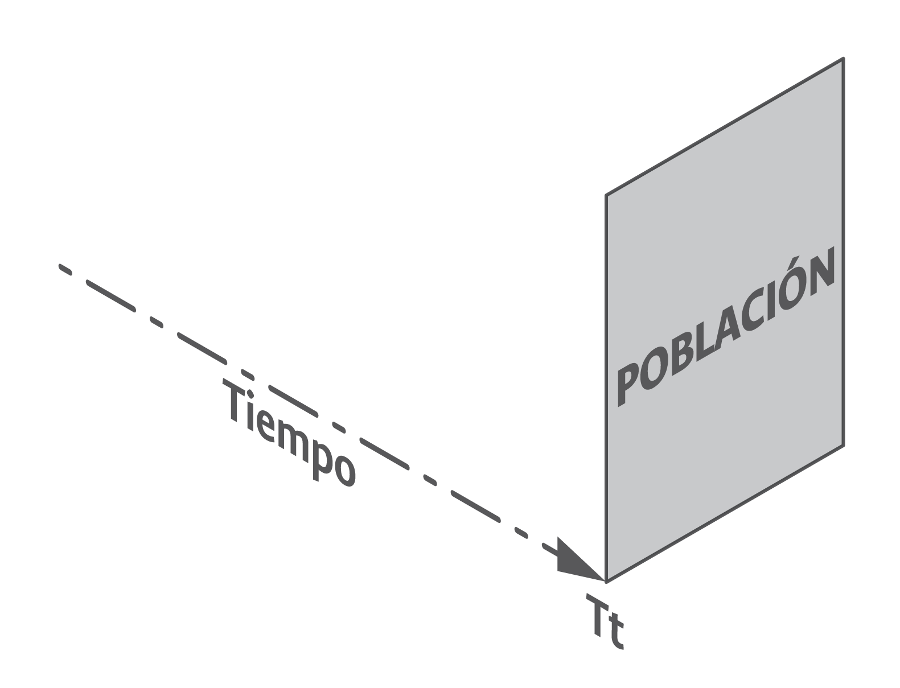
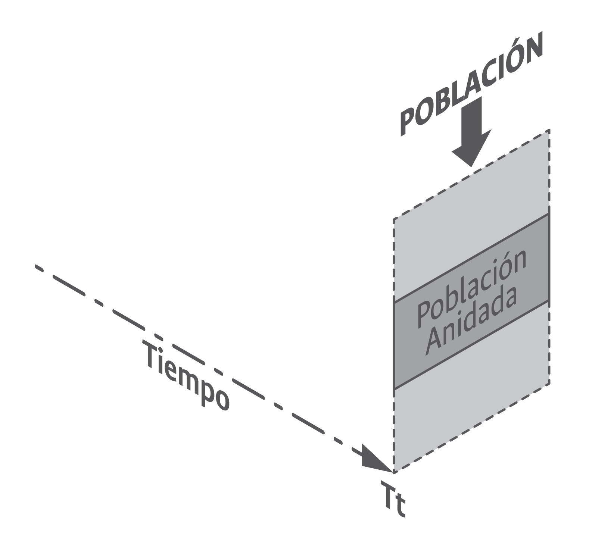
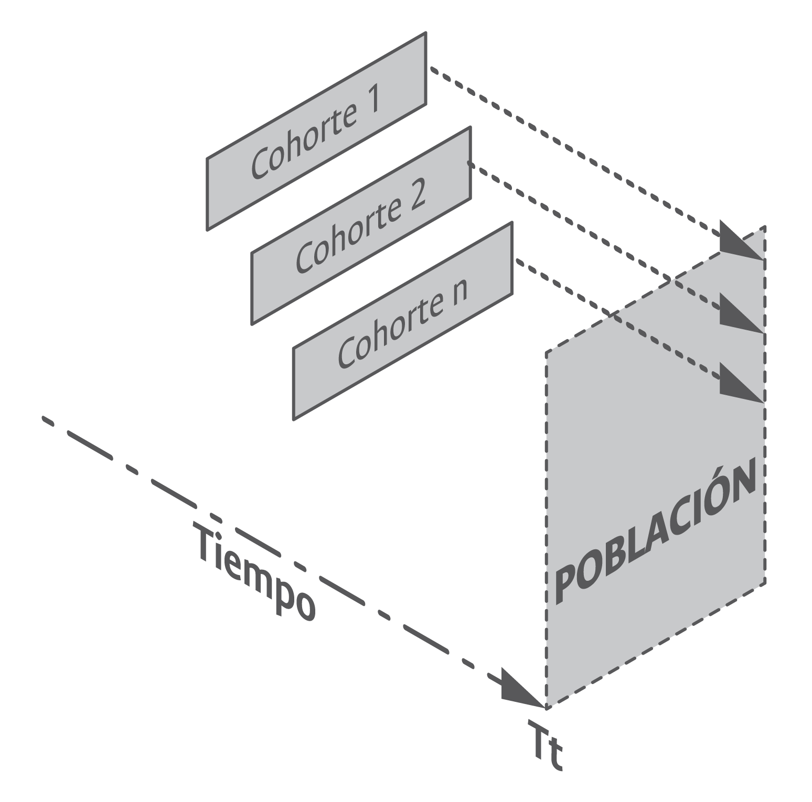
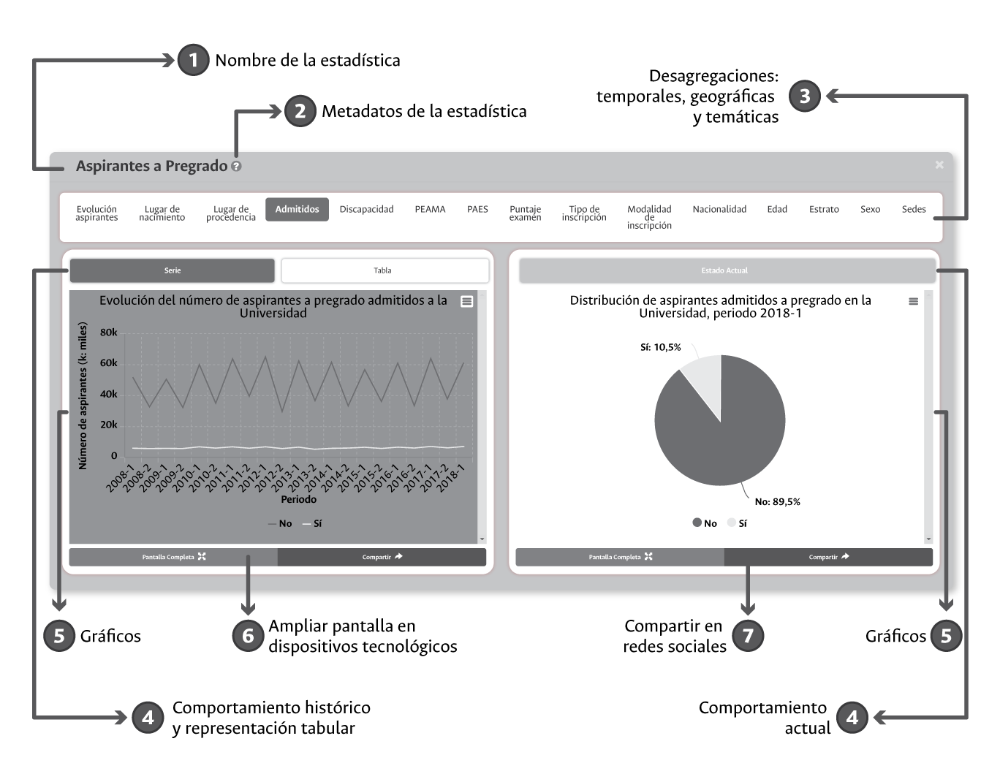
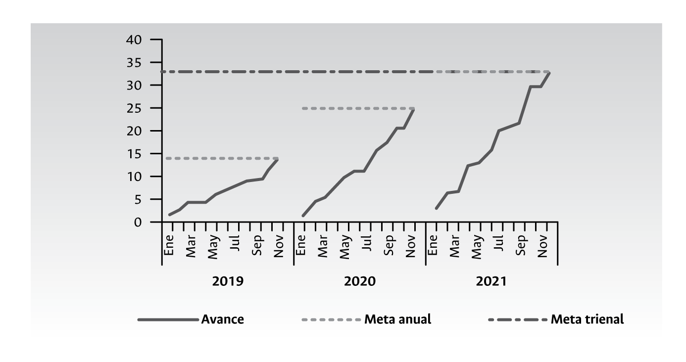
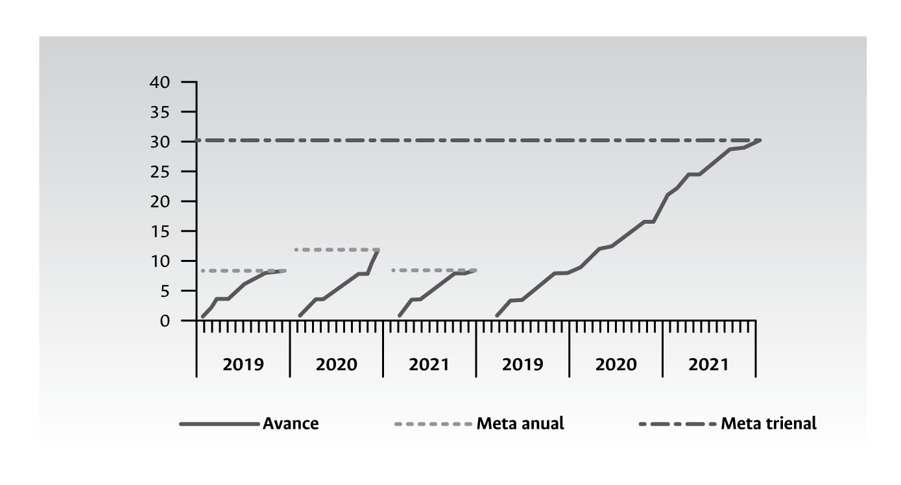
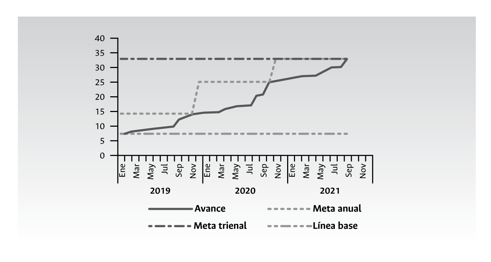
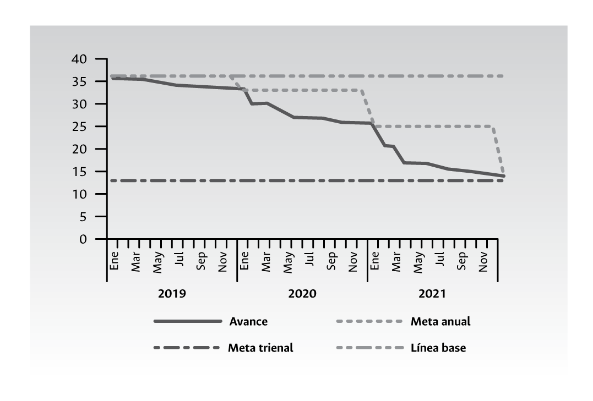
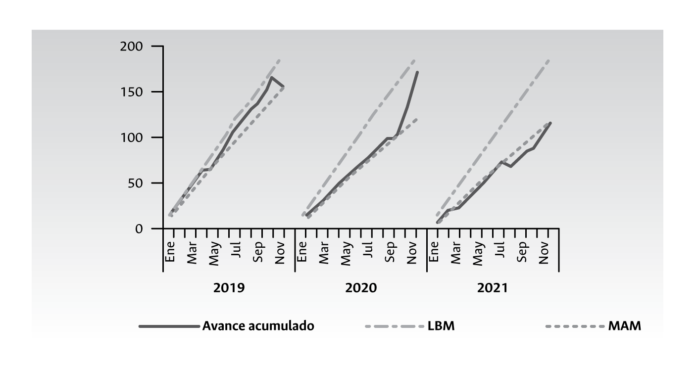
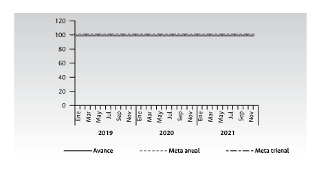

# **Cuantificación y medición en las universidades - Una aproximación descriptiva** {#Cap04}

```{block2, type='flushright', html.tag='p'}
_La simplicidad es la máxima sofisticación._\
--- **Leonardo da Vinci**
```

El contexto contemporáneo en el que se desenvuelve la gestión de las universidades públicas en el país está altamente influenciado por las nuevas formas de administrar lo público y, en todas ellas, la gestión y disposición de la información cuantitativa disponible a nivel institucional juega un papel especial. Así mismo, el protagonismo que están alcanzando los datos en la actualidad, derivado en buena medida de los avances académicos, la disponibilidad de nuevas tecnologías y su utilidad para múltiples propósitos configuran toda una constelación que gira hoy en torno al mundo de los datos institucionales. 

El encuentro entre las demandas de información cuantitativa que viven las universidades públicas derivadas de un contexto altamente regulado y globalizado, de una sociedad más capacitada, informada y empoderada, así como de la realidad académica y técnica que experimentan el estudio y la gestión moderna de los datos implica grandes retos para aquellas universidades interesadas en gestionar de manera óptima la información cuantitativa disponible. ¿Qué y cómo medir? y ¿cómo gestionar los datos y las mediciones en la actualidad?, se convierten en inquietudes de fondo que analizaremos a la luz de la experiencia vivida en la Universidad Nacional de Colombia.

## **¿Qué y cómo medir?**

Las posibilidades existentes y alcanzables a través de la gestión de los datos en las universidades son tan numerosas que es fundamental priorizar y establecer una gestión que maximice las necesidades cuantitativas institucionales y del país a un costo financiero, humano, administrativo, académico y técnico razonable. Para ello se propone un enfoque minimalista. El minimalismo, en términos generales, hace referencia a la tendencia de volver a lo esencial, reducir una expresión a lo básico, eliminando aspectos sobrantes o accesorios. Esta es una corriente que inicia en el ámbito artístico y ha sido adoptada para diferentes usos, como obras de arte y decoración de ambientes. En este documento proponemos enfrentar, en un primer paso, la sobreinformación con minimalismo para una gestión de la información más efectiva a sus propósitos.

Es posible y deseable adelantar apuestas de _Big Data_ en las universidades, así como apuestas de minería o analítica de datos y estudios cuantitativos con propósitos causales o evaluaciones profundas a políticas institucionales, aunque académica, metodológica, operativa y financieramente resulta costoso. Cada vez existen más lineamientos y presiones a nivel estatal para ir en esta dirección, sin embargo, lo que actualmente más se le demanda a las universidades en Colombia es la carga de microdatos para sistemas de información externos, y la construcción y disposición de cifras estadísticas e indicadores institucionales.

Haciendo uso de los diferentes niveles que acompañan actualmente la gestión de la información cuantitativa en las universidades^[Los niveles se expusieron de manera detallada en el capítulo anterior y se ilustraron en la figura \@ref(fig:fig15).], la tabla 2 presenta el resultado de priorización –apuesta minimalista– que ha emprendido la Universidad Nacional de Colombia para enfrentar el contexto actual de demanda de información cuantitativa que se experimenta a nivel interno, el cual hace uso del acercamiento más simple a los datos –descriptivo–, responde a la mayoría de las exigencias internas y externas en materia de gestión y disposición de las cifras institucionales, y aprovecha aquellas herramientas tecnológicas de alta calidad y accesibles para cualquier universidad pública dados sus bajos costos.

**Tabla 2.** *Actividades priorizadas en materia de gestión estadística en la Universidad Nacional de Colombia*

|                                                               |                                                                                                                                        **Preguntas  orientadoras**                                                                                                                                       |                                                                                                                                                                                                                                                                                                                                                                                                                                                                                                                                              **Respuesta. Prioridad en la  Universidad Nacional de Colombia  – Apuesta minimalista**                                                                                                                                                                                                                                                                                                                                                                                                                                                                                                                                             |
|---------------------------------------------------------------|:----------------------------------------------------------------------------------------------------------------------------------------------------------------------------------------------------------------------------------------------------------------------------------------------------:|:----------------------------------------------------------------------------------------------------------------------------------------------------------------------------------------------------------------------------------------------------------------------------------------------------------------------------------------------------------------------------------------------------------------------------------------------------------------------------------------------------------------------------------------------------------------------------------------------------------------------------------------------------------------------------------------------------------------------------------------------------------------------------------------------------------------------------------------------------------------------------------------------------------------------------------------------------------------------------------------------------------------------------------------------------------------------------------------------------------------------------------------------------------------------------:|
| **Contexto de las cifras  en la universidad estatal  colombiana** | **Nivel 1.1** ¿Por qué y para qué  son útiles las cifras cuantitativas  en el escenario de la universidad  estatal contemporánea?                                                                                                                                                                        | Gestionar y disponer el legado histórico  y numérico de esta universidad, contar con más y mejor información para la planeación  y la toma de decisiones institucionales, mejorar los niveles de monitoreo y seguimiento  a políticas institucionales y aumentar los niveles  de transparencia institucional a través de un ejercicio  de rendición cuantitativa de cuentas de manera permanente.                                                                                                                                                                                                                                                                                                                                                                                                                                                                                                                                                                                                                                                                                                                                                                            |
|                                                               | **Nivel 1.2** ¿Qué normas o lineamientos  existen a nivel nacional e internacional  para orientar la construcción y disposición de cifras en el contexto de las entidades públicas y,  en especial, en las universidades? y  ¿cuál es el alcance a nivel institucional  de dichas normas y lineamientos? | Conocer y aplicar, en el contexto de las posibilidades, los lineamientos expedidos  en materia de gestión de información cuantitativa por parte de entidades nacionales como: <br/> **Sector de la educación y CTI:**  <br/> MEN (CESU-CNA, Conaces, SNIES, Spadies, OLE), Colciencias y OCyT. <br/> DANE: Plan Estadístico Nacional y NTCPE 1000. <br/> DNP: *Guía metodológica para el seguimiento  y la evaluación a políticas públicas.* <br/> DAFP: MIPG, *Manual Único de rendición de cuentas*, guía(s) para la construcción de indicadores. <br/> MinTIC: Gobierno Digital, datos abiertos. Secretaría de la Transparencia: Ley de  transparencia. <br/> Contraloría: MECI, Sireci. <br/> Contexto internacional: ONU, OCDE, Unesco, Eurostat, Cepal, Manuales internacionales  (Frascati, Oslo).                                                                                                                                                                                                                                                                                                                                                                                                                           |
|                                                               | **Nivel 1.3** ¿Cuál es el uso y alcance que se dará a los datos  disponibles a nivel institucional?                                                                                                                                                                                                      | Disponer de las cifras y los indicadores que se le demandan a la Universidad. Las principales demandas internas y externas que vive la universidad pública actual en Colombia y como consecuencia, las que más se gestionan en su interior son: estadísticas oficiales, indicadores de gestión, indicadores de desempeño, indicadores de eficiencia, indicadores de eficacia, indicadores de efectividad, indicadores de rentabilidad pública, indicadores de procesos, indicadores de proyectos, indicadores de planes de desarrollo, indicadores de calidad, indicadores de productos, indicadores de resultados, indicadores de impacto, indicadores ambientales, indicadores de economía, datos públicos, datos abiertos, cifras agregadas de aspirantes, estudiantes admitidos, estudiantes matriculados, graduados, docentes, funcionarios administrativos, investigadores, grupos de investigación, productos de investigación (publicaciones, patentes, citaciones, etc.), programas académicos, movilidad entrante y saliente a nivel nacional e internacional de docentes y estudiantes, cobertura en programas de bienestar universitario y capacidad financiera. |
|                                                               | **Nivel 1.4** ¿Qué modelo o cuáles modelos  organizacionales orientarán la gestión  de los datos disponibles?                                                                                                                                                                                            | Responder a las necesidades derivadas de la gestión por procesos,  la gestión funcional y la gestión por proyectos existentes  en la Universidad.                                                                                                                                                                                                                                                                                                                                                                                                                                                                                                                                                                                                                                                                                                                                                                                                                                                                                                                                                                                                                            |
| **Contexto académico y técnico de los datos**                     | **Nivel 2.1** ¿Qué tipos de datos existen a nivel institucional y cuáles vamos a gestionar?                                                                                                                                                                                                              | Aprovechar la existencia y disposición de datos de tipo estructurado.                                                                                                                                                                                                                                                                                                                                                                                                                                                                                                                                                                                                                                                                                                                                                                                                                                                                                                                                                                                                                                                                                                        |
|                                                               | **Nivel 2.2** ¿Bajo qué disciplina o tendencia serán analizados los datos?                                                                                                                                                                                                                               | Utilizar recursos heredados de la estadística y la inteligencia de negocios.                                                                                                                                                                                                                                                                                                                                                                                                                                                                                                                                                                                                                                                                                                                                                                                                                                                                                                                                                                                                                                                                                                 |
|                                                               | **Nivel 2.3** ¿Qué queremos responder y qué uso, en términos de análisis, haremos de los datos disponibles a nivel institucional?                                                                                                                                                                        | Aproximarnos de manera descriptiva a los datos estructurados disponibles.                                                                                                                                                                                                                                                                                                                                                                                                                                                                                                                                                                                                                                                                                                                                                                                                                                                                                                                                                                                                                                                                                                    |
|                                                               | **Nivel 2.4** ¿Qué método o técnica emplearemos para dar respuesta a las preguntas de interés institucional?                                                                                                                                                                                             | Hacer uso de conteos, proporciones, visualización, razones, índices, tasas, distribuciones.                                                                                                                                                                                                                                                                                                                                                                                                                                                                                                                                                                                                                                                                                                                                                                                                                                                                                                                                                                                                                                                                                  |
|                                                               | **Nivel 2.5** ¿Cuáles fundamentos o bases teóricas soportan los métodos o las técnicas cuantitativas empleadas a nivel institucional?                                                                                                                                                                    | Construcción y disposición, a partir de información poblacional, de estadísticas, indicadores, KPI, teniendo como base las enseñanzas de la aritmética.                                                                                                                                                                                                                                                                                                                                                                                                                                                                                                                                                                                                                                                                                                                                                                                                                                                                                                                                                                                                                      |
|                                                               | **Nivel 2.6** ¿Cuáles herramientas tecnológicas se requieren para la gestión de los datos disponibles a nivel institucional?                                                                                                                                                                             | Hacer uso de herramientas tecnológicas como Excel, R, HTLM, JavaScript, CSS y disponer la información a través de *dashboards*, presentaciones web, libros web y boletines digitales.                                                                                                                                                                                                                                                                                                                                                                                                                                                                                                                                                                                                                                                                                                                                                                                                                                                                                                                                                                                          |

El ejercicio de priorización que ha emprendido la Universidad Nacional en el contexto de la gestión de los datos institucionales disponibles a nivel administrativo, que se sintetiza en la figura \@ref(fig:fig16), es una de las probables rutas que pudiera haberse emprendido en materia de gestión estadística. No obstante, esta aproximación da respuesta a la mayoría de las necesidades internas y externas que experimenta esta institución en la actualidad a unos costos institucionales razonables.

```{r fig16, fig.align='center', out.width='75%', fig.show='hold', fig.cap='Alcance de la gestión estadística actual en la Universidad Nacional de Colombia en el contexto contemporáneo de los datos. Fuente: elaboración propia.',echo=FALSE}
knitr::include_graphics('imagenes/F_16.png')
```

En el contexto contemporáneo de los datos cuantitativos son de gran utilidad tanto las aproximaciones descriptivas como aquellas que hacen uso de técnicas e instrumentos sofisticados; sin embargo, la cultura estadística en las entidades que conforman el Estado será difícil de alcanzar si se inicia con la aplicación del procedimiento más complejo; no se escala una montaña iniciando por su cima. La cultura estadística en la Universidad Nacional de Colombia y en otras universidades y entidades es posible de alcanzar si se inicia por lo esencial y, de manera reflexiva, se avanza hacia lo complejo.

## **Diferencia entre estadísticas e indicadores**

La aproximación descriptiva de los datos disponibles en las universidades públicas, en la que nos concentraremos en lo que resta del presenta capítulo, está atravesada por dos acepciones de uso frecuente tanto en la cotidianidad de la gestión estadística a nivel de las universidades como en la normatividad y los lineamientos metodológicos expedidos por entidades nacionales e internacionales en lo referente a la materia: las cifras estadísticas (o estadísticas) y los indicadores. Hoy el lenguaje dominante en el escenario de lo público es el de los indicadores; no obstante, ayer era el de las estadísticas. No nos concentraremos en los antecedentes históricos sobre el origen y posicionamiento de estas acepciones y sobre las diferentes tipologías que las acompañan. Consideramos pertinente, por el momento, hacer una separación entre estos dos términos y, en especial, destacar la importancia de las estadísticas dada su cercanía, desde el nombre mismo, con la intención de cuantificar la realidad de un Estado y sus instituciones.

Las estadísticas y los indicadores de cumplimiento, como se ilustra en la figura \@ref(fig:fig17), se diferencian y complementan según el momento o la intención temporal en la que estos tienen sentido y pueden ser empleados. A través de las estadísticas nos es posible conocer la realidad descriptiva actual e histórica de un Estado y sus instituciones, mientras que a través de los indicadores de cumplimiento nos es posible monitorear el desarrollo de las metas y apuestas implementadas a través de planes, programas y proyectos liderados por los gobiernos de turno. Por medio de las estadísticas se cuantifica mientras que por medio de los indicadores se mide.

```{r fig17, fig.align='center', out.width='75%', fig.show='hold', fig.cap='Contexto de las estadísticas y los indicadores a lo largo del tiempo. Fuente: elaboración propia.',echo=FALSE}
knitr::include_graphics('imagenes/F_17.png')
```

## **Once características asociadas a las estadísticas**^[Esta caracterización de los rasgos que constituyen las estadísticas institucionales se soporta en la experiencia, los aportes y los lineamientos propios de la Universidad Nacional de Colombia. Más que una definición formal y de alcance global, se propone para ser analizada, adaptada, discutida y mejorada cuando así se considere en otras universidades y entidades públicas.]

Las estadísticas son cifras descriptivas de interés social e institucional que se caracterizan, en el ámbito de lo público y, dentro de este, en el contexto universitario, principalmente por: 

1. Ser construidas a partir de información poblacional o muestral obtenida de censos, registros administrativos o encuestas probabilísticas o no probabilísticas.
2. Estar conformadas por cifras agregadas de naturaleza descriptiva derivadas de conteos o de mediciones.
3. Caracterizar/desagregar temporal, temática y geográficamente rasgos de los individuos que conforman las poblaciones o muestras de interés.
4. Representar el presente y el pasado a través de la disposición de series de tiempo.
5. Tener la capacidad de reconocer y representar el comportamiento de grupos poblacionales minoritarios (incluyentes / inclusivas).
6. Ser susceptibles de ser representadas de manera tabular y gráfica (visualización).
7. Estar orientadas y delimitadas por normas y hacer uso de conceptos, estándares, clasificaciones y nomenclaturas internacionales, nacionales e institucionales que favorezcan su interpretación y comparación.
8. Estar disponibles a través de múltiples mecanismos de difusión y comunicación que permitan una adecuada interacción con los usuarios.
9. Hacer un uso intensivo de las nuevas tecnologías de la información y las comunicaciones.
10. Ser construidas a través de un proceso estadístico.
11. A partir de la comparación entre e intra poblaciones o muestras, aportar a la creación de nuevas estadísticas e indicadores institucionales y extrainstitucionales.

Dado que el ejemplo es quizá el mejor de los mecanismos existentes para ilustrar la utilidad que tiene esta forma de abordar las estadísticas a nivel institucional nos valdremos, cuando sea necesario, de la experiencia en la aplicación y el uso de estas en la Universidad Nacional de Colombia, por lo que invitamos al lector a conocer y explorar, al tiempo que avanza en la lectura de este documento, el componente de estadísticas estratégicas institucionales disponibles en el sitio web http://estadisticas.unal.edu.co/, el cual es pieza central de la apuesta que viene adelantando en la actualidad esta Universidad en pro de la construcción y consolidación de un sistema estadístico institucional. 

### ***Construidas a partir de información poblacional o muestral***

La *primera característica* de las estadísticas en el contexto de la universidad pública es que estas se extraen y soportan a partir de información disponible en poblaciones o muestras existentes a nivel institucional.

***Poblaciones***

Es el tipo de información más frecuente de encontrar en el ámbito de la universidad pública para efectos de la construcción y consolidación de estadísticas institucionales. Según @everitt2006cambridge, el término población se usa para identificar la colección de unidades finitas e infinitas^[En el contexto de la universidad pública es improbable encontrar ejemplos asociados a estadísticas derivadas de poblaciones infinitas, por lo que este documento, en adelante, cuando haga referencia al término población, asume que esta es finita, es decir, se conoce el número de individuos que conforman dichas poblaciones.] que corresponde muchas veces a personas pero que pueden ser también instituciones, eventos u otros. Las poblaciones de aspirantes a pregrado y posgrado, de estudiantes matriculados, de graduados, de revistas institucionales, de docentes de carrera, de funcionarios administrativos de carrera, etc., son ejemplos tangibles de poblaciones existentes en el contexto universitario las cuales, de hecho, soportan la construcción de estadísticas en la Universidad Nacional de Colombia dado el interés institucional existente por conocer el comportamiento global de ciertos aspectos comunes que comparten los individuos que las conforman^[Los individuos que conforman una población, como su nombre probablemente lo sugiere, no se reducen a personas u otros seres vivos, sino que estos, en el ámbito de las poblaciones existentes al interior de las universidades públicas, incluyen también aquellos que se ubican fuera del contexto biológico. Revistas científicas, artículos, patentes, universidades con las que se tienen firmados convenios de doble titulación, empresas vinculadas a través de servicios de extensión, etc., son algunos ejemplos de poblaciones en donde claramente los individuos que las conforman no son seres vivos.]. Por ejemplo, es de interés institucional y social el conocimiento de la evolución histórica del total de aspirantes a cursar estudios de pregrado en la universidad, o ciertas características de estos como la edad, el sexo, la nacionalidad, el lugar de nacimiento, el estrato socioeconómico, entre otros. 

Las características que comparten los miembros de una población de interés institucional son capturadas a través de lo que técnica y científicamente se conocen como *variables*. Desde una perspectiva estadística, las variables^[En un sentido coloquial una variable, como su nombre lo indica, hace referencia a algo que varía entre los individuos de una población o que puede estar sujeta a cambios. Por ejemplo, la edad es una variable asociada a poblaciones como los estudiantes, los aspirantes, los docentes, los graduados que, desde luego, varía entre los diferentes individuos que conforman dichas poblaciones.] asociadas a una población pueden ser clasificadas en: nominales, ordinales, de intervalo y de razón^[Clasificación propuesta por @stevens1946theory en el artículo “On the theory of scales of measurement” de la revista _Science_.] . 

Las _variables nominales_^[También conocidas como variables categóricas.]  son aquellas que permiten identificar cualidades de los individuos bajo observación. Por ejemplo, las variables sexo, estado civil y facultad en la que se encuentra matriculado un estudiante hacen parte del mundo de las variables nominales, las cuales se identifican/etiquetan con números o códigos cuyo único propósito es poder asociar una cualidad observada en los individuos, no es una característica numérica de estos. Las _variables ordinales_, a diferencia de las nominales, tienen un orden establecido; el estrato socioeconómico de un estudiante y el máximo nivel de formación alcanzado por un docente, por ejemplo, hacen parte del mundo de las variables ordinales. Tener como máximo nivel de formación pregrado es menor que tener maestría y este, desde luego, es menor que tener estudios de doctorado. Las variables nominales y ordinales hacen uso de los números con propósitos de identificación de cualidades, no obstante, en estas últimas existe una relación de orden entre dichas cualidades. 

Las _variables de razón y de intervalo_ hacen uso de los números para representar características asociadas a los individuos que conforman una población o muestra de interés. La única diferencia existente entre estos dos tipos de variables es el cero absoluto. En las variables de razón el cero significa ausencia de un atributo de interés, mientras que en las de intervalo el cero no significa la ausencia de dicho atributo. El tiempo de vinculación de un docente de carrera en la universidad, y el puntaje obtenido por los estudiantes en una prueba de admisión son dos ejemplos de variables de razón, dado que el valor cero significa que hasta ahora se vincula un docente a la universidad o que se obtuvo un valor de cero en una prueba de admisión --la peor puntuación--. La temperatura en un día dado, en contraste, es el ejemplo clásico empleado para representar variables de intervalo puesto que el valor cero no significa ausencia de atributo; es decir que no exista temperatura.

El mundo de las variables nominales y ordinales, dado el uso que hacen de los números, conforma lo que popularmente se conoce como variables de tipo cualitativo^[El uso del término cualitativo en el contexto estadístico no debe confundirse con el uso de este término en el estudio de fenómenos sociales que hacen uso de técnicas y métodos de tipo cualitativo y, en especial, aquellas empleadas por disciplinas de las ciencias humanas y sociales.]. Por su parte, el escenario de las variables de razón y de intervalo, dada su naturaleza numérica asociada, conforman el mundo de las variables cuantitativas. Los métodos y las técnicas estadísticas y analíticas deben su origen y se justifican gracias a su poder para estudiar los diversos fenómenos de estos dos conjuntos de variables. Unos son los métodos estadísticos y de analítica de datos disponibles para el estudio de fenómenos, que incluyen variables cualitativas, y otros aquellos disponibles para el estudio de las variables cuantitativas. La construcción de estadísticas institucionales se soporta principalmente en la disposición y construcción de variables de tipo cualitativo.

+ *Tipos de poblaciones*

Las estadísticas asociadas a información de tipo poblacional pueden ser de naturaleza diversa de acuerdo con la forma como son obtenidas o consolidadas. En principio, y salvo contadas excepciones, estas pueden ser de tipo transversal, anidado o longitudinal.

Las *poblaciones de tipo transversal*, como se ilustra en la figura \@ref(fig:fig18), son aquellas obtenidas en un punto determinado del tiempo sin importar el momento en que los individuos que las conforman empezaron a ser parte de las mismas. Para el caso de las universidades, los momentos típicos de corte empleados para la obtención y consolidación de poblaciones con propósitos de construcción de estadísticas son los semestres y los años^[En otras áreas de interés social se requieren periodos más cortos para la consolidación de poblaciones con miras a la disposición de estadísticas. Por ejemplo, en el contexto económico colombiano actual algunas cifras de interés nacional, como el Índice de Precios al Consumidor (IPC) y las tasas de desempleo se calculan y disponen de manera mensual por parte del DANE y el Banco de la República, respectivamente.]. Por ejemplo, en la Universidad Nacional de Colombia, poblaciones como las de aspirantes a pregrado y posgrado, de admitidos a pregrado y posgrado, de estudiantes matriculados, de graduados, de estudiantes en movilidad internacional, de funcionarios administrativos, de docentes, etc., se obtienen semestralmente con el fin de consolidar las estadísticas institucionales asociadas a estas. Poblaciones relacionadas con la investigación, dado su comportamiento, se obtienen anualmente.

```{r fig18, fig.align='center', out.width='75%', fig.show='hold', fig.cap='Representación esquemática de una población de tipo transversal. Fuente: elaboración propia.',echo=FALSE}

```

Las _poblaciones de tipo anidado_ también se obtienen en un punto determinado del tiempo sin importar el momento en que los individuos que las conforman empezaron a ser parte de estas. No obstante, estas poblaciones a su vez están contenidas dentro de una población mayor (figura \@ref(fig:fig19)) de la cual y contra la cual se extrae información de interés para las estadísticas institucionales. Las poblaciones de estudiantes admitidos o de matriculados por primera vez son ejemplos típicos de poblaciones anidadas, pues estas se encuentran contenidas dentro de una población mayor que es la de aspirantes (para el caso de los admitidos) y la de matriculados (para el caso de los matriculados por primera vez). Las poblaciones anidadas, además de servir de base para la consolidación de estadísticas, favorecen la construcción de indicadores simples como el de cobertura de admitidos a pregrado y posgrado en las universidades públicas (proporción entre admitidos y aspirantes).

```{r fig19, fig.align='center', out.width='75%', fig.show='hold', fig.cap='Representación esquemática de una población de tipo anidado. Fuente: elaboración propia.',echo=FALSE}

```

Las _poblaciones de tipo longitudinal_ son aquellas obtenidas en un momento  del tiempo en las cuales, a diferencia de las poblaciones transversales y anidadas, sí importa el tiempo en que los diferentes individuos que las conforman empezaron a ser parte de estas. Aunque teóricamente el tiempo de ingreso a la población de estudio puede ser medido de manera precisa, para el caso de la información de las universidades es frecuente que este sea igual para un número elevado de individuos y conforma lo que metodológicamente se conoce como cohortes^[Aunque existe una amplia variedad de definiciones sobre el significado de cohorte, para propósitos de este documento las entendemos como un grupo de individuos que son objeto de estudio a lo largo del tiempo, y que se caracterizan porque se conoce el momento en el que estos empezaron a conformarlas, así como la evolución de sus respectivas características.]. Por ejemplo, la población conformada por la unión de las cohortes de estudiantes admitidos a pregrado durante varios periodos de tiempo, además de permitir la consolidación de estadísticas institucionales, es la base para la construcción y medición de indicadores complejos como las tasas de deserción universitaria en las cuales se ha demostrado que el tiempo juega un rol fundamental. En la figura \@ref(fig:fig20) se puede observar que la población ilustrada en un momento o periodo del tiempo, está conformada por los individuos que integran un número de diferentes cohortes de interés institucional.

```{r fig20, fig.align='center', out.width='75%', fig.show='hold', fig.cap='Representación esquemática de una población de tipo longitudinal. Fuente: elaboración propia.',echo=FALSE}

```

+ *Disposición de poblaciones*

En el escenario de la universidad actual existen dos mecanismos de conformación de poblaciones: los registros administrativos y los censos.

El Estado y sus instituciones, desde la misma conformación de las naciones modernas, han sido grandes acopiadores y usuarios de información estadística de alcance poblacional. La forma como esta es capturada y almacenada se materializa en la actualidad, según el DANE, a través del uso de los *registros administrativos*, entendidos como: “Toda información que las instituciones públicas o privadas recolectan, almacenan o administran de personas naturales o jurídicas, en el ejercicio de sus funciones o competencias”^[Artículo 1.3.1.1 del Decreto 1743 de 2016 del DANE.]. La información poblacional de estudiantes matriculados, de docentes y funcionarios, de grupos de investigación, de profesores visitantes, entre otros, que es obtenida con propósitos administrativos, que se gestiona al interior de las universidades a través de sistemas de información y que se encuentra disponible en bases de datos institucionales, es información poblacional obtenida a través del uso de registros administrativos.

Un segundo mecanismo de acceso a información poblacional son los *censos*^[Los censos son el método estadístico más antiguo empleado por la humanidad para la obtención de información cuantitativa, como lo demuestra su uso desde tiempos bíblicos, por ejemplo, Lucas 2:1 cita: “Y aconteció en aquellos días que salió un edicto de César Augusto, para que se hiciera un censo de todo el mundo habitado”. Otros ejemplos de apartados bíblicos en el que se hace alusión de manera directa o indirecta a información censal son: Números 1:2, Números 3:40, Jueces 21:9, Samuel 11:18, Samuel 13:15, Isaías 33:18, Samuel 24:4, etc., y hacia el año 2238 antes de la era cristiana en la China al mando del emperador Yao. Desde los inicios de la nueva era cristiana, pasando por la Edad Media, el Renacimiento y hasta la consolidación y conformación de las naciones actuales, los censos, en especial aquellos asociados a las poblaciones humanas, siguen siendo uno de los instrumentos empleados de manera regular para la obtención y consolidación de estadísticas nacionales y la construcción de información clave para la disposición y medición de indicadores sectoriales e institucionales.] . A través de esta metodología se observa a cada miembro de una población con el fin de extraer de ellos información de interés de un conjunto de variables para su posterior análisis e interpretación. 

Los censos, de amplio uso en el ámbito nacional, son poco frecuentes en el contexto de las instituciones públicas para la conformación de poblaciones con miras a la consolidación de estadísticas institucionales. El poco uso de este mecanismo de obtención de información poblacional en el ámbito de las universidades se debe en especial a la buena disposición de datos a través del uso de registros administrativos la cual, además de implicar bajos costos y despliegues administrativos, se encuentra disponible de manera periódica, lo que no ocurre con los censos.

***Muestras***

La construcción y consolidación de estadísticas de alcance poblacional es el fin buscado en el ámbito de lo público. Esta información se obtiene a través del uso de registros administrativos o de censos cuando las circunstancias lo permiten (objetivos globales, poblaciones relativamente pequeñas y fácilmente identificables, recursos suficientes, etc.) (@sarndal2003model; @soto1996fundamentos). No obstante, en ocasiones se requiere cierta información y, por diversas razones, no es factible acceder a todos los individuos que conforman las poblaciones. Para estos casos, el mecanismo de obtención de información tradicionalmente empleado son las muestras^[Las muestras, al igual que las poblaciones, pueden ser clasificadas según su naturaleza en transversales, anidadas y longitudinales.]. 

Una muestra está conformada por un subconjunto de individuos de una población, los cuales pueden o no ser seleccionados a través de un mecanismo probabilístico. En las muestras, al igual que en las poblaciones, los individuos comparten características comunes sobre las que se está interesado en obtener estadísticas poblacionales de interés nacional, sectorial o institucional haciendo uso para ello de estimaciones inferidas a partir de los comportamientos observados en los individuos que las conforman. Una _muestra probabilística_^[El muestreo probabilístico o estadístico conforma un área de estudio de la disciplina estadística contemporánea, el cual cuenta con importantes desarrollos teóricos y metodológicos, así como una alta popularidad y uso en el contexto de la práctica estadística moderna, gracias a la precisión alcanzada.], según @levy2013sampling, es aquella en donde los individuos que la conforman fueron seleccionados a través de un procedimiento en el cual cada uno de aquellos que conformaban la población finita de origen tenía una probabilidad conocida (no necesariamente igual) de ser seleccionados. En caso contrario, *la muestra es no probabilística*. 

Un ejemplo del uso de muestras para la consolidación de estadísticas institucionales en el contexto de la educación superior son los llamados indicadores de opinión requeridos por el CNA en el marco de las autoevaluaciones con fines de acreditaciones de alta calidad. Los indicadores de opinión hacen referencia principalmente a la apreciación de estudiantes, egresados y docentes sobre aspectos académicos y administrativos del quehacer de las instituciones y sus programas académicos para los cuales, en la mayoría de los casos, no se cuenta con información poblacional accesible a través de registros administrativos y, por consiguiente, es común que se acceda a la misma a través del uso de muestras que regularmente son conformadas y construidas a través del uso de estrategias no probabilísticas, a pesar de la disposición de marcos poblacionales institucionales.

### ***Conformar cifras agregadas***

La _segunda característica_ de las estadísticas está relacionada con la capacidad que estas tienen para representar la información de manera resumida o agregada. Las estadísticas no existen sin la disponibilidad de cifras descriptivas agregadas, producto de la actividad de contar o de medir, estas son su esencia. Las estadísticas se interesan por el descubrimiento de regularidades sociales, no es de su interés el estudio del comportamiento de rasgos individuales, aunque se valen de ellos para sus propósitos^[El ejercicio estadístico moderno, en el contexto de la construcción y consolidación de estadísticas nacionales e institucionales, se fundamenta en la otrora disciplina estadística de mediados del siglo pasado cuyo interés se centraba principalmente en el estudio de estos tipos de medidas y en especial aquellas requeridas y asociadas al contexto de los Estados. De hecho, en 1940 se definía a la disciplina estadística como “el cómputo o enumeración metódica de los hechos, de los individuos o de las cosas que pueden contarse o medirse y la coordinación de las cifras obtenidas”, en donde por coordinación se entendía “la aproximación, la comparación y el arreglo de las cifras, bajo la forma de cuadros y gráficos, para facilitar la utilización de ellas con fines prácticos y científicos” (@rodriguez, p. 16). Hoy, la disciplina estadística se ha acercado de manera importante a la línea matemática y científica en detrimento de la de mediados del siglo pasado, la cual podríamos catalogar como una estadística de naturaleza administrativa.]. 

Las medidas agregadas asociadas a las estadísticas son aproximaciones de tipo descriptivo que pueden ser de dos tipos: conteos o mediciones.

+ _Conteos: estadísticas derivadas de variables cualitativas_

El primer tipo de cifras derivadas del proceso de construcción de estadísticas lo conforman aquellas cuyo resultado es el producto de contar los individuos que conforman una población o muestra, o que al interior de estas comparten ciertos rasgos o atributos de interés. Por ejemplo, el total de estudiantes matriculados en un momento dado del tiempo y, de estos, cuántos son hombres, cuántas son mujeres, cuántos pertenecen a un estrato socioeconómico bajo, cuántos están ubicados en una determinada sede o facultad, etc., es el resultante de una actividad centrada en contar individuos y rasgos de estos al interior de una población la cual, en el caso de nuestro ejemplo, está conformada por los estudiantes matriculados en una universidad.

Las medidas estadísticas agregadas, producto de la actividad de contar, se construyen a partir de la disposición de variables nominales u ordinales. La construcción y disposición de estas variables ofrecen una gran posibilidad para contar y para construir series, a través de las cuales es posible observar los cambios y las tendencias que sufren las cifras a lo largo del tiempo. Esto último nos lleva a concluir que la construcción de estadísticas es más una actividad de cuantificación que de medición en sentido estricto; es decir, contar pero, sobre todo, contar bien, y para ello es suficiente con tener buenas nociones sobre los tipos de variables y las operaciones básicas de la aritmética^[Aunque el conteo es el ideal buscado, no siempre, por cuestiones técnicas o por exigencias institucionales, es posible alcanzarlo, en cuyo caso debemos acudir a las mediciones. Medir, desde luego, es tan importante en el contexto de la consolidación y construcción de estadísticas como contar.].

+ _Mediciones: estadísticas derivadas de variables cuantitativas_

El segundo tipo de cifras asociadas a la construcción de estadísticas lo conforman aquellas que miden ciertos parámetros de interés poblacional asociados al comportamiento de los individuos en una o más variables de interés. Mientras que el primer tipo de cifras asociadas a las estadísticas se centra en contar, este tipo de cifras se centra en medir, por ejemplo, las medidas de tendencia central como el promedio, la mediana o la moda; de posición no central como los cuartiles, deciles, quintiles o percentiles; de dispersión como la varianza, la desviación estándar o el rango; de apuntamiento como la kurtosis, y de simetría o asimetría.

La medición en el contexto de las estadísticas exige el uso y la disposición de variables cuantitativas al interior de las poblaciones que las soportan. A partir de este tipo de variables es posible construir cifras estadísticas agregadas que miden comportamientos globales de interés. Por ejemplo, en el contexto universitario, el promedio de edad de los estudiantes, su varianza, los cuartiles en las que estas se ubican, así como la asimetría observada hacen parte de las probables cifras estadísticas de naturaleza descriptiva que pueden medir estos parámetros de interés institucional.

+ _Transformación entre tipos de variables_

Las tipologías de las variables asociadas a una población o muestra, en el marco de la construcción de estadísticas, pueden ser transformadas en nuevas tipologías a través de un ejercicio de mutación de valores originales en nuevos valores. No obstante, no toda tipología de una variable puede ser transformada en una nueva tipología pues estas presentan ciertas reglas. La principal regla es la _imposibilidad de transformar variables cualitativas en cuantitativas_. La segunda regla es la _posibilidad de transformar variables cuantitativas en cualitativas, pero a lo sumo dentro de estas en variables ordinales_^[Existen más reglas de transformación de los tipos de variables, por ejemplo, la posibilidad de transformar  variables nominales en variables dicotómicas o _dummies_. El presente trabajo, por utilidad directa con el proceso de construcción de estadísticas, presenta únicamente dos reglas de transformación.]. Por ejemplo, desde una perspectiva estadística, la edad de un estudiante es una variable cuantitativa de razón, la cual puede ser transformada en una variable cualitativa ordinal a partir de la creación de clases o rangos de edad a la cual pertenecen las respectivas edades. En este sentido, un estudiante de pregrado con una edad de 17,5 años puede pertenecer a la clase de estudiantes con 18 años o menos, mientras que uno con 23 años puede pertenecer al grupo de estudiantes con 22 o más años y así sucesivamente, sin olvidar que cada una de las edades debe pertenecer a una única clase. 

La posibilidad de transformar variables cuantitativas en variables cualitativas favorece el proceso de construcción de estadísticas y debe ser usada si las circunstancias técnicas y funcionales lo permiten.

### ***Caracterizar y desagregar rasgos de interés de los individuos que conforman las poblaciones o muestras***

La _tercera característica_ de las estadísticas es la _capacidad de disponer y presentar información de manera desagregada_. En el apartado anterior se expuso que esta información se encuentra contenida en las variables disponibles en una población o muestra de origen. Las variables que conforman una población o muestra, para propósitos de construcción y disposición de estadísticas, pueden ser clasificadas a su vez según la posibilidad que estas tienen para representar la información de interés institucional desde diferentes perspectivas conocidas como desagregaciones. Las desagregaciones a través de las cuales se representa la información institucional, en el contexto de la universidad pública, son de tres tipos: temporales, geográficas/institucionales y temáticas.

+ _Desagregaciones temporales_

Una característica central de las estadísticas es la capacidad que tienen para representar la información desde una perspectiva temporal. En una universidad, por ejemplo, es tan importante conocer el número de matriculados en un momento dado del tiempo como su evolución histórica. La capacidad de las estadísticas para representar la información desde una perspectiva histórica implica la consolidación, el almacenamiento y la disposición de las poblaciones y muestras generadas a lo largo del tiempo. Los años, los semestres y, en una menor medida, los trimestres o meses son las variables comúnmente empleadas en el ámbito de la universidad colombiana para la provisión de estadísticas desde una perspectiva temporal^[Aunque en la teoría existe, y técnicamente hoy día es factible contar con información en tiempo real, para el caso de las estadísticas de una universidad pública es tolerable que estas estén medidas en periodos de tiempo que implican algunos rezagos en el acceso y la disposición de información institucional como son los semestres o los años.], y que conforman el subconjunto de desagregaciones temporales contenidas dentro de las poblaciones o muestras que las conforman.

+ _Desagregaciones geográficas e institucionales_

Los individuos que conforman una muestra o población asociada a la construcción de estadísticas generalmente se encuentran distribuidos espacialmente dentro de un territorio o ubicados jerárquicamente dentro de una estructura organizacional. La capacidad de las estadísticas para representar la información desde una perspectiva geográfica o institucional es una de las características esenciales que favorecen el hacer y la toma de decisiones en el contexto de lo público. Para una universidad como la Nacional es tan importante saber, por ejemplo, de qué municipios y departamentos del país proceden los estudiantes matriculados en un momento dado del tiempo como de qué países son los títulos obtenidos por sus docentes en sus máximos niveles de formación. Así mismo, a nivel institucional, es tan importante saber cuántos estudiantes están matriculados en una de sus sedes como el conocimiento sobre la distribución de estos por las respectivas facultades, institutos, escuelas y programas académicos de dichas sedes.

Las _desagregaciones geográficas nacionales e internacionales_ hacen un uso intensivo de información georreferenciada estandarizada a través de la cual es posible representar y comparar la información estadística institucional desde una perspectiva territorial. Las codificaciones estandarizadas de países, las distancias angulares de longitud y de latitud asociadas a un punto en un territorio particular, así como la disponibilidad de polígonos que representan áreas de interés nacional como los municipios o los departamentos hacen parte de los estándares requeridos para la disposición de estadísticas desde una perspectiva geográfica. En el módulo de cifras del sitio web de estadísticas de la Universidad Nacional de Colombia^[Ver UN - Cifras, en http://estadisticas.unal.edu.co/index.php?id=13] podrán ser exploradas, para el caso de poblaciones como los aspirantes y admitidos a pregrado y posgrado, los matriculados, los graduados y los docentes de carrera, representaciones geográficas a través de la disposición de mapas web interactivos con la distribución de estas poblaciones según el territorio en el que han nacido, proceden, residen o han alcanzado máximos niveles de formación, por ejemplo^[Esta información implica decisiones institucionales. Si, por ejemplo, se llegara a detectar que la población de aspirantes y admitidos a pregrado en la Universidad Nacional de Colombia se concentra solo en unos pocos municipios o departamentos del país, se podrían tomar medidas que permitan reiterar su carácter nacional.].

Además de la necesidad de disponer de información estadística desde un ámbito nacional e internacional, es de interés institucional que la información cuantitativa disponible tenga la capacidad de ser presentada desde una perspectiva interna –geografía institucional–. La forma como se organizan las universidades^[La Constitución Política de Colombia de 1991 reconoce la autonomía universitaria a todas las universidades del país, esto, a diferencia de otras entidades del Estado, les permite definir de manera libre la forma como se organizan y prestan el servicio público de educación superior.] difiere de manera importante, hecho que exige de las estadísticas el uso de normas internas que favorezcan la desagregación y presentación de la información cuantitativa desde una perspectiva organizacional. 

La organización y presentación de las estadísticas en una universidad debe tener la capacidad de reconocer, cuando así se requiera, la forma como estas se organizan. Por ejemplo, la Universidad Nacional de Colombia, según su Estatuto General^[Expedido mediante el Acuerdo 11 de 2005 del CSU, en http://www.legal.unal.edu.co/rlunal/home/doc.jsp?d_i=35137], se organiza académica y administrativamente en la actualidad en tres niveles: nivel nacional, nivel de sede y nivel de facultad, los cuales a su vez se subdividen en otros niveles. La Universidad tiene en la actualidad nueve sedes físicas ubicadas a lo largo del territorio nacional^[Bogotá, Medellín, Manizales, Palmira, Caribe, Orinoquia, Amazonia, Tumaco y La Paz.], hecho que exige el reconocimiento de sus particularidades y el fomento del uso y la disposición de la información cuantitativa que obedezca a la cultura de cada una de sus sedes. En esta universidad es tan importante contar con información cuantitativa a través de estadísticas a nivel nacional –el todo– como disponer de esta misma o nueva información en cada una de sus sedes. Por lo anterior, la apuesta actual de consolidación de un sistema estadístico a nivel institucional tiene entre sus retos ser capaz de representar la información de manera organizada tanto a nivel nacional como a través de cada una de sus sedes, y al interior de estas entre las facultades, escuelas y departamentos. A la fecha, además de la información oficial, estratégica y nacional contenida en el sitio web de estadísticas de esta universidad^[Ver UN en un vistazo, en http://estadisticas.unal.edu.co/], existen importantes ejercicios de consolidación de esta misma idea y de fomento de la cultura estadística en las sedes de esta institución, como lo evidencian los trabajos adelantados en este sentido en Bogotá^[Ver UN - La sede en cifras, en http://planeacion.bogota.unal.edu.co/cifras.html], Medellín^[http://planeacion.medellin.unal.edu.co/ opción ESTADISTICA] y Orinoquia^[Ver Boletín Estadístico de la Sede Orinoquia, en https://estadisticaun.github.io/BoletinOrinoquia/index.html], principalmente. 

+ _Desagregaciones temáticas_	

Las desagregaciones temáticas son características de los individuos que hacen parte de poblaciones o muestras las cuales trascienden el tiempo y la geografía y, al igual que estas, hacen parte constitutiva de las estadísticas. Por ejemplo, el sexo, el género, la edad, las condiciones socioeconómicas, la presencia de discapacidades, entre otras, hacen parte de los tipos de desagregaciones probables de ser tenidas en cuenta en las universidades para caracterizar las poblaciones humanas que hacen parte de sus comunidades.

Para la Universidad Nacional de Colombia, por ejemplo, son de interés desagregaciones temáticas de la estadística de aspirantes a pregrado: la presencia o ausencia de discapacidades, tipos de inscripción, nacionalidad, edad, estrato, sexo, puntajes en la prueba de admisión, tipo de inscripción, modalidades de inscripción, admitidos, pertenencia a programas de admisión especial, entre otras. Para el caso de las estadísticas de docentes, en esta institución las desagregaciones temáticas de interés son la edad, el sexo, la nacionalidad, el máximo nivel de formación, la dedicación, los años de servicio y la categoría docente. Cada población o muestra asociada a las estadísticas institucionales posee desagregaciones temáticas y es responsabilidad de cada universidad o entidad pública definir y caracterizar cuáles son de su interés.

### ***Representar el presente y el pasado***

Las entidades públicas, en especial aquellas encargadas de aportar al cumplimiento de derechos humanos y constitucionales como es el caso de la educación^[La educación fue reconocida como un derecho humano a partir de la inclusión del artículo 26 de la Declaración Universal de Derechos Humanos, la cual fue proclamada por la Asamblea General de las Naciones Unidas en París en el año 1948. Así mismo, en Colombia el derecho a la educación se encuentra consagrado en el artículo 67 de la Constitución Política el cual reza: “La educación es un derecho de la persona y un servicio público que tiene una función social; con ella se busca el acceso al conocimiento, a la ciencia, a la técnica, y a los demás bienes y valores de la cultura”.], además de disponer de la capacidad requerida para dar cumplimiento a estos deberes en los términos que la sociedad y los países lo demandan, deben proyectar y garantizar una gestión que trascienda los tiempos y los gobiernos. Las instituciones de educación en general, y las de educación superior en particular, por su naturaleza y por la labor que les ha encargado la sociedad, a diferencia de organizaciones privadas e incluso algunas entidades públicas, no pueden ni deben cambiar fácil y regularmente sus misiones, pues estas se encuentran atadas a un acuerdo social derivado de un derecho universal y constitucional como lo es la garantía de la educación y, con ella, el acceso de los miembros de la sociedad a los beneficios sociales, económicos y culturales que esta genera.

La *cuarta característica* de las estadísticas institucionales está relacionada con la capacidad que estas cifras deben tener para contar la historia que una entidad o institución pública ha vivido y, en ese sentido, rendir cuentas públicas a la sociedad sobre cómo estas han venido aportando al cumplimiento de las obligaciones y los derechos para las cuales fueron creadas. Las _series de tiempo_ son como técnicamente se conoce al conjunto de cifras estadísticas que reflejan la evolución histórica institucional. Estas, en el ámbito de lo público, son una muestra de las huellas que ha acumulado una institución a través de las cuales se da fe de una vida vivida, de posibles justificaciones, así como del horizonte hacia donde probablemente esta se dirige. La capacidad de las estadísticas para representar y contar hechos históricos institucionales a través de la consolidación y disposición de series de tiempo es uno de los aspectos definitorios de las estadísticas institucionales y constitutivos del ejercicio estadístico administrativo. No en vano, como lo mencionó @rodriguez en referencia a Schlozer, “la estadística es una historia estacionaria y la historia es la estadística en movimiento” (p. 19). A través de las series de tiempo se evidencia el grado de cumplimiento histórico de la misión encomendada a una institución por parte de una sociedad y, a partir de estas, es posible detectar la existencia de desviaciones y corregir el curso institucional cuando así se desee.

Desde una perspectiva formal e institucional, según la Norma Técnica de Calidad del Proceso Estadístico NTCPE 1000^[Expedida conjuntamente en el año 2017 por el DANE y el Icontec.], una serie histórica se define como una “sucesión de datos sobre una o más características que sean objeto de estudio, las cuales son consolidadas en intervalos de tiempo iguales (diario, semanal, semestral, anual, entre otros) y organizadas cronológicamente para permitir su análisis temporal teniendo en cuenta los cambios metodológicos que estas pueden presentar” (@DaneIcontec, pág. 14). Las características históricas que se miden desde las estadísticas generalmente hacen referencia a la evolución de las clases o los atributos asociados a las desagregaciones de las poblaciones o muestras bajo observación. Para el caso específico de la educación superior pública, los años y los semestres y, en menor medida los trimestres y los meses, son los intervalos de tiempo generalmente utilizados para la consolidación de las cifras históricas.

Contar con cifras históricas, además de ser uno de los requisitos centrales de las estadísticas, exige a nivel institucional la disposición y consolidación de la información desde una perspectiva temporal, hecho que trae consigo importantes retos para la gestión estadística institucional. En primer lugar, implica la disposición de desagregaciones temporales, lo cual se traduce en la consolidación y el almacenamiento histórico de la información contenida en las muestras o poblaciones asociadas a las estadísticas, cuya periodicidad dependerá de los intervalos de tiempo definidos para cada una de ellas. En segundo lugar, exige la definición de la forma como será almacenada la información poblacional o muestral histórica la cual, dados los avances tecnológicos actualmente existentes, puede ir desde archivos planos en _software_ de uso masivo como Excel, hasta la disposición de bases de datos sofisticadas como las bodegas de datos en donde se cuenta con la información institucional oportuna y de calidad para la gestión estadística institucional. Finalmente, la consolidación de series de tiempo a nivel institucional exige la existencia de un proceso metodológico claro y sostenible para su construcción, pues estas cifras, por su razón de ser, deben ser construidas de la misma manera a lo largo del tiempo.

Una muestra de que las series de tiempo son la memoria numérica escrita a través de la cual se da fe de una vida institucional vivida la constituyen, por ejemplo, los siguientes dos casos de aplicación de estas en el contexto de las estadísticas institucionales de la Universidad Nacional de Colombia los cuales, entre múltiples muestras de series de tiempo contenidas en el sitio web oficial de las cifras institucionales^[Ver UN en un vistazo, en http://estadisticas.unal.edu.co/], evidencian la importancia de la construcción, conservación y disposición de este tipo de medidas en el contexto de las entidades públicas en Colombia y, en específico, en las universidades tanto del orden nacional como del regional. 

La figura \@ref(fig:fig21) nos muestra la evolución histórica –-series de tiempo-– de la cantidad de aspirantes y admitidos a cursar estudios de pregrado en la Universidad Nacional de Colombia durante los últimos 23 periodos (2008-I -– 2019-I) equivalentes a un lapso de 11,5 años^[Ver gráfica Evolución del número de aspirantes a pregrado admitidos en la universidad, en https://estadisticaun.github.io/G_Aspirantes/20191/Nal/Pre/S_admitidos.html]. La información contenida en esta figura nos cuenta, entre otros aspectos, los siguientes hechos históricos institucionales: la cantidad de aspirantes a la Universidad durante los últimos años^[Los semestres son la periodicidad temporal de medición de esta serie de tiempo, la cual se corresponde con las dinámicas de las convocatorias, el acceso y los ciclos de formación universitaria de pregrado en la Universidad Nacional de Colombia.] ha oscilado entre los 60 mil y los 76 mil^[En el primer semestre del año 2019, con 75.681, se alcanzó la máxima cantidad de aspirantes a pregrado durante los últimos 12 años de historia (23 convocatorias).] en los primeros semestres de los años y ha descendido a un valor que oscila entre los 30 mil y los 40 mil aspirantes en los segundos semestres de los años. La cantidad de admitidos, a diferencia de lo ocurrido con los aspirantes, se ha mantenido relativamente constante alrededor de los 6.000 admitidos^[En el primer semestre del año 2019, con 75.681, se alcanzó la máxima cantidad de aspirantes a pregrado durante los últimos 12 años de historia (23 convocatorias).] y, finalmente, con base en las anteriores cifras históricas, se puede deducir que la probabilidad de que un aspirante sea admitido a pregrado en la Universidad Nacional de Colombia oscila entre un 8 y un 16\%. Es decir, en esta Universidad el indicador de absorción o cobertura para cursar estudios de pregrado es bajo dada la cantidad de aspirantes frente a la cantidad de cupos efectivos disponibles por periodo académico.


```{r message=FALSE, echo=FALSE, warning=FALSE}

library(tidyverse)
library(DT)          # version 0.4
library(highcharter) # version 0.5.0.9999
library(readxl)    # version 1.0.0

# Importar funciones

source("R/Funciones.R", encoding = 'UTF-8')

# Microdatos

FUENTES <- read_excel("Fuentes Graficos/FUENTES.xlsx") 
Puntaje <- read_excel("Fuentes Graficos/Puntaje.xlsx")

FUENTES$Variable <- as.character(FUENTES$Variable)
FUENTES$YEAR <- as.numeric(FUENTES$YEAR)
FUENTES$SEMESTRE <- as.numeric(FUENTES$SEMESTRE)
FUENTES$Clase <- as.character(FUENTES$Clase)
FUENTES$Total <- as.integer(FUENTES$Total)

```

```{r fig21, fig.cap='Evolución histórica de aspirantes y admitidos a pregrado en la Universidad Nacional de Colombia (2008-2018). Fuente: elaboración propia.', message=FALSE, echo=FALSE, warning=FALSE}

# Código Gráfico

col <-   c( "#8cc63f", # verde, No
            "#f15a24") # naranja, Sí

ADMITIDO_SERIE <- series(
  datos = FUENTES %>% 
    filter(Clase != "Regular"),
  categoria = "ADMITIDO",
  colores = col,
  titulo = "",
  eje = "Número de aspirantes (k: miles)"
);ADMITIDO_SERIE

```

Las figuras \@ref(fig:fig22) y \@ref(fig:fig23) ilustran la capacidad de las series de tiempo para contar una historia institucional vivida y las posibles diferencias con la actualidad de una entidad. La figura \@ref(fig:fig22) presenta la distribución de aspirantes a pregrado en la Universidad Nacional de Colombia^[Ver gráfica Distribución de aspirantes a pregrado del programa PAES, periodo 2019-1, en https://estadisticaun.github.io/G_Aspirantes/20191/Nal/Pre/A_paes.html]  para el primer semestre del año 2019 en cada una de las modalidades de inscripción y admisión especial que conforman el Programa de Admisión Especial (PAES)^[El Programa de Admisión Especial (PAES) de la Universidad Nacional de Colombia, dados los antecedentes históricos, económicos, sociales y culturales de nuestra nación, está dirigido a la asignación regular de cupos en los programas de pregrado y la admisión y disposición de apoyos especiales durante su proceso de formación para aspirantes provenientes de comunidades indígenas, de colegios ubicados en municipios en estado de extrema pobreza, de bachilleres de los mejores colegios del país, de integrantes de comunidades afrocolombianas y de víctimas del conflicto armado interno.]. Los aspirantes que hacen parte del programa de Víctimas del Conflicto Armado Interno en Colombia son actualmente, de lejos, el subgrupo poblacional que más aspirantes congrega en el marco de este programa, seguido de los aspirantes provenientes de las comunidades indígenas y de la población afrocolombiana.

```{r fig22, message=FALSE, echo=FALSE, warning=FALSE, fig.cap='Distribución de aspirantes a la Universidad Nacional de Colombia por modalidad del PAES (periodo 2019-1). Fuente: elaboración propia.'}

# Código Gráfico

col <-   c("#0071bc", # azul vivo, comunidades indigenas
            "#fbb03b", # amarillo, mejores bachilleres
            "#6d6666", # gris, mejores bachilleres municipios pobres
            "#f15a24", # naranja, población afro
            "#8cc63f")# verde, victimas del conflicto
             
             
PAES_BARRA <- barra_vertical(
  datos = FUENTES %>% 
    filter(is.na(Clase)==FALSE),
  categoria = "PAES",
  colores = col,
  ano = 2019,
  periodo = 1,
  periodo_titulo = "",
  titulo = "",
  eje = "Número de aspirantes"
); PAES_BARRA

```

La información que nos ofrece la figura \@ref(fig:fig22) es solo una instantánea de la realidad observada en un momento del tiempo. No obstante, la curiosidad nos lleva a hacernos algunas preguntas derivadas del comportamiento observado en esta figura, cuyas respuestas no encontraremos en su contenido. Por ejemplo, podríamos preguntarnos si la distribución de aspirantes del programa PAES y, en especial, el comportamiento destacado de los aspirantes que han sido víctimas del conflicto armado interno en Colombia es una constante, una tendencia o un hecho aislado. La respuesta a esta inquietud la encontramos en la figura \@ref(fig:fig23), que ilustra la serie de tiempo con la evolución del número de aspirantes a pregrado en la Universidad Nacional del programa de víctimas del conflicto armado interno en Colombia^[Ver Evolución del número de aspirantes a pregrado del programa PAES, en https://estadisticaun.github.io/G_Aspirantes/20191/Nal/Pre/S_paes.html]. De cuatro aspirantes inscritos mediante esta modalidad en el segundo periodo del año 2013, en cinco años hemos pasado a tener más de 8000 aspirantes mediante esta opción de inscripción especial. Es decir, lo que hoy sobresale en el programa PAES era un hecho inexistente en esta universidad hace cinco años, y esta realidad no hubiese sido posible de descubrir y documentar si no dispusiéramos de cifras institucionales históricas. 

La evolución creciente y significativa en el número de aspirantes que han sido víctimas del conflicto interno armado para cursar estudios de pregrado en la Universidad Nacional de Colombia, y que se evidencia en el comportamiento observado en la figura \@ref(fig:fig23), a su vez nos enfrenta a nuevos cuestionamientos que trascienden en muchos casos a esta universidad, pero que difícilmente podrían planearse sin la construcción y disposición de cifras históricas a nivel institucional. Por ejemplo, ¿qué explicación podemos dar al crecimiento significativo observado en la cantidad de aspirantes a pregrado que han sido víctimas del conflicto interno armado en nuestro país?^[Una muy probable explicación a este crecimiento es que este se da como consecuencia del proceso de paz adelantado y firmado entre el Gobierno nacional del entonces presidente Juan Manuel Santo Calderón y las Fuerzas Armadas Revolucionarias de Colombia (FARC). Las víctimas del conflicto que ha sufrido nuestro país hoy, más que nunca, buscan reconocimiento, pero sobre todo acceso a las oportunidades que ofrece nuestra sociedad y entre esas, desde luego, está el acceso a educación superior pública y de calidad.], ¿qué implicaciones trae para la Universidad Nacional este comportamiento?, ¿deberíamos aumentar la cantidad de cupos disponibles para este tipo de poblaciones?, ¿cómo aumentar cupos en pregrado con unos recursos económicos y humanos que crecen a un ritmo inferior a los esperados?, ¿cómo evitar, como país y universidad, revictimizar a las víctimas cerrándoles las puertas de la educación superior? Estas y otras grandes preguntas de interés nacional e institucional surgirán, sin lugar a dudas,  y serán mejor atendidas si como entidades del Estado tenemos la capacidad de reconocer el valor histórico de nuestras cifras, las hacemos públicas, las debatimos y aportamos a la construcción de las propuestas de solución que la sociedad demanda de sus entidades y de manera especial de sus universidades. El debate sobre políticas públicas asociadas a la educación en general, y a la superior en particular, se verá cualificado si este se soporta en cifras actuales, pero sobre todo en aquellas de naturaleza histórica; es allí donde las series de tiempo cumplen la función para las cuales fueron creadas y adquieren todo su esplendor.

```{r fig23, message=FALSE, echo=FALSE, warning=FALSE, fig.cap='Evolución de aspirantes a pregrado en la Universidad Nacional de Colombia del Programa de Víctimas del Conflicto Armado Interno (periodo 2013-2 - 2019-1). Fuente: elaboración propia.'}

col <-   c( "#0071bc", # azul vivo, comunidades indigenas
            "#fbb03b", # amarillo, mejores bachilleres
            "#6d6666", # gris, mejores bachilleres municipios pobres
            "#f15a24", # naranja, población afro
            "#8cc63f") # verde, victimas del conflicto


PAES_SERIE <- series(
  datos = FUENTES %>% 
    filter(is.na(Clase)==FALSE),
  categoria = "PAES",
  colores = col,
  titulo = "",
  eje = "Número de aspirantes (k: miles)"
);PAES_SERIE             

```

### ***Tener la capacidad de reconocer y representar el comportamiento de grupos poblacionales minoritarios*** 

Según la Constitución Política de Colombia de 1991, en Colombia:

> Todas las personas nacen libres e iguales ante la ley, recibirán la misma protección y trato de las autoridades y gozarán de los mismos derechos, libertades y oportunidades sin ninguna discriminación por razones de sexo, raza, origen nacional o familiar, lengua, religión, opinión política o filosófica. El Estado promoverá las condiciones para que la igualdad sea real y efectiva y adoptará medidas en favor de grupos discriminados o marginados. El Estado protegerá especialmente a aquellas personas que, por su condición económica, física o mental, se encuentren en circunstancia de debilidad manifiesta y sancionará los abusos o maltratos que contra ellas se cometan.^[Artículo 13 de la Constitución Política de Colombia de 1991.]

Así mismo, nuestra Constitución indica que: “El Estado reconoce y protege la diversidad étnica y cultural de la Nación colombiana”^[Artículo 6 de la Constitución Política de Colombia de 1991.].

Con la expedición de la Constitución Política de 1991, los grupos poblacionales minoritarios, las poblaciones históricamente marginadas, los miembros de la sociedad con limitaciones físicas o psicológicas, las poblaciones que han vivido en condiciones de desigualdad e inequidad, así como los que enriquecen la diversidad étnica y cultural de nuestro país y nos dan identidad como nación adquieren un lugar preponderante, primero en su reconocimiento y, segundo, en el derecho a participar y acceder a los bienes de la sociedad, entre ellos la educación.

La _quinta característica_ de las estadísticas está relacionada con la capacidad que este tipo de cifras tienen, en el ámbito de lo público, para representar a las poblaciones que hacen parte de la sociedad sin discriminaciones por razones de sexo, raza, origen, religión, opinión política, filosofía, etc. 

En la actualidad, las cifras de estadísticas públicas de nuestro país por omisión, costos, complejidad en la recolección, ausencia de conceptos, normas, o por otros motivos, como lo reconoce el Plan Estadístico Nacional 2017-2022, evidencian una importante ausencia de información con un enfoque diferencial, de forma tal “que se puedan analizar de manera conjunta las situaciones en las que convergen distintos tipos de discriminación: etnia, género, orientación sexual, entre otros” (@Dane2017, pág. 12). Para enmendar esta situación, el Plan Estadístico Nacional apuesta, en su quinta línea estratégica, por la “promoción de la inclusión del enfoque diferencial e interseccional en la producción y difusión de las estadísticas del Sistema Estadístico Nacional SEN” (pág. 28); así mismo, conmina a que, a más tardar en el año 2022, las estadísticas oficiales del país que sean objeto de este enfoque lo incluyan (pág. 29). 
	
La necesidad de la disposición de estadísticas incluyentes o con un enfoque diferencial en el contexto de las entidades públicas implica abordar y superar ciertos retos, algunos de naturaleza política y otros de técnica estadística, entre los que se destacan: en primer lugar, pocas entidades y universidades reconocen hoy efectivamente la responsabilidad, el valor y la riqueza que tiene la existencia de poblaciones diversas al interior de las instituciones, hecho que ha traído como consecuencia la imposibilidad de identificar cuantitativamente a sus miembros y, por ende, visibilizarlos a través de la disposición de estadísticas institucionales. Miembros de comunidades en situación de discapacidad, paridad de género, presencia de indígenas, afros, raizales, palenqueros, gitanos o población Rom, víctimas del conflicto interno armado; población ubicada en municipios con baja densidad demográfica, alejados de las urbes o con altos niveles de pobreza, etc., hacen parte de las múltiples caras de los integrantes que conforman la nación colombiana los cuales, en un país que busca reducir los niveles de olvido e inequidad al que han sido históricamente expuestos, merecen un lugar privilegiado al interior del Estado, en las universidades públicas y, desde luego, en sus cifras institucionales.

En segundo lugar, las estadísticas se caracterizan por ser altamente discriminatorias si no se reconoce el valor que tienen para una sociedad ciertas cifras cuyo tamaño resulta insignificante o atípico, desde una perspectiva estadística, pero inmensamente significativo desde una perspectiva social. Representar gráficamente cifras pequeñas en presencia de grandes datos^[En la figura \@ref(fig:fig31) se ilustra con un ejemplo cómo la tecnología que existe hoy nos permite avanzar en la representación gráfica de estadísticas con perspectivas diferenciales e incluyentes.] puede llevar a desconocer la presencia de dichos datos y a eliminarlos dada su atipicidad. En ciertas ocasiones, como en el caso de las estadísticas inclusivas o con un enfoque diferencial, hay que ser sumamente cuidadosos con este aspecto. Por ejemplo, la presencia de estudiantes matriculados pertenecientes a comunidades afrodescendientes, en comparación con el total de estudiantes, en una universidad como la Universidad Nacional de Colombia o en el sector de la educación en general, podría no ser tenida en cuenta y el impacto sobre la cifra global de matriculados ser mínimo. 

La totalidad de estadísticas asociadas a las poblaciones estudiantiles^[Este estamento, por su importancia, es el que actualmente ofrece cifras estratégicas con un enfoque diferencial. A futuro se espera consolidar esta información en todos los subtipos de poblaciones estudiantiles y avanzar en la misma dirección en los estamentos de docentes y administrativos de carrera.] en la Universidad Nacional de Colombia, por ejemplo, como puede ser corroborado y explorado en el sitio web institucional en donde se aloja la información estratégica oficial, incluye desagregaciones que reconocen y visibilizan la existencia de un número importante de integrantes pertenecientes a poblaciones minoritarias o excluidas como, por ejemplo, los integrantes de poblaciones indígenas, afros, raizales, víctimas del conflicto interno armado en Colombia, mejores bachilleres del país, mejores bachilleres provenientes de municipios pobres, en situación de discapacidad y estudiantes ubicados en las fronteras del país los cuales aspiran, son admitidos y se matriculan en la mayoría de los casos de manera particular o específica en esta institución a través de programas especiales, ejemplos de movilidad social en este país, como el PAES y el Programa Especial de Admisión y Movilidad Académica (Peama)^[El Peama tiene como propósito proyectar la institución en el territorio nacional y, en específico, en departamentos y municipios con baja o nula cobertura de programas de educación superior, de difícil acceso o con problemas de orden público. Su foco de acción se concentra de manera especial en aspirantes provenientes de los departamentos de San Andrés, Providencia y Santa Catalina, Amazonas, Guainía, Guaviare, Putumayo, Vaupés, Arauca, Casanare, Vichada y algunos municipios o localidades de los departamentos de Caquetá, Chocó, Nariño, Boyacá, Norte de Santander, Caldas y Bogotá.].

### ***Poder ser representadas de manera tabular y gráfica***

Basta hacer una rápida exploración a nuestro alrededor para darnos cuenta de la cantidad de información que nos está siendo entregada de manera gráfica y, dentro de esta, un importante número de naturaleza cuantitativa: folletos, revistas, periódicos, libros, infografías, carteleras, boletines, publicidad, televisión, información en la web, entre otros medios, a diario nos transmiten información a través del uso de gráficos. “Un hecho sorprendente sobre la cognición humana es que nos gusta procesar información cuantitativa en forma gráfica” [@pinker1990theory], dado nuestro gusto y capacidad para extraer información de naturaleza numérica con el uso de este tipo de representaciones. 

Aunque es posible creer que la construcción y representación gráfica de cifras cuantitativas es sencilla y relativamente moderna, esta tiene raíces históricas profundas construidas durante siglos de historia, en donde consideraciones psicológicas, sociológicas, artísticas, estéticas, estadísticas y recientemente computacionales han jugado un rol central en su diseño, construcción y disposición. Estas consideraciones, pocas veces conocidas y dominadas en el contexto de la construcción de gráficos, inciden en el mensaje y, en muchos casos, son una de las piezas centrales de abuso y desinformación de aquello que pretende ser contado a través de una representación gráfica^[Entre los trabajos destacados en esta dirección resaltamos los de @friendly2008handbook; @tufte1997; @chambers2017graphical; @cleveland1985elements y @wilkinson, los cuales invitamos a conocer y explorar. Una importante colección de libros orientados a la construcción y visualización de gráficos soportados en datos puede ser consultada en la opción libros del sitio web http://visualizationuniverse.com/]. Por ejemplo, y para ilustrar uno de los aspectos conceptuales –el neuropsicológico– que interviene y debemos considerar en la representación gráfica, en la figura \@ref(fig:fig24) se ilustra, a través de las piezas expuestas, una correlación existente entre la geometría y la forma que define un gráfico y la manera como estos son percibidos por los humanos. En la pieza de la parte izquierda se percibe la parte interna en movimiento a pesar de que es estática; así mismo, en la pieza de la parte derecha nos es difícil contar cuántos puntos negros o blancos existen en tal ilustración. Desde luego que la visualización de estadísticas muy pocas veces se corresponde con tal nivel de complejidad, pero este hecho nos invita a recordar que en la construcción de representaciones gráficas asociadas a cifras cuantitativas son diversos los aspectos que debemos conocer y dominar^[Otro de los campos que ha alcanzado altos niveles de estudio y desarrollo en la actualidad es el de la estética asociada a los gráficos. Cada vez más se exige que estos sean sobre todo atractivos, además de que funcionen y ello se logra si tienen la capacidad de ser leídos e interpretados correctamente por parte de los usuarios. Si además de tener la capacidad de interpretarse correctamente, los gráficos asociados a las estadísticas son atractivos desde la perspectiva del usuario, el éxito de los mismos será total.].

```{r fig24, fig.align='center', out.width='75%', fig.show='hold', fig.cap='Relación entre geometría de los gráficos y percepción humana (ilusiones ópticas). Fuente: imágenes construidas por el psicólogo experimental Akiyoshi Kitaoka, en http://www.psy.ritsumei.ac.jp/~akitaoka/motion20e.html.',echo=FALSE}

```

La _sexta característica_ de las estadísticas está relacionada con la capacidad que estas tienen para ser representadas de manera gráfica y tabular. La representación gráfica es el rostro de las cifras y es el principal instrumento de comunicación para transmitir el mensaje que deseamos a través de la disposición de las estadísticas en el contexto del Estado y desde luego en sus universidades. A continuación presentamos una breve muestra con ocho ilustraciones tradicionales y de amplio uso en la visualización de estadísticas en el contexto universitario (figuras \@ref(fig:fig25) a \@ref(fig:fig32))^[Evidencia de esto se encuentra en el sitio web actualmente disponible para la disposición de las cifras oficiales y estratégicas de la Universidad Nacional de Colombia, en http://estadisticas.unal.edu.co/].

Además de acompañar el ejercicio de construcción de estadísticas desde su nacimiento, en tiempos modernos y gracias a las bondades que nos ofrecen las nuevas tecnologías, la representación gráfica es uno de los mecanismos centrales para la disposición de información abierta en las entidades del Estado. Esta muestra de tipos de gráficos empleados para diversas desagregaciones y variables asociadas es una evidencia de que en el marco de la representación de estadísticas institucionales no todo gráfico es susceptible de ser empleado para cualquier propósito, hecho que debe ser cuidadosamente manejado con el fin de no violar los requisitos exigidos por las diferentes formas gráficas hoy existentes para la visualización de datos^[El libro _Fundamentals of Data Visualization_, de Claus O. Wilke, presenta un número importante de reglas para ser tenidas en cuenta en los procesos de visualización de datos. Invitamos al lector a explorar este libro en su versión electrónica en https://serialmentor.com/dataviz/]. 

Los primeros dos tipos de gráficos centrales en la representación de estadísticas, que se ilustran en las figuras \@ref(fig:fig25) y \@ref(fig:fig26), están relacionados con la exposición de estadísticas en el escenario geográfico. La figura \@ref(fig:fig25), por ejemplo, a través del uso de mapas o cartogramas^[Para una definición de cartograma, ver https://en.wikipedia.org/wiki/Cartogram], muestra la distribución de los 75.681 aspirantes a pregrado en la Universidad Nacional de Colombia para el primer periodo del año 2019 en los 1122 municipios^[Ver mapa en https://estadisticaun.github.io/G_Aspirantes/20191/Nal/Pre/Nac_mun.html] que conforman la división política y administrativa del territorio colombiano^[Según el DANE, en Colombia políticamente existen 1101 municipios. Además de estos, hay 20 corregimientos departamentales o áreas no municipalizadas y las islas de San Andrés y Providencia por lo que, en total, existen 1122 unidades territoriales las cuales sumadas conforman la nación colombiana. Hecha la anterior aclaración, en el presente documento, cuando hagamos referencia a municipios del país, entenderemos que estos son los 1122 que conforman la totalidad de la geografía nacional.]. En este cartograma, entre más intenso el color, mayor es la cantidad de aspirantes provenientes de dichos municipios. A partir de esta forma de representar la información geográfica es posible, por ejemplo, observar que la Universidad Nacional de Colombia atrae aspirantes nacidos en prácticamente todo el territorio nacional y, dada la desigualdad demográfica, social y económica de nuestro territorio, concentra una demanda importante de aspirantes provenientes de ciertos lugares o municipios del país^[Por ejemplo, la cifra de aspirantes nacidos en Bogotá, Distrito Capital, para el periodo 2019-1 fue de 32.720 y la de nacidos en Medellín, la segunda ciudad en importancia del país, 3666, por lo que estas dos ciudades, con un total de 36.383 aspirantes, concentran el 48\% de la demanda académica de pregrado de la Universidad Nacional de Colombia.].

```{r message=FALSE, warning=FALSE, include=FALSE}
source("R/Mapa.R", encoding = 'UTF-8')
```

```{r fig25, message=FALSE, warning=FALSE, echo=FALSE, fig.cap='Cartograma. Distribución de aspirantes a pregrado en la Universidad Nacional de Colombia por municipios de nacimiento (periodo 2019-1). Fuente: elaboración propia.'}

# INICIO MAPA

# Ubicar el centroide del país

centroidecol <- centro_dept%>% filter(dept  == "CUNDINAMARCA")


# Paleta para mapa de aspirantes por municipio de nacimiento

pal_col <- colorBin(palette = "YlGn" , bins = c(0 , 1 ,  6 ,  11 ,  101 ,  1001 ,  35000))

# Etiquetas para el mapa interactivo

labels_mun <- sprintf(
  "<strong> %s </strong> (%s) <br/> %g  aspirantes" , 
  cities_col.R@data$NOMBRE_MPI ,  cities_col.R@data$NOMBRE_DPT ,  cities_col.R@data$CANT_ASP
) %>% lapply(htmltools::HTML)

# Inicio mapa

municipios <- leaflet(cities_col.R) %>% setView(lat = centroidecol$lat , lng =  centroidecol$lon , zoom = 7)

for (k in c(1 , 2 , 3)) {
  municipios <- municipios %>% addProviderTiles(names(esri[k])  , group = names.esri[k] ,  options =  providerTileOptions(minZoom = 5))
}

municipios %>%
  setView(lng = -69.79854267 ,  lat = 4.444487622 ,  zoom = 6)%>%
  addPolygons(stroke = T ,  smoothFactor = 0.05 ,   color = "gray" ,  weight = 1 , 
              fillColor = ~pal_col(CANT_ASP) , 
              label = labels_mun ,  labelOptions = labelOptions(     style = list("font-weight" = "normal" ,  padding = "3px 8px") ,   textsize = "12px" , direction = "auto"   ) ,  dashArray = "3" , 
              fillOpacity = 1 , 
              highlight = highlightOptions(
                weight = 5 , 
                color = "#666" , 
                dashArray = "" , 
                fillOpacity = 0.7 , 
                bringToFront = F)) %>% 
  addPolylines(data =  colombia.R ,  stroke = T ,  smoothFactor = 0.05 ,  color = '#005a32' ,  weight = 2)%>%
  addLayersControl(baseGroups = names.esri ,  overlayGroups = c( "Mostrar <br> sedes UNAL") , 
                   options = layersControlOptions(collapsed = FALSE)) %>%
  addLegend("bottomright" ,  colors = c('#ffffcc' , '#d9f0a3' , '#addd8e' , '#78c679' , '#31a354' , '#006837') ,  values = ~CANT_ASP ,  
            title = "Aspirantes 2019-1" , 
            opacity = 1 ,  bins = c(0 , 1 , 6 , 11 , 101 , 1001 ,  35000) ,  labels = c("0" ,  "1 - 5" ,  "6 - 10" ,  "11 - 100" ,  "101 - 1000" ,  "Más de 1000"))%>%
  addScaleBar(position = "bottomleft" , scaleBarOptions(metric = T ,  imperial =  F))%>%
  addMiniMap(position = "bottomleft" , zoomAnimation = T ,  toggleDisplay = T ,  autoToggleDisplay = T)%>%
  hideGroup("Mostrar <br> sedes UNAL")%>%
  addEasyButton(easyButton(
    icon = "glyphicon-screenshot" ,  title = "Retornar" , 
    onClick = JS("function(btn ,  map){ map.setView(L.latLng(4.796276 , -74.11589) ,  6); }")))%>%
  addLabelOnlyMarkers(data =  colombia.R ,  lat = centro_dept$lat ,  lng = centro_dept$lon , label =  ~paste0(sapply(tolower(NOMBRE_DPT) , simpleCap)) ,   labelOptions = labelOptions(zoomAnimation = T ,  noHide = T ,  direction = 'top' ,  textOnly = T , textsize = "9px") )%>%
  addCircleMarkers(data =  colombia.R ,  radius = 2 ,  fillOpacity =  0.9 ,  stroke = T ,  color = '#d95f02' , fill =  T ,  fillColor = "orangelight"  , lat = capitales$latitud ,  lng = capitales$longitud)%>%
  addAwesomeMarkers(group = "Mostrar <br> sedes UNAL" ,  lat = sedes$latitud ,  lng = sedes$longitud ,  icon = sedeIcon ,  label =  label_sede ,  labelOptions = labelOptions(     style = list("font-weight" = "large" ,  padding = "3px 8px") ,   textsize = "15px" , direction = "auto"   ))
```

La figura \@ref(fig:fig26), en contraste, ilustra un diagrama de árbol –o mejor conocido como _Treemap_–^[Este tipo de representaciones geográficas, por encima de otro tipo de figuras, son útiles si las mismas se visualizan en el contexto web. En el mundo escrito, como podrán observar aquellos lectores que estén haciendo uso de la versión impresa de este libro, su potencial es limitado. Para mayores detalles sobre los _tree maps_, los invitamos a explorar el sitio web https://en.wikipedia.org/wiki/Treemapping]  ideal para la representación de cifras jerárquicas a través del uso de figuras anidadas generalmente rectangulares. Las desagregaciones geográficas de naturaleza institucional como, por ejemplo, las existentes en una universidad: sedes, facultades, escuelas, departamentos o programas académicos alojan, por su naturaleza, tipos de cifras anidadas. La figura \@ref(fig:fig26) presenta un _Treemap_ de dos niveles con el total de admitidos a los programas académicos de pregrado en el primer semestre del año 2019 en la Universidad Nacional de Colombia en las ocho sedes existentes con estudiantes a lo largo y ancho del territorio nacional^[Ver gráfica Admitidos a pregrado por sede y programa académico, periodo 2019-1, en https://estadisticaun.github.io/G_Admitidos/20191/Nal/Pre/A_programa.html]. La sede Bogotá, por el tamaño del rectángulo más grande, es aquella sede con un mayor número de admitidos, seguida por las sedes de Medellín, Manizales y Palmira, principalmente. Las de sedes de Orinoquia, Tumaco, Amazonia y Caribe, en su orden, admiten la menor cantidad de estudiantes pero, a su vez, dada la modalidad de admisión y formación existente en estas sedes^[En estas sedes de la Universidad Nacional de Colombia, ubicadas estratégicamente en las fronteras del país, los estudiantes son admitidos de manera especial a través del Peama.], presentan la mayor cantidad de programas académicos a los que son admitidos los aspirantes.


<iframe width="100%" height="500px" frameborder="0" mozallowfullscreen="true" webkitallowfullscreen="true" allowfullscreen="true" src="https://estadisticaun.github.io/G_Admitidos/20191/Nal/Pre/A_programa.html"></iframe>

```{r fig26, fig.align='center', out.width='1%', fig.show='hold', fig.cap='Treemap. Distribución de estudiantes admitidos a pregrado en la Universidad Nacional de Colombia por sede y programa académico (periodo 2019-1). Fuente: elaboración propia.',echo=FALSE}

```

La figura \@ref(fig:fig27) ilustra el tercer tipo de representación gráfica altamente empleado en la visualización de las estadísticas institucionales. Este tipo de figura, conocido como gráfico de líneas o de series de tiempo es, por norma y como su nombre lo sugiere, el mecanismo empleado para la visualización de series de tiempo^[Para una definición de _time series_, ver https://en.wikipedia.org/wiki/Time_series]. La figura \@ref(fig:fig27) ilustra la serie de tiempo^[Para aquellos lectores que están accediendo a este documento a través de la versión web, al dar clic en las etiquetas ubicadas en la parte baja de la figura \@ref(fig:fig27) podrán activar o desactivar aquellas opciones del máximo nivel de formación de su interés –interacción con el gráfico–. Así mismo, podrán ampliar la figura a toda la pantalla del dispositivo que estén utilizando y retornar nuevamente al documento danto clic en la tecla Esc.] con la evolución del máximo nivel de formación de los docentes de carrera de la Universidad Nacional de Colombia durante los últimos 10 años^[Ver gráfica Evolución del número de docente de carrera según máximo nivel de formación, en https://estadisticaun.github.io/G_Docentes/20181/S_formacion.html]. En esta figura se observa, por ejemplo, el alto crecimiento de docentes de carrera cuyo máximo nivel de formación es el grado doctoral (27\% en 2008-2 frente a 51\% en 2018-1); así mismo, se observa un importante decrecimiento en aquellos docentes de carrera cuyo máximo nivel de formación es la maestría o el pregrado^[De continuar esta tendencia, se espera que hacia el año 2028 aproximadamente un 80\% de los docentes de carrera de la Universidad Nacional tengan doctorado, se haya reducido de manera importante el número de aquellos con maestría y, muy probablemente, no existan docentes con pregrado como máximo nivel de formación.].

```{r fig27, message=FALSE, echo=FALSE, warning=FALSE, fig.cap='Diagrama de líneas. Evolución del máximo nivel de formación de los docentes de carrera de la Universidad Nacional de Colombia (periodo 2008-2 - 2018-1). Fuente: elaboración propia.'}

col <-   c( "#8cc63f", # verde, Doctorado
            "#0071bc", # azul vivo, Especialidad Médica
            "#93278f", # Morado, Especialización
            "#f15a24", # naranja, Maestría
            "#6d6666" # gris, Pregrado
) 


FORMACION_SERIE <- series(
  datos = FUENTES,
  categoria = "FORMACION",
  colores = col,
  titulo = "",
  eje = "Número de docentes (k: miles)"
);FORMACION_SERIE

```

Los mapas, los _treemaps_ y los diagramas de línea son los tres tipos de gráficos principalmente empleados para la visualización de desagregaciones geográficas a nivel territorial, geográficas a nivel institucional y temporales asociadas a las estadísticas, respectivamente. Las figuras \@ref(fig:fig28), \@ref(fig:fig29) y \@ref(fig:fig30), por su parte, son los principales gráficos empleados en la visualización de desagregaciones temáticas. Las figuras \@ref(fig:fig28) y \@ref(fig:fig29) presentan los dos tipos de gráficos más empleados en la visualización de cifras institucionales: los diagramas de torta o _pies_^[Para una definición de Pie chart, ver https://en.wikipedia.org/wiki/Pie_chart]  y los diagramas de barras^[Para una definición de Bar chart, ver https://en.wikipedia.org/wiki/Bar_chart]. Estos tipos de gráficos están asociados exclusivamente a desagregaciones contenidas en variables cualitativas, es decir, nominales u ordinales desde una perspectiva estadística. La pregunta que surge, ante la presencia de desagregaciones temáticas es, cuándo usar tortas y cuándo usar diagramas de barras para la visualización de estadísticas. Aunque la respuesta no es precisa, entre más opciones de respuesta asociadas a una desagregación temática, más necesidad de usar diagramas de barras de tipo horizontal en detrimento de las verticales y, entre menos opciones de respuesta, más necesidad de usar tortas o _pies_ en detrimento de las barras verticales^[Para el caso de las estadísticas oficiales de la Universidad Nacional de Colombia contenidas en el sitio web oficial http://estadisticas.unal.edu.co/ y asociadas a desagregaciones temáticas, si la cantidad de opciones de respuesta es igual o inferior a 4, se utilizan diagramas de torta, si oscila entre 5 y 7, se utilizan diagramas de barras verticales y, finalmente, si es igual o supera 8 opciones de respuesta, el gráfico seleccionado para visualizar y representar estas desagregaciones temáticas son los diagramas de barras horizontales.].

```{r fig28, message=FALSE, echo=FALSE, warning=FALSE, fig.cap='Torta o pie. Distribución de admitidos a pregrado en la Universidad Nacional de Colombia por tipo de inscripción (periodo 2019-1). Fuente: elaboración propia.'}

col <-   c( "#f15a24", # naranja, PAES
             "#0071bc", # azul vivo, PEAMA
             "#8cc63f") # verde, Regular


TIPO_INS_TORTA <- torta(
  datos = FUENTES,
  variable = "TIPO_INS",
  colores = col,
  titulo = "",
  etiqueta = "Número de admitidos",
  ano = 2019,
  periodo = 1,
  periodo_titulo = ""
);TIPO_INS_TORTA
```

La figura \@ref(fig:fig28) presenta la distribución de admitidos a pregrado en la Universidad Nacional de Colombia en el primer semestre del año 2019 según el tipo de admisión^[Ver gráfica Distribución de admitidos a pregrado por tipo de admisión, periodo 2019-1, en https://estadisticaun.github.io/G_Admitidos/20191/Nal/Pre/A_tipo.html]. En ella se observa que cerca de un 21\% de los admitidos lo hacen mediante alguna de las opciones de inscripción y acceso especial contenidas en los programas institucionales PAES^[Incluye admitidos pertenecientes a comunidades indígenas, afrodescendientes, raizales, palenqueros, mejores bachilleres del país, mejores bachilleres ubicados en municipios pobres y víctimas del conflicto interno armado.] y Peama^[Incluye principalmente los aspirantes admitidos en las sedes de la Universidad Nacional de las sedes ubicadas en las fronteras del territorio nacional –Caribe, Amazonia, Orinoquia y Tumaco–.]. En contraste, la figura \@ref(fig:fig29) ilustra la distribución de estudiantes matriculados en pregrado en la Universidad Nacional de Colombia en el primer semestre del año 2018 según el área del conocimiento en la que se ubican los programas académicos^[Ver gráfica Distribución de estudiantes matriculados en pregrado por áreas del conocimiento SNIES, periodo 2018-1, en https://estadisticaun.github.io/G_Matriculados/20181/Nal/Pregrado/A_snies.html]. Los matriculados en Ingeniería, Arquitectura, Urbanismo y afines conforman la mayor cantidad de estudiantes matriculados en esta universidad, seguidos de aquellos ubicados en programas del área de Ciencias Humanas y Sociales. Los estudiantes matriculados en el área de Matemáticas y Ciencias Naturales, a diferencia de muchas universidades de Colombia, constituyen el tercer grupo con mayor cantidad de matriculados en esta institución, hecho que la convierte en una de las instituciones de educación superior del país que forma una buena parte de los profesionales de ciencias básicas.

```{r fig29, message=FALSE, echo=FALSE, warning=FALSE, fig.cap='Diagrama de barras. Distribución de estudiantes matriculados en pregrado en la Universidad Nacional de Colombia por áreas del conocimiento (periodo 2018-1). Fuente: elaboración propia.'}

col <-   c( "#93278f", # morado, agronomia..
            "#29abe2", # azul claro, bellas artes
            "#fbb03b", # amarillo, ciencias de...
            "#f15a24", # naranja, ciencias sociales...
            "#0071bc", # azul vivo, economia...
            "#8cc63f", # verde, ingenieria...
            "#6d6666", # gris, matemáticas...
            "#c1272d"  # rojo, sin informacion
          )

AREAC_SNIES_BARRA <- barra_horizontal(
  datos = FUENTES %>% 
    filter(is.na(Clase)==FALSE),
  categoria = "AREAC_SNIES",
  colores = col,
  ano = 2018,
  periodo = 1,
  periodo_titulo = "",
  titulo = "", 
  eje = "Número de estudiantes"); AREAC_SNIES_BARRA

```

La figura \@ref(fig:fig30) presenta uno de los principales tipos de gráfico empleado para la visualización de estadísticas asociadas a desagregaciones temáticas soportadas en variables de naturaleza cuantitativa conocido como diagrama de cajas^[Para una definición de _Box plot_, ver https://en.wikipedia.org/wiki/Box_plot] o _box plots_^[Además de este tipo de gráfica, también son ampliamente usados en la visualización de estadísticas cuantitativas, los histogramas y los diagramas de violín.]. Esta figura ilustra el comportamiento de los puntajes obtenidos en la prueba de admisión realizada por la Universidad Nacional de Colombia a los aspirantes a pregrado según el tipo de inscripción realizado^[Ver gráfica Evolución distribución de puntajes en el examen de admisión de los aspirantes a pregrado por tipo de inscripción, en https://estadisticaun.github.io/G_Aspirantes/20191/Nal/Pre/S_puntajec.html]. A partir del comportamiento observado en esta figura es posible concluir algunos aspectos de interés como: la distribución de puntajes obtenidos en la prueba de admisión se ha mantenido semejante durante los últimos periodos de medición; la distribución de puntajes en los tres grupos poblacionales tiene un comportamiento aparentemente normal; la mediana de puntajes en los aspirantes regulares es más alta que en los inscritos mediante el PAES y estos, a su vez, presentan una mediana de puntajes superior que los aspirantes inscritos mediante el Peama^[A través de los diagramas de caja también es posible observar los valores máximos y mínimos, los cuartiles y el rango intercuartil.].

```{r fig30, message=FALSE, echo=FALSE, warning=FALSE, fig.cap='Box Plot o diagrama de cajas. Evolución de la distribución de puntajes en el examen de admisión de los aspirantes a pregrado en la Universidad Nacional de Colombia por tipo de inscripción (periodo 2016-1 -- 2019-1). Fuente: elaboración propia.'}

col <-   c( "#f15a24", # naranja, PAES
            "#0071bc", # azul vivo, PEAMA
            "#8cc63f") # verde, Regular


PUNTAJE_COMPARACION_BOXPLOT <- caja_n(
  datos = Puntaje,
  titulo = '',
  eje = "Puntaje total del examen",
  colores = col
); PUNTAJE_COMPARACION_BOXPLOT

```

La figura \@ref(fig:fig31) presenta una posible forma para abordar la representación gráfica de poblaciones minoritarias asociadas a estadísticas institucionales. La propuesta consiste en la combinación de gráficos. La figura \@ref(fig:fig31), por ejemplo, presenta la distribución de aspirantes a pregrado en situación de discapacidad en la Universidad Nacional de Colombia en el primer semestre del año 2019. El gráfico ubicado en la parte izquierda de esta figura nos muestra que la incidencia de discapacidades en la población de aspirantes en la Universidad Nacional de Colombia en este periodo fue de 10 por cada 10.000 aspirantes. El gráfico ubicado en la parte derecha nos muestra la distribución de este pequeño número de aspirantes en situación de discapacidad según la tipología de la discapacidad observada. Las discapacidades de tipo motriz, seguidas de las auditivas y visuales, son las que más se presentan entre los aspirantes a pregrado en la Universidad Nacional de Colombia.

```{r fig31, message=FALSE, echo=FALSE, warning=FALSE, fig.cap='Diagramas combinados. Incidencia y distribución de discapacidades en los aspirantes a pregrado en la Universidad Nacional de Colombia (periodo 2019-1). Fuente: elaboración propia.'}

col <-   c( "#8cc63f", # verde, no
            "#f15a24" # naranja, sí
           ) 

periodo_actual_titulo <- ""

TIPO_DISC_DRILLDOWN <- drilldown_si_no_torta(
  datos = FUENTES,
  categoria = "DISCAPACIDAD",
  categoria_drilldown = "TIPO_DISC",
  colores = col,
  titulo = "",
  titulo_drilldown = "Aspirantes con discacidades por tipo",
  etiqueta = "Total de aspirantes",
  eje = "Número de aspirantes",
  ano = 2019,
  periodo = 1,
  periodo_titulo = periodo_actual_titulo
);TIPO_DISC_DRILLDOWN

```

El uso de las TIC --a diferencia de lo que ocurre con la visualización tradicional de estadísticas institucionales de manera impresa-- se ha convertido, dada la posibilidad de interactuar a través de representaciones gráficas en la web y la opción de profundizar --_drill down_-- al interior de diferentes aspectos de estas, en una gran aliada para la representación y disposición de estadísticas con un enfoque diferencial. En el sitio web de las cifras estratégicas institucionales^[Ver UN - Cifras, en http://estadisticas.unal.edu.co/index.php?id=13], en la estadística de aspirantes a pregrado en la Universidad Nacional de Colombia, en la desagregación titulada Discapacidad, podremos evidenciar el aporte de la tecnología a la visualización de estadísticas con un enfoque diferencial^[Invitamos a explorar la gráfica mencionada en https://estadisticaun.github.io/G_Aspirantes/20191/Nal/Pre/A_discapacidad.html. Al ingresar a la gráfica se sugiere dar clic sobre la etiqueta en la que se ilustra la incidencia de discapacidades para ingresar a las opciones de respuesta asociadas a esta.].

Las muestras de tipos de gráficos asociados a la visualización de las estadísticas institucionales que acabamos de presentar son, en su totalidad, de naturaleza geométrica. No obstante, las representaciones gráficas de naturaleza tabular, conocidas como tablas, son el mejor objeto gráfico que ha acompañado la descripción y difusión de las cifras cuantitativas en el contexto del Estado y sus instituciones. 

Las tablas son el instrumento clásico empleado para la entrega, con precisión, de las cifras agregadas asociadas a las estadísticas. Este tipo de objeto se caracteriza por tener doble entrada^[Aunque técnica y conceptualmente estas pueden ser de naturaleza n dimensional. (¿)]  –filas y columnas– y por contener en su interior las cifras asociadas a una única desagregación o al cruce entre dos o más desagregaciones de interés institucional –tablas cruzadas–. Así mismo, en la actualidad, estos objetos son el instrumento central de apertura de información institucional –información abierta– pues a través de ellas es posible acceder a cifras resumidas, precisas y darles un uso secundario al inicialmente planteado si así se desea. La figura \@ref(fig:fig32) ilustra la forma como la Universidad Nacional de Colombia aspira entregar a los usuarios la información agregada contenida en las estadísticas institucionales oficiales a través de la disposición de tablas en formatos web^[Las mayores bondades que ofrece esta forma de disponer de manera tabular las cifras asociadas a las estadísticas institucionales pueden ser exploradas a través de la navegación web en dichas tablas. Para ello, invitamos a rastrear el sitio web de estadísticas de la Universidad Nacional de Colombia, en http://estadisticas.unal.edu.co/ y, en específico, a navegar en el módulo de cifras institucionales. Para aquellos interesados únicamente en explorar las posibilidades que nos ofrecen las tablas web, en la URL https://estadisticaun.github.io/G_Aspirantes/20181/Pre/T_estrato.html se presenta la tabla web cuya imagen se ilustra en la figura \@ref(fig:fig32).]. Esta estrategia, que acompaña buena parte de las desagregaciones asociadas a las estadísticas institucionales contenidas en el sitio web dispuesto para este propósito, permite a los usuarios, por ejemplo, interactuar a través del uso de filtros con la información histórica agregada asociada a cada cifra de interés. Así mismo, como se observa en la parte superior izquierda de esta figura, permite la descarga de la información en diversos formatos como CSV, Excel y PDF, o imprimir dichas tablas en su totalidad o filtradas, si así se desea. 

```{r fig32, message=FALSE, echo=FALSE, warning=FALSE, fig.cap='Tablas. Representación tabular de información contenida en las diferentes desagregaciones de las estadísticas estratégicas de la Universidad Nacional de Colombia. Fuente: elaboración propia.'}

ESTRATO_TABLA <- tabla(
  datos = FUENTES,
  categoria = "ESTRATO",
  variable = 'Total de aspirantes a pregrado por estrato socieconómico',
  mensaje = "Número de aspirantes según el estrato socioeconómico",
  titulo = "Aspirantes según el estrato socioeconómico"
);ESTRATO_TABLA

```

La representación gráfica y tabular asociada a las estadísticas, como se mencionó previamente, es el rostro de las cifras y es el principal instrumento de comunicación de estas. Hoy existen cientos de gráficos^[En el sitio web http://visualizationuniverse.com/ se presenta un inventario con un número importante de tipos de gráficos actualmente disponibles con sus respectivas características, los cuales pueden ser estudiados y usados para la visualización de cifras cuantitativas asociadas a las estadísticas.]  susceptibles de ser empleados en la visualización de las cifras institucionales, los cuales pueden ser de gran utilidad si se cumplen ciertas reglas básicas y con el adecuado análisis y estudio [@wilke2019fundamentals].

### ***Estar orientadas y delimitadas por normas y conceptos, estándares, clasificaciones y nomenclaturas***

Las universidades públicas, como entidades del Estado, ejercen su actividad en el marco de un conjunto de reglas internas y externas contenidas en una amplia normatividad que regula su acción. De la misma manera, estas instituciones se encuentran inmersas dentro de un contexto institucional, nacional y cada vez más internacional que les exige cumplir ciertos estándares que facilitan la comparación de sus actividades con otras instituciones o sistemas de educación ubicados en diversas latitudes. La _séptima característica_ de las estadísticas indica que estas, en el contexto de lo público, _están orientadas y acotadas por normas y deben, siempre que sea posible, facilitar su entendimiento y comparación a nivel interno y externo_.

En primer lugar, las estadísticas deben respetar y subordinarse al marco normativo que regula la acción de las entidades en las que estas se encuentran circunscritas. El marco normativo existente a nivel nacional e institucional en Colombia, para adelantar el ejercicio de lo público, a pesar de su extensión, diversidad y dispersión, se convierte en uno de los grandes aliados en la consolidación y construcción de estadísticas institucionales, dado que este contiene el acuerdo social materializado en un conjunto de reglas que se deben cumplir. Por ejemplo, la Ley 30 de 1992, por medio de la cual se organiza el servicio público de la educación superior en Colombia, en su artículo 76 reza: “El escalafón del profesor universitario comprenderá las siguientes categorías: a) Profesor Auxiliar, b) Profesor Asistente, c) Profesor Asociado, d) Profesor Titular”^[Ver Ley 30 de 1992, en http://www.legal.unal.edu.co/rlunal/home/doc.jsp?d_i=34632] ; guardando correspondencia con lo expuesto en la Ley 30, el Estatuto de Personal Académico de la Universidad Nacional de Colombia adopta las mismas categorías para clasificar a los docentes de esta institución^[Artículo 6 del Acuerdo 123 de 2013 del CSU].

Las estadísticas de docentes de carrera de la Universidad Nacional de Colombia, por ejemplo, y como puede ser corroborado en la categoría Docentes del sitio web de cifras estratégicas^[Ver UN - Cifras, opción Docentes, en http://estadisticas.unal.edu.co/index.php?id=13], incluye como una de sus desagregaciones la condición de vinculación de los docentes de carrera y para ello se vale de las clasificaciones dadas al respecto tanto en la Ley 30 de 1992 como en el Estatuto Docente de esta institución. El proceso de construcción de estadísticas en el contexto de lo público se soporta en normas internas y externas, y de este escenario no debemos salirnos a menos que no exista normatividad sobre aquello que deseamos contar o medir. Pueden existir ciertos aspectos de las estadísticas que no estén regulados normativamente; pero lo que no debe suceder es que haya estadísticas institucionales en el escenario público que, existiendo un marco normativo interno o externo, no hagan uso de él^[Leyes, estatutos, acuerdos, resoluciones, regímenes, entre otros, hacen parte del acervo que debemos conocer previo o durante el proceso de construcción y disposición de estadísticas institucionales. Por desgracia, no son pocas las ocasiones en donde primero nos dedicamos a construir propuestas de cuantificación o medición a nivel institucional para al final darnos cuenta de que estas no son las requeridas o las más importantes.]. 

Además del contexto normativo, una característica constitutiva de las estadísticas es la posibilidad que deben ofrecer y tener las cifras derivadas del ejercicio estadístico administrativo para ser comparables frente a uno o más referentes. Los resultados derivados de las cifras estadísticas, en la medida de las posibilidades, deben ser contrastables a nivel institucional, nacional o internacional, hecho que exige el uso de procedimientos semejantes que faciliten alcanzar un lenguaje común. Este reto ha sido una de las preocupaciones permanentes en el proceso de consolidación de las estadísticas nacionales e institucionales desde el surgimiento de la estadística administrativa hasta nuestros días^[Desde mediados del siglo pasado, y en especial durante las últimas dos décadas, dados los fenómenos globalizadores que vivimos, la necesidad de contar con estadísticas que hagan uso de un lenguaje común a nivel mundial ha cobrado una creciente importancia en donde, además de los actores tradicionales interesados en su disposición como los organismos multilaterales, han entrado a participar nuevos actores como la sociedad civil, las organizaciones no gubernamentales y los rankings a nivel global de países e instituciones.].

La creación y consolidación de oficinas nacionales de estadística como el DANE en Colombia, así como la pertenencia del país como miembro activo en organismos multilaterales entre los que se cuentan la ONU, la Organización de los Estados Americanos (OEA) y la OCDE han traído consigo la necesidad del uso de conceptos, estándares, clasificaciones y nomenclaturas comunes, en el marco de la construcción y disposición de estadísticas oficiales, con el fin de hacer comparables las cifras entre los Estados y, al interior de estos, entre sus sectores e instituciones.

Por ejemplo, con el SNIES surgen en Colombia las codificaciones para identificar los programas académicos, las instituciones de educación superior^[Hoy conocidos popularmente como códigos SNIES de programas e instituciones de educación superior IES.]  así como la clasificación de los programas ofertados según las áreas de conocimiento definidas en la CINE^[La CINE fue adaptada para el caso de Colombia mediante la Resolución 776 de 2015 del DANE y presentada por esta entidad a través del documento titulado “Clasificación Internacional Normalizada de la Educación Adaptada para Colombia CINE-2011 A.C.”.] de la Unesco. De igual modo, con la estandarización del método de medición basado en distancias angulares de longitud y de latitud en 1884 en la Conferencia Internacional del Meridiano realizada en Washington^[Las nociones de longitud y latitud no surgieron como fruto de esta conferencia pues estas, en estado rudimentario, ya existían siglos atrás. El logro central de esta conferencia fue el acuerdo alcanzado entre los países respecto a la definición del punto cero (meridiano de Greenwich) para poder representar la longitud.] , se incentivó el surgimiento al interior de los países de un número importante de estándares y nomenclaturas que han servido, entre otros usos, para la disposición de estadísticas institucionales estandarizadas desde una perspectiva territorial y, en especial, aquellas que representan las divisiones políticas y administrativas de las naciones^[Desde una perspectiva internacional existen estándares y codificaciones para identificar territorios como, por ejemplo, la norma ISO 3166 provista por la International Organization for Standardization (ISO) a través de la cual se codifican y etiquetan los países.].

Para el caso de Colombia, según el Título 11 de la Constitución Política y normas afines, el país está dividido política y administrativamente en departamentos, municipios, corregimientos departamentales y corregimientos municipales, principalmente, cuyas codificaciones y ubicaciones son provistas y se encuentran disponibles en el estándar División Político Administrativa de Colombia (Divipola)^[Ver Portal DANE, Divipola, en https://geoportal.dane.gov.co/pruebadivipola/] provisto por el DANE. Por ejemplo, con el fin de que sean comparables a nivel nacional e internacional, las estadísticas de la Universidad Nacional de Colombia se valen de la CINE y de la Divipola para presentar la distribución de los programas académicos por áreas del conocimiento y para representar la distribución de aspirantes, matriculados y graduados^[Ver UN - Cifras, en http://estadisticas.unal.edu.co/index.php?id=13] desde una perspectiva territorial según lugares de nacimiento, residencia o procedencia. Toda desagregación asociada a las estadísticas institucionales debe hacer uso, cuando existan, de estándares, codificaciones o nomenclaturas que faciliten su comparación a nivel institucional, sectorial, nacional e internacional. 

Además de la subordinación de las estadísticas a la normatividad, y del uso por parte de estas de estándares, codificaciones y nomenclaturas que faciliten su comparación, estas deben hacer uso de un lenguaje claro y preciso para que sean correctamente entendidas por los interesados. La educación superior se caracteriza por el estudio, uso, definición y discusión de un número importante de conceptos los cuales en muchas ocasiones se trasladan al ámbito de la medición y cuantificación institucional aumentando su nivel de complejidad. Por ejemplo, para la mayoría de los miembros de una comunidad académica es consenso que el bienestar o la extensión universitaria son aspectos constitutivos de la universidad contemporánea y que, por ende, deben ser medidos y cuantificados. Pero ¿qué entendemos por bienestar universitario o por extensión universitaria?, la respuesta a esta pregunta es fundamental para abordar la medición hasta el punto de que, si no existe una definición formal, fenómeno muy común en el contexto universitario, lo mejor es no entrar a cuantificar o medir. Las estadísticas exigen, en el caso de enfrentarse a mediciones asociadas a conceptos o constructos institucionales, que estos estén consensuados y, en la medida de lo posible, claramente definidos en las instituciones.

En el proceso de construcción y disposición de estadísticas institucionales es común el uso de siglas que resultan familiares para muchos de los miembros que conforman una institución, pero no necesariamente para los actores externos. Por ejemplo, PAES, Peama, PBM, PAPA, entre otras, son siglas comunes usadas en un buen número de las estadísticas institucionales y conocidas por los miembros de la comunidad universitaria de la Universidad Nacional de Colombia, pero seguramente no lo son para alguien externo a esta institución sin que ello signifique que no sean de su interés^[Estas siglas, en el contexto de la Universidad Nacional, hacen referencia al PAES que benéfica a indígenas, víctimas del conflicto interno armado, afros, raizales, palanqueros, mejores bachilleres del país y estudiantes provenientes de municipios pobres; al Peama a través del cual se beneficia con educación superior de calidad a estudiantes ubicados en regiones apartadas del país; al Puntaje Básico de Matrícula (PBM) a través del cual se estiman las condiciones socioeconómicas de los estudiantes de pregrado y se definen los costos de matrícula, y al Promedio Académico Ponderado Acumulado (PAPA) por el número de créditos que mide los resultados académicos acumulados de los estudiantes fruto del trabajo y aprendizaje alcanzado a lo largo de sus carreras.]. En el proceso de construcción de estadísticas institucionales es importante la disposición, el uso y la comunicación adecuada de las siglas utilizadas en el contexto organizacional.

La existencia de las estadísticas en un contexto normativo, la necesidad de que estas hagan uso de estándares, codificaciones y nomenclaturas que faciliten su comparación y promuevan su uso, la disposición y comunicación adecuada de siglas institucionales, sumado a la existencia de conceptos que organicen y faciliten su entendimiento, como se mostró, son de gran utilidad si estos requisitos hacen parte de la cultura estadística a nivel institucional. No obstante, de nada sirve contar con este conocimiento si quienes consumen las estadísticas institucionales, por ejemplo, lo desconocen. Los _metadatos_, es decir, los datos de los datos, son un componente central en el proceso de difusión y comunicación de las estadísticas y son el instrumento, por excelencia, empleado para definir y documentar la forma como las estadísticas deben ser leídas y entendidas por aquellos usuarios que no tienen un conocimiento profundo sobre la estructura, el lenguaje y la cultura que caracterizan a las entidades. Para ilustrar con el ejemplo, la totalidad de estadísticas estratégicas de la Universidad Nacional de Colombia que se encuentran disponibles en el sitio web están documentadas a través de la disposición de sus respectivos metadatos^[Ver UN - Protocolos, en http://estadisticas.unal.edu.co/index.php?id=42] los cuales, por facilidad lingüística, se conocen al interior de esta universidad como _protocolos_^[El uso y posicionamiento de esta palabra al interior de la Universidad Nacional de Colombia se hace con el propósito de desligarla de las hojas de vida de los indicadores y, en especial, de aquellos de desarrollo o cumplimiento institucional los cuales, como veremos en la siguiente sección de este documento, poco tienen que ver con la forma como se gestionan las estadísticas institucionales.].

Los protocolos/metadatos asociados a las estadísticas institucionales, además de contener las definiciones, la traducción de las siglas, los estándares, las codificaciones y las nomenclaturas que faciliten su entendimiento, se convierten en el mejor instrumento que las entidades, las universidades y la sociedad tienen para que las cifras publicas sean correctamente leídas y alcancen los fines sociales deseados pero, sobre manera, para que estas no se malinterpreten o tergiversen.

### ***Estar disponibles a través de múltiples mecanismos de difusión y comunicación***

La parte más importante en el proceso de construcción y consolidación de estadísticas en las entidades públicas, desde la perspectiva de los miembros que hacen parte de la sociedad, es la capacidad que estas instituciones deben tener para difundir y comunicar la información contenida en ellas. La _octava característica_ de las estadísticas está relacionada con la _estrategia de difusión y comunicación de las cifras disponibles a nivel institucional_. 

Hoy, nuestra sociedad está conformada por generaciones que distan de manera importante en el uso de los medios de comunicación empleados para estar informadas. Ciudadanos nacidos en la era de lo digital conviven con aquellos nacidos en la era analógica y de esto deben ser conscientes las instituciones públicas en el proceso de difusión y comunicación de las cifras institucionales. La transparencia institucional a través de la disposición de las cifras oficiales de manera pública solo se logra si los medios de difusión y comunicación empleados están dirigidos a los diferentes sectores de la sociedad sin privilegiar a una mayoría en detrimento de otros. Siendo conscientes de que aún falta idear mecanismos que cubran algunos sectores de la sociedad^[Miembros de la sociedad con limitaciones visuales, por ejemplo, no se benefician de estas herramientas de comunicación de las estadísticas institucionales, hecho que a futuro nos invita a investigar sobre qué estrategias de difusión utilizar para llegar a tales segmentos poblacionales.], los boletines estadísticos, los datacubos, los tableros de mando (_dashboards_), las presentaciones, los _brochures_ o folletos y las redes sociales se convierten en seis instrumentos contemporáneos que consideramos pueden ser empleados por parte de las universidades en el proceso de acceso, difusión y comunicación de las cifras institucionales. A continuación, se presenta una breve descripción de cada una de estas herramientas aprovechando para ello la forma como las mismas están siendo usadas o se piensan usar en un futuro en la Universidad Nacional de Colombia.

+ *Boletines estadísticos*

El boletín, anuario o revista estadística es, desde antaño, el mecanismo de socialización más usado por parte de las entidades públicas para la difusión de las estadísticas institucionales. En la Universidad Nacional de Colombia, por ejemplo, la revista _Estadísticas e indicadores_, antes llamado _Boletín Estadístico_, se empezó a publicar desde el año 1965 y hoy ya dispone de más de 50 ediciones, como puede ser explorado en el componente de publicaciones del sitio web de las estadísticas oficiales institucionales^[Ver UN - Publicaciones 2010-2019, en http://estadisticas.unal.edu.co/index.php?id=37]. Aunque la estructura de estos boletines no ha variado significativamente, las herramientas empleadas para su construcción y difusión sí lo han hecho.

 El primer _Boletín Estadístico_ de la Universidad Nacional de Colombia^[Ver La Universidad en cifras, en http://estadisticas.unal.edu.co/fileadmin/user_upload/LA_UNIVERSIDAD_EN_CIFRAS_V3.pdf]  contó con la presencia de dibujantes como parte de los coautores, que hicieron de las primeras revistas casi una obra de arte desde la perspectiva de la aplicación de la otrora estadística administrativa en el contexto de las universidades, con cartogramas construidos prácticamente a mano, uso de geometrías o gráficos que hoy se encuentran en desuso, construcción de gráficos de manera física, escaso uso del color, poca resolución de los objetos gráficos, una descripción precisa de los datos institucionales con el uso de grandes y complejas tablas, y una difusión centrada exclusivamente en las impresiones físicas. Esto contrasta en gran medida con la edición de la revista _Estadísticas e indicadores_ institucionales del año 2017^[Ver revista Estadísticas e Indicadores, 2017, en http://estadisticas.unal.edu.co/fileadmin/user_upload/Revista_2017.pdf], en donde el diseño y el color son protagonistas, los gráficos son construidos a través del uso de _software_ especializados tipo Excel que garantizan altas resoluciones y, además de impresa, tiene una alta difusión y disposición en formatos digitales como, por ejemplo, documentos tipo pdf. Hoy, la construcción y publicación de boletines estadísticos sigue siendo una práctica común en el contexto universitario, pero cada vez más estos hacen uso de nuevas herramientas, tecnologías y formas de presentación en donde la creatividad y el diseño tienen un rol especial^[Por ejemplo, la Universidad Nacional de Colombia en la actualidad viene adelantando un proceso de innovación tecnológica en la forma de construcción y disposición de boletines estadísticos que se encuentra en fase experimental en la Sede Orinoquia. Para aquellos interesados en conocer esta nueva forma de construcción y difusión de la información contenida en las estadísticas institucionales, ver https://estadisticaun.github.io/BoletinOrinoquia/index.html].
 
Las TIC, en el contexto de la gestión, difusión y comunicación de las estadísticas institucionales, están modificando de manera significativa la forma como se transfiere y comunica la información cuantitativa en la actualidad. Las siguientes herramientas de difusión y comunicación de las estadísticas institucionales, en una mayor o menor medida, se soportan en la disposición y el dominio de las nuevas TIC.

+ *Cubos de información* 

Los cubos de información o datacubos son una estrategia tecnológica que hace parte de la arquitectura de la inteligencia de negocios y que tiene como objetivo permitir que los usuarios de las estadísticas puedan interactuar en la web de manera tabular^[Como se mencionó en la sección de inteligencia de negocios del Capítulo II, un cubo de datos es equivalente a las funciones que cumple una tabla dinámica en Excel, con la diferencia de que esta está disponible en línea.]  y acceder, entre otras perspectivas, a los conteos derivados de la combinación de una o más desagregaciones asociadas a las cifras institucionales. Esta herramienta, por ejemplo, es empleada por la sede Medellín de la Universidad Nacional de Colombia, lo que permite a los funcionarios y usuarios de la información estadística de esta sede disponer de un lugar centralizado con las principales cifras de interés institucional^[Ver _UN Medellín_, Gestor de información, en http://planeacion.medellin.unal.edu.co/estadisticas/gestor-de-informacion.html]. 

Esta estrategia de difusión de la información contenida en las estadísticas institucionales exige, en primer lugar, a nivel de las instituciones contar con sistemas de información gobernados y con adecuados niveles de calidad en los datos. En segundo lugar, dada la presentación tabular de la información, requiere un conocimiento preciso sobre los metadatos institucionales para poder interactuar de manera correcta con la información y extraer lo deseado. La difusión de información institucional a través del uso de cubos de datos es altamente recomendada para aquellas entidades y universidades que estén continuamente consultando y entregando información –reportería–, pero, sobre todo, para aquellas instituciones que han alcanzado altos niveles de cultura estadística.

+ _Dashboards_	

Los tableros, cuadros de mando o dashboards son el mecanismo tecnológico más empleado en la actualidad para difundir y comunicar la información cuantitativa de una entidad y, en especial, aquella de naturaleza descriptiva, como la contenida en las estadísticas institucionales. La apuesta para la visualización y el acceso a las estadísticas estratégicas oficiales de la Universidad Nacional de Colombia hace un uso intensivo de los tableros como estrategia de difusión y comunicación de la información estadística oficial^[Ver UN - Cifras, en http://estadisticas.unal.edu.co/index.php?id=13].

La estructura de un tablero difiere según las necesidades de cada una de las instituciones. En la figura \@ref(fig:fig33) se presentan el diseño y las opciones que nos ofrece el _dashboard_^[Además de esta estructura de presentación de las cifras oficiales, las sedes de Bogotá y Medellín han iniciado paralelamente la entrega de información estadística a través de _dashboards_ alternativos, como se evidencia en los siguientes sitios web de estas sedes: http://planeacion.bogota.unal.edu.co/cifras.html en Bogotá http://planeacion.medellin.unal.edu.co/ opción Reportes UN en Medellín] disponible en la Universidad Nacional de Colombia para navegar a través de las estadísticas estratégicas de esta institución. Este tablero está compuesto por 7 componentes: nombre de la estadística, metadatos de la estadística, desagregaciones, cifras históricas y actuales, gráficos, ampliar pantalla y compartir en redes sociales o a través de código embebido.

```{r fig33, fig.align='center', out.width='75%', fig.show='hold', fig.cap='Estructura y características del dashboard empleado en la Universidad Nacional de Colombia para la visualización de estadísticas estratégicas. Fuente: elaboración propia.',echo=FALSE}

```

El nombre, ubicado en la parte superior izquierda, nos indica qué estadística institucional estamos explorando; los metadatos de la estadística que está siendo explorada los podemos consultar al dar clic sobre el nombre de la estadística; la información asociada a las desagregaciones temporales, geográficas y temáticas las encontramos disponibles y las podemos explorar navegando a través de las opciones ubicadas en la barra superior del tablero; en el cuadrante izquierdo del tablero^[En dispositivos como tabletas y teléfonos móviles, estos cuadrantes se reubican en la parte superior e inferior de las pantallas.], en el caso de que exista, se dispone la información gráfica histórica y tabular y, en el cuadrante derecho, los gráficos con el comportamiento actual de las cifras instituciones. Finalmente, en la parte baja del tablero encontramos dos opciones; la primera permite ampliar a toda la pantalla los gráficos cuando se requiera, y, la segunda, la posibilidad de compartir la información gráfica asociada a las desagregaciones a través de las principales redes sociales o embebiendo sus códigos en sitios, presentaciones y libros web externos. 

+ *Presentaciones*

Las presentaciones, en especial aquellas de alcance web, cada vez más se convierten en un mecanismo alternativo de difusión de las cifras contenidas en las estadísticas institucionales. Aunque este tipo de herramienta en general está focalizado en uno o unos pocos temas de interés institucional, resultan ser un excelente aliado para socializar e invitar a una audiencia, en general estratégica o especializada, a conocer tanto el comportamiento de las cifras institucionales como la forma y el lugar en donde estas se encuentran disponibles –fomentar la cultura estadística–. Por ejemplo, la línea base con las estadísticas estratégicas requeridas para la construcción del Plan Global de Desarrollo 2019-2021 de la Universidad Nacional de Colombia fue presentada a los miembros de las comunidades de esta institución y a los demás interesados a través de una presentación web^[Ver _Tendencias UN_, en https://estadisticaun.github.io/TendenciasPGD2018/#1, o en la opción Presentaciones del componente de Gestión Estadística del sitio web de estadísticas, en https://bit.ly/2vlA5Jm], que comparte los mismos objetos gráficos y algunas herramientas contenidos en los tableros de las estadísticas institucionales oficiales.

+ *Folletos* 

Los folletos o _brochures_, también conocidos como infografías, es otra de las alternativas empleadas para la difusión de estadísticas institucionales. Esta estrategia se soporta de manera significativa en las áreas de diseño y es actualmente empleada para la presentación y socialización de las principales cifras en eventos. Es una de las estrategias que actualmente está empleando la Universidad Nacional de Colombia para comunicar a la sociedad los principales resultados alcanzados anualmente a través de los procesos de rendición pública de cuentas institucionales^[En el componente de publicaciones del sitio web http://estadisticas.unal.edu.co/index.php?id=37, en la etiqueta titulada “Brochures”, se encuentran los últimos cuatro folletos construidos en esta universidad para acompañar los procesos de rendición de cuentas realizados durante los últimos cuatro años. En ellos, como se puede observar, se hace un uso intensivo de las principales cifras institucionales de esta institución en cada una de las últimas cuatro vigencias.]. 

Los folletos, al igual que los tableros, hacen un uso intensivo de las nuevas tecnologías de la información y las comunicaciones, pero en dos sentidos complementarios. Los tableros son una herramienta de exploración y entrega de información institucional permanente, mientras que los folletos son una pieza de comunicación puntual, útil para la presentación e impresión creativa de las principales cifras institucionales.

+ *Redes sociales*

El medio de comunicación con mayor auge en la actualidad son las redes sociales^[De hecho, dentro de las empresas más poderosas del mundo en la actualidad encontramos algunas que, o son redes sociales, o están altamente relacionadas con las mismas.]. La influencia que las redes sociales están alcanzando sobre las sociedades contemporáneas es a la vez espectacular y preocupante. Espectacular porque solo una gran creación de la humanidad logra el impacto que estas han alcanzado, y preocupante, por la capacidad que tienen de modificar los comportamientos sociales sin que se haya entendido aún las razones de dichas modificaciones y si estas van en pro o en detrimento del desarrollo de la humanidad. 

En el contexto de lo público, las estadísticas institucionales deben tener la capacidad de ser compartidas y socializadas a través de diversos medios de comunicación, entre los que se encuentran las redes sociales. La totalidad de estadísticas públicas de la Universidad Nacional de Colombia^[Ver _UN - Cifras_, en http://estadisticas.unal.edu.co/index.php?id=13] permiten ser compartidas a través de las principales redes sociales hoy existentes^[Facebook, Twitter, Google +, WhatsApp, Linkedin y Email.], así como ser incluidas en presentaciones u otros sitios web. 

La clave en el proceso de difusión y comunicación de la información contenida en las estadísticas institucionales es procurar una estrategia mixta que use tanto medios tradicionales (p. ej., los boletines estadísticos), como nuevos medios (p. ej., las redes sociales), con el fin de llevar el mensaje a la mayor parte de personas posible.

### ***Hacer uso intensivo de las nuevas tecnologías de la información y las comunicaciones***

Hace 80 años, las herramientas y competencias requeridas para la construcción y disposición de estadísticas oficiales eran:

> Dos (2) escuadras de 60 grados y una de 45 grados –antes llamadas escuadras de celuloide–; un transportador de 360 grados (redondo completo); una regla triangular de 6 escalas distintas y 30 centímetros de largo; una regla plana, dividida en centímetros y milímetros, de 50 centímetros de largo; un compás para lápiz y tinta china, con brazos de 8 a 10 cm de largo; dos tiralíneas inoxidables; una tabla lisa de madera blanda de 40 por 40 centímetros, en vez de una costosa mesa de dibujo.^[“Todo estadístico que se aprecie como profesional debe procurar la adquisición de estos útiles por su propia cuenta, en la mejor calidad posible y para su uso personal y exclusivo. Elementos de dibujo no se piden prestados ni se prestan a nadie […] Si el trabajo es ejecutado por un dibujante, conviene que los letreros (letras y cifras) sean escritas también con tinta china. Al mismo el dibujante se puede encargar del trabajo de calcar el gráfico, pero el dibujo del original es de todas maneras asunto del estadístico puesto que solo él sabe aplicar los métodos gráficos cuyo conocimiento íntimo es indispensable para presentar trabajos correctamente ejecutados y por consiguiente de provechosa utilidad […] Si el estadístico no tiene buena disposición para la escritura elegante de letreros, puede introducir el dibujo en una máquina de escribir y producir por medio de ella los títulos, números, etc.” (@guthardt, p. 39).] 

Hoy estas herramientas^[Y algunas otras, como papel transparente, cincograbados, clisés, normógrafos, díngrafos, mimeógrafos, buriles, etc.] nos son tan ajenas como lo hubiesen sido para esta época acepciones contemporáneas como bases de datos, archivos planos, _scripts_, cubos de datos (datacubos), tableros de control (_dashboards_), bodegas de datos, librerías, _software_, repositorios, control de versiones, Git, GitHub, Cloud Computing, _analytics_, minería de datos, _Big Data_, internet, computación, presentaciones web, libros web, libros electrónicos, redes sociales, etc. 

Aunque el fin se ha mantenido, las TIC incursionaron en el contexto de la gestión de las cifras institucionales y cambiaron, en unas pocas décadas^[Muy pocos hoy, en el proceso de construcción de estadísticas, alcanzarían sus plumas y papel cuadriculado como todavía era común treinta o cuarenta años atrás. Hoy todos accedemos a nuestros archivos planos, utilizamos scripts o programas computacionales, y empleamos software o herramientas tecnológicas para la construcción y comunicación de las estadísticas institucionales.], la forma como actualmente se analiza y dispone la información cuantitativa en las entidades y universidades. Del compás y la regla T al programa computacional; del dibujante y el artista clásico al diseñador gráfico; del trabajo centrado en el estadístico a la construcción multidisciplinaria de las cifras institucionales; del conteo y almacenamiento manual de los datos y los archivos planos a las bases de datos, las bodegas de datos y el cálculo computacional; del uso exclusivo de los datos para construir estadísticas oficiales a su uso para múltiples propósitos; de años o meses para obtener resultados a cuestión de minutos para alcanzarlos; de la difusión y comunicación centrada en la impresión escrita al uso de la web y de las redes sociales. 

La _novena característica_ de las estadísticas está asociada con el _uso intensivo que estas deben hacer, en la actualidad, de las TIC para su gestión_. La captura, el almacenamiento, la transformación, la construcción, la visualización y comunicación de cifras estadísticas está mediada por el uso de herramientas de tipo tecnológico. Datos derivados de registros administrativos capturados en sistemas de información; información extraída a partir de consultas^[Consultas SQL, NoSQL y NOSQL.]  a estos sistemas en archivos planos o almacenada en bodegas de datos o _data lakes_; agregación de datos o transformación de los mismos a través del uso de _software_ como Excel o especializados como R, SAS o Python; entrega de resultados a través de datacubos, _dashboards_ o boletines impresos, en archivos pdf o documentos web; construcción de gráficos estáticos y dinámicos, con altos niveles de diseño y con capacidad de interactuar con los usuarios a través de ambientes web y, finalmente, comunicación de los resultados a través de instrumentos modernos como las redes sociales, como se ha mostrado a lo largo de este documento, hacen parte del lenguaje, la cotidianidad y las competencias actuales requeridas para la gestión de las estadísticas en el escenario de lo público y todos estos requisitos, en mayor medida, tienen que ver con el lenguaje que traen consigo las TIC.

Por ejemplo, el sitio web en donde se alojan las cifras oficiales estratégicas de la Universidad Nacional de Colombia^[Ver UN en un vistazo, en http://estadisticas.unal.edu.co/]  es una muestra del uso intensivo de las TIC en el proceso de consolidación de las cifras institucionales. La administración y el sostenimiento de este sitio web exige un alto dominio de herramientas tecnológicas, tanto de uso comercial como libre, las cuales juegan un papel central en la fase actual de consolidación del sistema estadístico institucional de la Universidad, en donde se apostó por la reconstrucción de las estadísticas institucionales, su disposición y comunicación a través de la web, así como la adquisición y el dominio de herramientas tecnológicas que favorecen el propósito superior de entregar a la sociedad los resultados cuantitativos derivados del hacer de esta Universidad pública y nacional. 

A pesar del rol protagónico de la tecnología, es importante recalcar que en el ámbito de la gestión de las estadísticas esta es un medio y no un fin, el fin es la información contenida en las cifras institucionales. Adquirir la última tecnología no garantiza, _per se_, la disposición de información cuantitativa o elevar los niveles de transparencia institucional. Para que las bondades que nos ofrecen las tecnologías actualmente disponibles sean aprovechadas de manera óptima en favor de la gestión de la información, es condición necesaria, además del dominio de estas herramientas, tener clara la necesidad y el alcance de la cuantificación y la medición en el ámbito universitario, así como la ética y la transparencia de quien genera la información.

### ***Ser construidas a través de un proceso estadístico***

La construcción y disposición de estadísticas institucionales requiere la ejecución sistemática y ordenada de un conjunto de actividades conducentes a la disposición de las cifras institucionales requeridas. La _décima característica_ de las estadísticas está relacionada con la necesaria _existencia de un proceso estadístico sostenible que garantice la construcción y disposición de las estadísticas institucionales_. 

Entendemos por proceso estadístico a un “conjunto sistemático de actividades encaminadas a la producción de estadísticas que comprende, entre otras, la detección de necesidades, el diseño, la recolección, el procesamiento, el análisis y la difusión” (@Dane2017, pág. 8). Este conjunto de actividades se acompaña a su vez de unos requisitos de calidad para la generación de estadísticas institucionales^[Ver DANE, Proceso estadístico, en http://www.dane.gov.co/files/sen/normatividad/NTC_Proceso_Estadistico.pdf]. Para que las estadísticas que producen las entidades públicas sean consideradas oficiales, además de estar incluidas en el Plan Estadístico Nacional, deben haber aprobado la evaluación de la calidad estadística establecida por el Sistema Estadístico Nacional (SEN)^[DANE, artículo 2.2.3.2.1, Decreto 1743 de 2016.].

Aunque existe un trabajo adelantado, especialmente por el DANE en cabeza del SEN, la forma como el proceso estadístico debe ser entendido y aplicado en las universidades públicas se encuentra hoy en una fase incipiente. Por ejemplo, en la Universidad Nacional de Colombia, el área encargada de liderar la actividad estadística institucional^[Oficina Nacional de Estadística adscrita a la Dirección Nacional de Planeación y Estadística.] considera la idea de proceso estadístico interesante, pero la misma aún está pendiente de ser analizada y formalizada en esta institución^[Buena parte de las actividades y de los requisitos de calidad definidos en la NTCPE 1000 se están cumpliendo en la Universidad, pero se requiere un mayor análisis y consenso sobre lo que es y debería ser en sentido estricto un proceso estadístico en una universidad.]. Se espera, en los años venideros, avanzar en esta dirección una vez analizados y superados algunos interrogantes, entre los que se destacan: ¿cuál es la diferencia entre proceso estadístico y proceso administrativo a la luz de los sistemas de calidad orientados por procesos?, ¿cómo evitar convertir el proceso de construcción de estadísticas institucionales en un tema estrictamente procedimental y documental que termine por convertir la medición institucional en una medición de papel más que en una herramienta de gestión? Esperamos que el trabajo futuro adelantado en esta institución y en otras universidades y entidades públicas ayude a abonar el camino que deberá transitar la gestión de las estadísticas institucionales con un horizonte de futuro, bajo la concepción de proceso estadístico y con el foco puesto siempre en el fin deseado: la construcción y disposición de las cifras institucionales que den fe numérica del deber institucional cumplido y aumente la confianza en las entidades públicas y en las universidades.

### ***Aportar a la creación de nuevas estadísticas o indicadores***

Las cifras estadísticas son el mejor instrumento descriptivo creado para cuantificar y comunicar de forma numérica el hacer estatal por su capacidad de rendir cuentas a la sociedad sobre el pasado y el presente de las acciones públicas emprendidas; por la aproximación que ofrecen a la constatación del cumplimiento de derechos como, por ejemplo, la salud y la educación; por la oportunidad que traen para evaluar las acciones públicas emprendidas; por la posibilidad que brindan sus microdatos para la realización de estudios y adelantarnos, a través de la predicción, al cumplimiento de hechos individuales y sociales evitables; y por la oportunidad que ofrecen para construir nuevas medidas o sistemas de medición focalizados o de mayor complejidad. Actualmente, en el escenario de la nueva gestión pública, son el mejor instrumento por el potencial que ofrecen a la planeación, la definición de objetivos, y la construcción y el monitoreo del cumplimiento de metas alcanzables a través de la implementación de políticas públicas diseñadas en el escenario de los gobiernos nacionales e institucionales.

Son múltiples los beneficios derivados de la construcción y disposición de estadísticas en el ámbito de lo público, adicionalmente, estas nos brindan la posibilidad de construir nuevas estadísticas e indicadores. Este es uno de los pilares que justifican su existencia. La _décimo primera y última característica_ asociada a las estadísticas está relacionada con la _capacidad que estas ofrecen para la construcción y el soporte de nuevas estadísticas y, en especial, de sistemas o indicadores más complejos, así como de indicadores de cumplimiento_. En primer lugar, es posible la creación de nuevas mediciones a través de la combinación de las cifras contenidas en otras estadísticas. La relación o razón de estudiantes por docente^[En la Universidad Nacional, como se observa en la URL https://estadisticaun.github.io/TendenciasPGD2018/#73, la razón de estudiantes por docentes es de 17.68 a nivel nacional. No obstante, esta cifra difiere de manera importante entre las distintas sedes andinas de esta universidad: en Bogotá es de 15,48, en Manizales de 20,76, en Medellín de 21 y en Palmira de 32,38, ver https://estadisticaun.github.io/TendenciasPGD2018/#74 ] es uno de los ejemplos clásicos de la disposición de estadísticas derivadas a partir de la existencia de otras –docentes y estudiantes–. El costo financiero _per cápita_ de formar a un estudiante durante un año es otro ejemplo de la presencia de estadísticas derivadas a partir de la información contenida en otras mediciones –costo financiero y estudiantes–.

En segundo lugar, la existencia de estadísticas permite a su vez la creación de indicadores de mayor complejidad (p. ej., los índices o las tasas), y de sistemas de indicadores de carácter focalizado (p. ej., con perspectiva de género, de calidad académica, de bienestar, de eficiencia, de equidad o inequidad). Buena parte de las mediciones o los sistemas de medición que hoy acompañan áreas como la economía, la demografía, la epidemiología, la salud pública, etc., surgieron y existen gracias a la construcción y disposición de estadísticas del Estado, principalmente. Así mismo, un adecuado reconocimiento y gestión de las estadísticas institucionales es la base para la implementación de técnicas y herramientas estadísticas más sofisticadas para la extracción de nuevo conocimiento contenido en los mismos datos.

## **Indicadores de desarrollo o cumplimiento**

En las universidades oficiales existe un gobierno institucional que, durante un tiempo determinado, se encarga de definir y orientar el rumbo hacia donde deben navegar en el mediano plazo, en relación o no con los gobiernos municipal, departamental o nacional, según sea el caso. El norte hacia donde transitará una entidad se manifiesta principalmente a través de la construcción de políticas, la definición de objetivos y la disposición de metas institucionales cuyo cumplimiento se prevé a través de la construcción de programas y proyectos, que hacen parte de los planes de desarrollo institucional. Los planes e instrumentos de la planeación que orientan el futuro de las entidades exigen la disposición de medidas cuantitativas que permitan monitorear el cumplimiento de las metas institucionales y advertir, cuando sea necesario, de posibles anomalías que puedan llevar al incumplimiento de estas.

Los _indicadores de desarrollo o cumplimiento_ conforman el conjunto de mediciones institucionales orientadas a monitorear el cumplimiento de las políticas, los objetivos y las apuestas de mediano y largo plazo, definidas en metas y ejecutadas principalmente a través de programas y proyectos institucionales. _Mientras las estadísticas nos permiten rendir cuentas de manera numérica sobre el pasado y presente de una entidad, los indicadores de desarrollo o cumplimiento nos permiten monitorear el devenir que garantizará el futuro de dichas entidades_.
	
Los indicadores de desarrollo miden de manera descriptiva el cumplimiento de una expectativa o apuesta de futuro (meta) asociada a una política u objetivo institucional. Se caracterizan, cuando existan y tengan sentido, por la inclusión de líneas de base soportadas en estadísticas; la disposición de metas finales y de periodos intermedios; la existencia, dada su naturaleza, de un periodo o tiempo de vida de los indicadores; la construcción y disposición de fórmulas asociadas; la disposición de metadatos a través de la construcción de hojas de vida; el uso de diversas herramientas para su gestión y visualización y, dependiendo del tipo de meta por ser monitoreada, la disposición y el uso de diversos tipos de indicadores.

### ***Gestión de indicadores de desarrollo o cumplimiento***^[En adelante, por conveniencia, entenderemos como sinónimos los términos indicador de cumplimiento e indicador de desarrollo.]

Los elementos que conforman los _indicadores de desarrollo o cumplimiento_ difieren de manera significativa respecto de los constitutivos de las estadísticas presentados en la sección anterior. En primer lugar, estos no poseen una muestra o población asociada; no hacen uso de desagregaciones; no requieren del uso de estándares, codificaciones o nomenclaturas; no poseen series de tiempo debido a que están acotados en el tiempo y, aunque requieren de un proceso, de la presencia de metadatos y de la disposición de herramientas tecnológicas que faciliten su gestión, estos difieren respecto de la forma como son entendidos y empleados en el contexto de las estadísticas institucionales^[Se expondrán de manera general y somera las características asociadas a los indicadores de cumplimiento, dado el alcance y los objetivos de esta publicación.]. 

La característica central de los indicadores de cumplimiento es la presencia de metas numéricas, es decir, cuantificadas. Estas pueden ser de alcance estratégico si hacen parte, por ejemplo, de los planes nacionales, sectoriales o institucionales de desarrollo, o de soporte a la estrategia, si hacen parte de un proyecto o acción puntual. En segundo lugar, los indicadores de cumplimiento tienen líneas de base o puntos de partida que esperan ser modificados en dirección de las metas definidas. Las líneas de base, cuando existen y se requieren^[Cuando se apuesta por el cumplimiento de nuevos objetivos o metas institucionales, las líneas de base son iguales a cero.], deben soportarse en el comportamiento observado en las estadísticas institucionales. Por ejemplo, la Universidad Nacional de Colombia podría estar interesada en aumentar la cantidad de estudiantes admitidos a cursar estudios de pregrado y posgrado, por lo que la línea base asociada a esta intención sería la cantidad de admitidos en el último periodo académico, en el último año o, incluso, el promedio de admitidos durante un número anterior de periodos.

En tercer lugar, los indicadores de cumplimiento tienen un periodo de vida definido; estos nacen en el momento que se define una meta y mueren tiempo después de haber “agotado” los recursos y los instrumentos dispuestos para su cumplimiento. Así mismo, estos indicadores hacen uso de fórmulas por medio de las cuales es posible cuantificar el avance en el cumplimiento de las metas y apuestas de futuro definidas a nivel institucional. Esta es una de las diferencias con las estadísticas, que no requieren generalmente de la disposición y el uso de fórmulas para su construcción ni se caracterizan por un tiempo de vida definido^[Como se mencionó, una de las características definitorias de las estadísticas es la presencia y disposición de series de tiempo, las cuales se espera perduren a lo largo de la existencia de las entidades siempre y cuando estas conserven las funciones medulares para las cuales fueron creadas.].

En cuarto lugar, los _indicadores de cumplimiento_, al igual que las estadísticas, requieren de la construcción y disposición de metadatos para facilitar su entendimiento por parte de los usuarios y demás actores interesados; de igual modo, exigen el dominio y la disposición de herramientas y entornos, en especial de tipo tecnológico, para la visualización y presentación del avance observado en el cumplimiento de las metas propuestas. 

En este tipo de indicadores, los metadatos son almacenados en las llamadas hojas de vida^[El uso de nombres diferentes: protocolos en las estadísticas y hojas de vida en los indicadores, para hacer referencia a la forma como se almacenan los metadatos asociados a estos dos tipos de mediciones se hace con el fin de no reducir, como es común en la actualidad, a que únicamente existe una herramienta para el almacenamiento de metadatos o que los metadatos asociados a diferentes tipos de mediciones son iguales o altamente estandarizables. Para evitar estas confusiones a nivel institucional, en la Universidad Nacional de Colombia, los metadatos asociados a las estadísticas institucionales se encuentran contenidos dentro de protocolos y los asociados a los indicadores de cumplimiento dentro de hojas de vida.]. También se utilizan visualizaciones o representaciones gráficas, pero las geometrías difieren significativamente de las utilizadas en las estadísticas. Entre las representaciones gráficas de uso común para la visualización del avance de las metas contenidas en los indicadores de desarrollo se encuentran los velocímetros o _bullet chart_^[Ver _Bullet Chart_, en http://visualizationuniverse.com/charts/bullet-chart]. Representaciones gráficas como histogramas, diagramas de barras, _box plots_, tortas, series de tiempo, etc., de uso común en la visualización de estadísticas, no son apropiadas para representar gráficamente el avance en el cumplimiento de una meta monitoreada a través de un _indicador de cumplimiento_.

### ***Tipos de indicadores de desarrollo o cumplimiento***

Los indicadores de cumplimiento, dada la naturaleza de las metas asociadas y la forma como se espera que estas sean alcanzadas a lo largo del tiempo, pueden ser de diversos tipos (p. ej., ascendentes: aumentar la cobertura de estudiantes matriculados, o descendentes: reducir la deserción estudiantil); así mismo, dependen de si divide la meta en periodos de tiempo o no. Entre los diversos tipos de indicadores de desarrollo se destacan los indicadores de flujo, acumulado, capacidad, reducción, reducción anual y _stock._ A continuación, se presenta una breve y somera aproximación a estos tipos de indicadores tomando como base lo dispuesto en la guía propuesta por el @DNP2014, y realizando a la misma algunas adaptaciones^[Por ejemplo, en la _Guía metodológica para el seguimiento y la evaluación a políticas públicas_, los tiempos de vida asociados a la caracterización gráfica de los diferentes tipos de indicadores de cumplimiento son de 4 años, por ser este el periodo constitucionalmente definido para que ejerza como gobernante un presidente en Colombia. En la Universidad Nacional de Colombia los periodos rectorales son de tres años, por lo que en este trabajo las representaciones gráficas de los indicadores de cumplimiento tienen una periodicidad de vida de 3 años y no de 4 como se expone en el documento nacional. En la actualidad, esta institución se encuentra en la fase de construcción del Plan Estratégico Institucional con un horizonte al año 2033, en cuyo caso los indicadores de cumplimiento de dicho plan tendrían un horizonte de 12 años y no de tres como en los planes de gobierno regulares.]  con el fin de adecuarlas al contexto trianual de los periodos rectorales en la Universidad Nacional de Colombia. 

+ _Indicadores de flujo_

Los indicadores de flujo miden el cumplimiento de aquellas actividades o acciones en una entidad pública que se repiten vigencia a vigencia sin que los resultados de un momento de medición intermedia afecten los resultados finales. En los indicadores de flujo, a medida que avanzan los años, la meta deseada se incrementa respecto de los años anteriores con el fin de alcanzar el umbral deseado en el último año de medición. Este tipo de indicador de desarrollo exige de las universidades la definición de una meta final, la cual se aspira cumplir en un determinado momento del tiempo –generalmente 3 años dados los periodos de gobierno universitarios–, así como la creación de _n metas anuales ascendentes_ al interior del intervalo de tiempo definido para el cumplimiento de la meta final. El logro del periodo está determinado por el desempeño alcanzado en el último año de medición del indicador de flujo.

**Fórmulas de indicadores de flujo**

$$\text{Avance Anual } (\%) = \frac{UD}{MA} \times 100$$

$$\text{Avance Trienio } (\%) = \frac{UC}{MT} \times 100$$

$UD$: último dato disponible  
$UC$: último dato global disponible  
$MA$: Meta anual  
$MT$: Meta trienal  

```{r fig34, fig.align='center', out.width='75%', fig.show='hold', fig.cap='Representación gráfica de un indicador de flujo. Fuente: adaptado de la Guía metodológica para el seguimiento y la evaluación a políticas públicas - @DNP2014 (pp. 24 y 25).',echo=FALSE}

```

+ _Indicadores de acumulado_

Los indicadores de acumulado miden aquellas actividades o acciones que se repiten año a año en una entidad pública sin que los resultados de un año afecten los de otros. Este tipo de indicador exige de las entidades tanto la definición de una meta final la cual se aspira cumplir a lo largo de un periodo de tiempo –que puede estar asociada a un plan de desarrollo o proyecto institucional liderado por un gobierno–, así como la creación de _n metas anuales independientes_ en el mismo periodo definido para el cumplimiento de la meta final. En pocas palabras, las metas definidas para cada momento de medición a lo largo del periodo de tiempo tienen como línea base “0” y el resultado del avance de la meta final es igual a la suma de los resultados obtenidos en los diferentes años de medición.

**Fórmulas de indicadores de acumulado**

$$\text{Avance Anual } (\%) = \frac{UD}{MA} \times 100$$


$$\text{Avance Trienio } (\%) = \frac{\sum UD}{MT} \times 100$$

$UD$: último dato disponible  
$MA$: Meta anual  
$MT$: Meta trienal

```{r fig35, fig.align='center', out.width='75%', fig.show='hold', fig.cap='Representación gráfica de un indicador de acumulado. Fuente: adaptado de la Guía metodológica para el seguimiento y la evaluación a políticas públicas - @DNP2014 (pp. 24 y 25).',echo=FALSE}

```

+ *Indicadores de capacidad*

Los indicadores de capacidad miden la cantidad de resultados o productos acumulados alcanzados por una entidad en un periodo determinado de tiempo, centrando su interés en la medición del avance alcanzado entre un punto de partida conocido como línea de base y uno de llegada o meta que se espera alcanzar al final de la ejecución de las actividades emprendidas a nivel institucional. El valor de la línea de base equivale al existente en la institución al momento de proponer la meta que se desea alcanzar durante un periodo de tiempo el cual, por ejemplo, para el caso de la Universidad Nacional de Colombia, se espera no sobrepase los tres años si la meta se encuentra asociada a los programas y proyectos de gobierno de los rectores de turno, o a un número mayor de años si esta se asocia a un plan estratégico institucional de mediano o largo plazo^[La Universidad Nacional de Colombia, como ocurre en otras universidades estatales y otras entidades del país, en la actualidad adelanta un ejercicio de planeación con un horizonte al año 2033, a través del cual se aspira definir las grandes apuestas que guiarán el desarrollo de esta institución a mediano y largo plazo. Esta planeación, además de trascender los gobiernos universitarios de turno, implica la definición de las grandes apuestas o metas institucionales que deberán estar acompañadas de los respectivos indicadores de _desarrollo institucional_.]. 

**Fórmulas de indicadores de capacidad**

$$\text{Avance Anual } (\%) = \frac{UD-LB}{MA-LB} \times 100$$


$$\text{Avance Trienio } (\%) = \frac{UD-LB}{MT-LB} \times 100$$

$UD$: último dato disponible  
$LB$: Línea o valor de base  
$MA$: Meta anual  
$MT$: Meta trienal

```{r fig36, fig.align='center', out.width='75%', fig.show='hold', fig.cap='Representación gráfica de un indicador de capacidad. Fuente: adaptado de la Guía metodológica para el seguimiento y la evaluación a políticas públicas - @DNP2014 (pp. 24 y 25).',echo=FALSE}

```

+ *Indicadores de reducción*

Los indicadores de reducción miden los esfuerzos que realiza una entidad pública por disminuir un resultado negativo que se tiene en una fecha determinada. Los avances medidos a través de este indicador están dados por la reducción continua experimentada a partir de la implementación de una política o acción institucional encaminada a reducir un comportamiento existente (línea de base) en dirección a una meta que se desea alcanzar en un determinado periodo de tiempo.

**Fórmulas de indicadores de reducción**

$$\text{Avance Anual } (\%) = \frac{LB-UD}{LB-MA} \times 100$$


$$\text{Avance Trienio } (\%) = \frac{LB-UD}{LB-MT} \times 100$$

$UD$: último dato disponible  
$LB$: Línea o valor de base  
$MA$: Meta anual  
$MT$: Meta trienal

```{r fig37, fig.align='center', out.width='75%', fig.show='hold', fig.cap='Representación gráfica de un indicador de reducción. Fuente: adaptado de la Guía metodológica para el seguimiento y la evaluación a políticas públicas - @DNP2014 (pp. 24 y 25).',echo=FALSE}

```

+ *Indicadores de reducción anual*

Los indicadores de reducción anual miden los esfuerzos que realiza una entidad por disminuir un valor que se tiene en una fecha determinada del tiempo. En estos indicadores, a diferencia de los de reducción, los avances deseados se acumulan durante los años, se busca que al final se alcance un valor inferior al inicialmente observado, hecho que exige la definición de líneas de base y metas intermedias para cada uno de los momentos o periodos intermedios de implementación de una política o acción institucional.

**Fórmulas de indicadores de reducción anual**

$$\text{Avance anual } (\%) = \frac{\sum\limits_{t=1}^{12} t \frac{LB}{12}-UD}{\sum\limits_{t=1}^{12} t \frac{LB-MA}{12}} \times 100$$


$$\text{Avance Trienio } (\%) = \frac{\sum\limits_{t=1}^{12} t \frac{LB}{12}-UD}{\sum\limits_{t=1}^{12} t \frac{LB-MT}{12}} \times 100$$

$UD$: último dato disponible  
$LB$: Línea o valor de base  
$LBM$: Línea base mensualizada  
$MA$: Meta Anual  
$MAM$: Meta Anual Mensualizada  
$MT$: Meta trienal  
$t$: mes en el que se mide el avance

```{r fig38, fig.align='center', out.width='75%', fig.show='hold', fig.cap='Representación gráfica de un indicador de reducción anual. Fuente: adaptado de la Guía metodológica para el seguimiento y la evaluación a políticas públicas - @DNP2014 (pp. 24 y 25).',echo=FALSE}

```

+ *Indicadores de stock*

Los indicadores de _stock_ miden los esfuerzos de una entidad por mantener constante un resultado que se tiene en un momento determinado del tiempo. Para este tipo de indicador, tanto las líneas de base como las metas correspondientes, además de ser iguales, equivalen al resultado observado al momento de definir las metas institucionales. Dada la correlación que existe entre el crecimiento de los recursos financieros disponibles y la definición e implementación de nuevas apuestas y metas institucionales, en el ámbito de lo público, y en especial en el universitario, es usual encontrar implícita o explícitamente un número importante de indicadores de _stock_. Mientras no existan los recursos necesarios para la definición de nuevas políticas institucionales, lo usual por parte de las entidades públicas es mantener en un futuro, con recursos inerciales soportados en vigencias anteriores, resultados similares a los alcanzados en el pasado. 

**Fórmulas de indicadores de _stock_**

$$\text{Avance Anual } (\%) = \frac{UD}{MA} \times 100$$


$$\text{Avance Trienio } (\%) = \frac{UD}{MT} \times 100$$

$UD$: último dato disponible  
$MA$: Meta anual  
$MT$: Meta trienal  

```{r fig39, fig.align='center', out.width='75%', fig.show='hold', fig.cap='Representación gráfica de un indicador de stock. Fuente: adaptado de la Guía metodológica para el seguimiento y la evaluación a políticas públicas - @DNP2014 (pp. 24 y 25).',echo=FALSE}

```
