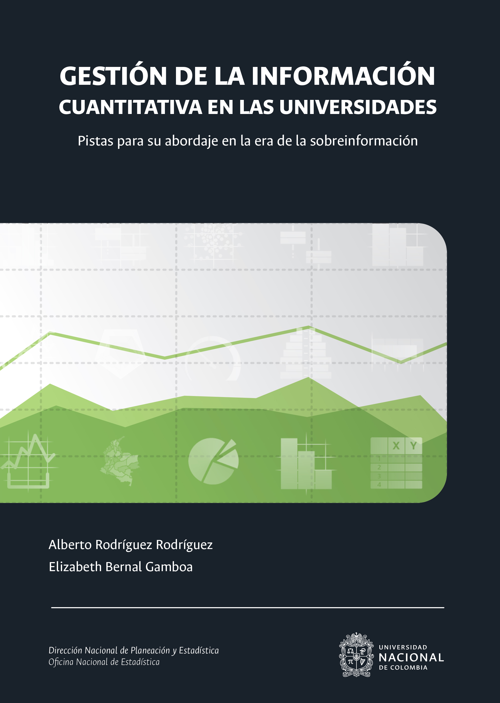

--- 
title: "Gestión de la información cuantitativa en las universidades"
subtitle: "Pistas para su abordaje en la era de la sobreinformación"
author: ["Alberto Rodríguez Rodríguez", "Elizabeth Bernal Gamboa"]
date: "`r Sys.Date()`"
site: bookdown::bookdown_site
documentclass: krantz
bibliography: [book.bib]
biblio-style: apalike
link-citations: yes
colorlinks: yes
graphics: yes
lot: yes
lof: yes
fontsize: 11pt
mainfont: Palatino
url: 'https://estadisticaun.github.io/L_Conceptual/'
github-repo: estadisticaun/L_Conceptual
cover-image: imagenes/Portada_Final.jpg
always_allow_html: yes
---

# Portada {-}

```{r fig.align='center', out.width='75%', fig.show='hold', echo=FALSE}

```


<style>
  .col2 {
    columns: 2 200px;         /* número de columnas y ancho en pixeles */
    -webkit-columns: 2 200px; /* chrome, safari */
    -moz-columns: 2 200px;    /* firefox */
  }
  .col3 {
    columns: 3 100px;
    -webkit-columns: 3 100px;
    -moz-columns: 3 100px;
  }
</style>

<div class="col2">

<b>GESTIÓN DE LA INFORMACIÓN CUANTITATIVA EN LAS UNIVERSIDADES.</b>  
Pistas para su abordaje en la era de la sobreinformación.  
&copy; Universidad Nacional de Colombia  
&copy; Alberto Rodríguez Rodríguez  
&copy; Elizabeth Bernal Gamboa  

<font color="DimGrey">DIRECTOR</font>  
&nbsp; Carlos ALberto Garzón Gaitán  

<font color="DimGrey">EQUIPO DE TRABAJO</font>  
&nbsp; Yenny Aleth Aldana Barrera  
&nbsp; Alberto Rodríguez Rodríguez  
&nbsp; Constanza Elena Rojas Olivera  
&nbsp; Johana María Díaz Díaz  
&nbsp; Liliana Andrea Gaitán Mendoza  
&nbsp; Luis Felipe Sánchez Mesa  
&nbsp; Luz Nancy Agudelo Otálora  
&nbsp; Rosa Yuleidi Gualdrón Monsalve  
&nbsp; Luz Stella Oviedo Molina  
&nbsp; María Claudia Galindo González  
&nbsp; Mónica Fernanda Mantilla Castellano  
&nbsp; Nelson Enrique Vivas Velandia  


ISBN 978-958-783-805-3  

Primera edición, Bogotá, abril de 2019  

<font color="DimGrey">CORRECCIÓN DE ESTILO</font>  
&nbsp; María José Díaz Granados M.  

<font color="DimGrey">DISEÑO CARÁTULA</font>  
&nbsp; Andrés Álvarez Ríos  

<font color="DimGrey">DISEÑO GRÁFICAS</font>  
&nbsp; Andrés Alvarez Rios 

<font color="DimGrey">DISEÑO Y DIAGRAMACIÓN IMPRESA</font>  
&nbsp; Gloría Diazgranados M.  

<font color="DimGrey">DISEÑO Y DIGRAMACIÓN WEB</font>  
&nbsp; Martín Andrés Macías Q.  

<font color="DimGrey">IMPRESIÓN</font>  
&nbsp; Imagen Editorial  

<font color="DimGrey">RECTORA</font>  
&nbsp; Dolly Montoya Castaño  

<font color="DimGrey">VICERRECTOR GENERAL</font>  
&nbsp; Pablo Enrique Abril  

<font color="DimGrey">VICERRECTOR ACADÉMICO</font>  
&nbsp; Carlos Augusto Hernández Rodríguez

<font color="DimGrey">VICERRECTORA INVESTIGACIÓN</font>  
&nbsp; Luz Teresa Gómez de Mantilla 

<font color="DimGrey">SECRETARÍA GENERAL</font>  
&nbsp; Carmen Alicia Cardozo de Martínez 

<font color="DimGrey">GERENTE NACIONAL FINANCIERO Y ADMINISTRATIVO</font>  
&nbsp; Álvaro Viña Vizcaino

<font color="DimGrey">DIRECTOR NACIONAL DE PLANEACIÓN Y ESTADÍSTICA</font>  
&nbsp; Carlos Alberto Garzón Gaitán

<font color="DimGrey">DIRECTORA DE RELACIONES EXTERIORES</font>  
&nbsp; Melba Libia Cárdenas Beltrán

<font color="DimGrey">DIRECTOR UNIDAD DE MEDIOS DE COMUNICACIÓN - UNIMEDIOS</font>  
&nbsp; Fredy Chaparro Sanabria  

<font color="DimGrey">DIRECTOR OFICINA JURÍDICA NACIONAL</font>  
&nbsp; Jairo Iván Peña Ayazo

<font color="DimGrey">DIRECTORA NACIONAL DE VEEDURÍA DISCIPLINARIA</font>  
&nbsp; Diana Yamile Rodríguez Niño

<font color="DimGrey">DIRECTORA NACIONAL FONDO PENSIONAL</font>  
&nbsp; Carolina Argüello Ospina 

<font color="DimGrey">GERENTE UNIDAD DE SERVICIOS DE SALUD - UNISALUD</font>  
&nbsp; Silvia Cristina Peña Cuéllar

<font color="DimGrey">JEFE OFICINA NACIONAL DE CONTROL INTERNO</font>  
&nbsp; Jesús Ángel Múnera  

<font color="DimGrey">VICERRECTOR SEDE BOGOTÁ</font>  
&nbsp; Jaime Franky Rodríguez 

<font color="DimGrey">VICERRECTOR SEDE MEDELLÍN</font>  
&nbsp; Juan Camilo Restrepo Gutiérrez 

<font color="DimGrey">VICERRECTOR SEDE MANIZALES</font>  
&nbsp; Camilo Younes Velosa  

<font color="DimGrey">VICERRECTOR SEDE PALMIRA</font>  
&nbsp; Jaime Eduardo Muñoz Flores 

<font color="DimGrey">VICERRECTOR SEDE DE LA PAZ</font>  
&nbsp; Iván Jaramillo Jaramillo 

<font color="DimGrey">DIRECTORES DE SEDE</font>  
&nbsp; Orinoquía: Óscar Eduardo Suárez Moreno  
&nbsp; Amazonía: Jhon Charles Donato  
&nbsp; Caribe: Adriana Santos Martínez  
&nbsp; Tumaco: Amanda Lucía Mora Martínez

<font color="DimGrey">JEFES OFICINAS DE PLANEACIÓN Y ESTADÍSTICA</font>  
&nbsp; Sede Bogotá: Geraldo Millán Cuervo  
&nbsp; Sede Medellín: Juan Manuel Vélez Restrepo  
&nbsp; Sede Manizales: Ricardo Augusto Tolosa Correa  
&nbsp; Sede Palmira: Nelson Lozano Duque  

</div>


<a rel="license" href="http://creativecommons.org/licenses/by-nc-nd/4.0/"></a><br />Este libro ha sido publicado por la Universidad Nacional de Colombia. La versión en línea de este libro está disponible bajo la licencia <a rel="license" href="http://creativecommons.org/licenses/by-nc-nd/4.0/">Creative Commons Attribution-NonCommercial-NoDerivatives 4.0 International</a>.